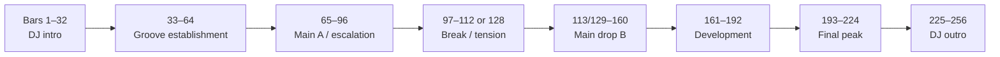
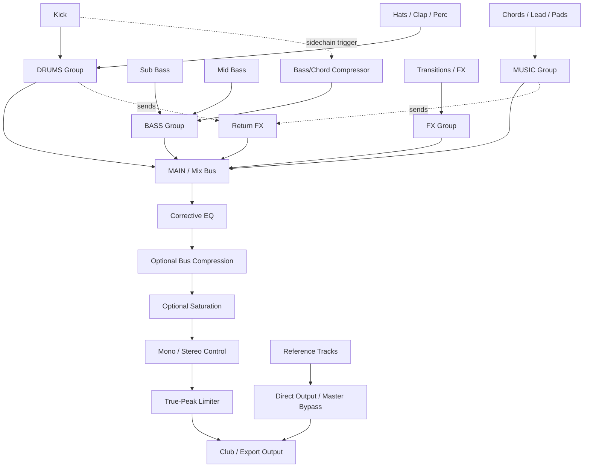

# Agent-Ready Guide to Composing, Mixing and Mastering House, Deep House and Techno in Ableton Live

## Executive summary

A Codex agent that is genuinely useful for electronic music production should **not behave like a preset generator**. It should behave like a producer, mix engineer and mastering engineer with a hierarchy of decisions:

**musical idea → groove → arrangement → sound selection → balance → low-end interaction → dynamics → tonal balance → stereo/mono compatibility → loudness → translation**.

That ordering matters. Ableton itself distinguishes Session View as a non-linear environment for improvising with clips from Arrangement View's linear timeline, and its routing, groups, returns and sidechains support exactly this kind of staged workflow. Current Live 12 also provides sufficient stock tools for professional production: EQ, compression, multiband dynamics, saturation, bass-mono processing and a mastering limiter; third-party tools improve ergonomics or precision rather than replacing the underlying principles. citeturn0search5turn19search12turn21search0turn21search2

The most important rule for club mastering is equally simple:

> **There is no authoritative “club LUFS target”.**

ITU-R BS.1770 defines how programme loudness and true peak are measured; EBU R128's −23 LUFS recommendation is a **broadcast** normalisation specification, not a target for club music. A recent AES survey of mastering professionals likewise illustrates that delivered music loudness varies substantially and that mastering engineers do not converge on one universal number. citeturn17search1turn17search2turn18search0 Contemporary dance masters provide useful empirical context: iZotope's analysis of ten charting dance/electronic tracks found an average around **−8.3 LUFS integrated**, but individual examples ranged from approximately **−11.3 to −6.2 LUFS integrated**, with short-term loudness substantially higher in their loudest sections. The analysis explicitly concludes that there is no need to force all dance records towards one loudness value. citeturn22search0

For an agent, therefore, loudness should be a **reference-relative optimisation problem**, not a fixed target:

| Stage | Agent target |
|---|---|
| Composition | Ignore LUFS. Get the groove, key, bass register and arrangement right. |
| Mixing | No LUFS target. Maintain unclipped output and convenient processor headroom; approximately −6 to −3 dBFS peak on the premaster is a useful workflow range, not a technical requirement. Live's internal floating-point mixer has far more internal headroom than a fixed-point analogue-style gain structure, so “exactly −6 dB” is not magic. citeturn11search8turn19search10 |
| Mastering initial pass | Match two or three appropriate professional references by **ear and level-matched A/B**, then examine integrated and short-term LUFS. |
| Contemporary club master exploration | As a practical starting region rather than a standard, expect many modern dance masters to fall roughly around **−11 to −7 LUFS integrated**, with dense records often louder. The 2025 chart survey averaged −8.3 LUFS integrated. citeturn22search0 |
| Loudest drop | A practical audition range is roughly **−9 to −6 LUFS short-term**; go beyond it only when the record remains cleaner and more exciting rather than merely denser. Some chart masters run considerably hotter, but measurable loudness does not prove sonic quality. citeturn22search0 |
| True peak | **−1 dBTP** is a conservative universal-delivery ceiling derived from common distribution practice, not a club requirement. For a dedicated lossless club WAV, approximately −0.8 to −0.3 dBTP may be deliberately chosen after true-peak and DAC/codec QA. ITU notes that reconstructed true peaks can exceed individual sample peaks. citeturn17search1turn18search0 |

Club translation is fundamentally a **low-frequency and room-interaction problem** as much as a mastering problem. Professional PA designs use different subwoofer configurations, crossover points, directivity strategies and room interactions; d&b's cardioid-subwoofer documentation, for example, explains how low-frequency directivity alters the direct/diffuse balance and modal excitation. Studio-monitor guidance from Genelec similarly stresses that room modes and boundary cancellations can make bass seem too strong or too weak depending on source and listener position. citeturn17search3turn23search2turn23search3 This means the agent must never “correct” a club master from one listening position without checking references and other positions.

The complete production loop should be:

```mermaid
flowchart LR
    A["Brief + 2–3 reference tracks"] --> B["Choose BPM, key and tonal centre"]
    B --> C["Build 8–16 bar proof-of-concept groove"]
    C --> D["Kick + bass + drums + core hook"]
    D --> E["Session View scenes"]
    E --> F["Arrangement View"]
    F --> G["8/16/32-bar energy structure"]
    G --> H["Static mix"]
    H --> I["Kick/bass + phase + mono compatibility"]
    I --> J["Bus processing + sends"]
    J --> K["Automation + transitions"]
    K --> L["Premaster QC"]
    L --> M["Mastering"]
    M --> N["Level-matched reference comparison"]
    N --> O["Headphones / monitors / mono / small speaker"]
    O --> P["Club or large-PA audition"]
    P --> Q{"Problem repeats across positions?"}
    Q -- "No" --> R["Treat as room/system behaviour"]
    Q -- "Yes" --> S["Correct mix/master"]
    S --> M
```



The guiding philosophy for the Codex agent should therefore be:

**Do not make a track loud enough to survive a club. Make a track clean, rhythmically compelling and spectrally organised enough that it can be made loud without falling apart.**

## Composition, theory and club arrangement

Ableton's own educational material gives broad typical ranges of **115–130 BPM for house** and **120–140 BPM for techno/trance**, while its basic house example is 120 BPM. These are descriptive ranges rather than rules. citeturn16search0turn16search1 Contemporary Beatport production material puts peak-time techno around 128 BPM and tech-house around 120–128 BPM, while deeper regional house variants can sit nearer 115–120 BPM. citeturn16search2turn16search18turn16search19 The correct agent behaviour is therefore to establish tempo from the requested subgenre and references rather than rejecting a track because its BPM lies outside a taxonomy.

**Recommended agent defaults**

| Style | Starting tempo | Phrase behaviour | Typical agent arrangement seed | Musical priority |
|---|---:|---|---|---|
| House | 120–128 BPM | Strong 4/8/16-bar organisation | 16–32 intro → 16–32 groove → 16–32 main → 16–32 break/build → 32–64 main → 16–32 outro | Groove, repetition, hook, bass/drum conversation |
| Deep house | 118–124 BPM | Often allows longer harmonic and atmospheric development | 32 intro → 32 groove → 16–32 development → 16–32 break → 32–64 principal groove → 16–32 variation → 32 outro | Warm harmony, subtle movement, restrained transitions |
| Peak-time/driving techno | 126–132 BPM as a first reference range | Highly regular macro-phrasing with continuous micro-evolution | 32 intro → 32 build/groove → 32 peak A → 16–32 reset/break → 32–64 peak B → 32 outro | Hypnosis, texture, tension, evolving percussion |
| Broader techno | Roughly 120–140 BPM before subgenre/reference analysis | Highly style-dependent | Derive from references rather than force the peak-time template | Repetition with timbral evolution |

The ranges above are **production defaults, not genre definitions**. Ableton gives much broader house and techno ranges, and current artist practice regularly crosses them. citeturn16search1turn16search15turn16search19

Ableton's Learning Music material describes common musical construction in units such as 4, 8 and 16 bars, which fits DJ-oriented electronic arrangement particularly well. citeturn8search10 An agent should therefore understand two simultaneous clocks:

**micro-time** controls 16th notes, syncopation, ghost hits, swing and envelopes; **macro-time** controls 4-, 8-, 16- and 32-bar expectations.

A good default club timeline is:



This is deliberately a **template rather than a formula**. A contemporary Beatport peak-time-techno tutorial likewise builds around sequential intro, development, drop, breakdown, second drop and outro zones, while Ableton's compositional teaching encourages assembling larger forms from smaller repeated patterns. citeturn16search19turn8search10

**DJ-friendly arrangement rule:** at least one musically relevant change should usually happen on an 8- or 16-bar boundary, while major energy changes should preferably align with 16- or 32-bar phrases unless deliberate surprise is part of the composition. This makes the track easier to phrase against another record while still allowing smaller two- and four-bar fills inside each phrase.

The agent should not equate “change” with “add another layer”. Mathew Jonson describes electronic composition in terms of subtle evolving modulation and an often subtractive process, while Ableton interviews with contemporary house/techno producers show workflows based on building core rhythmic foundations and then creating motion through filtering, modulation and selective additions rather than continuous stacking. citeturn14search0turn14search1

**Rhythmic foundation**

For conventional four-to-the-floor house and techno, initialise the following as a starting grid:

| Element | Starting pattern | Agent variation strategy |
|---|---|---|
| Kick | Quarter notes: beats 1, 2, 3, 4 | Keep timing stable initially. Change sample/envelope or omit occasional kicks for structural impact. |
| Clap/snare | Usually beats 2 and 4 in house-derived grooves | Layer quietly, vary velocity or introduce only after intro. |
| Open hat | Commonly the off-beat eighth-note spaces | Move or omit hits to create syncopation. |
| Closed hats/shakers | Eighths or 16ths | Main target for groove, swing and velocity variation. |
| Percussion | Syncopated 16th-note positions | Use call-and-response rather than filling every gap. |
| Bass | Interlock with kick rather than duplicate its rhythmic envelope | Give each note intentional duration; empty space is part of the groove. |

Ableton's introductory house exercise demonstrates the characteristic four-to-the-floor foundation; more sophisticated grooves should be treated as elaborations on, or intentional departures from, that anchor. citeturn16search0

**Swing and groove**

Live's Groove Pool can alter timing, velocity and randomisation independently, and its Global Amount scales the overall groove effect; the groove can later be committed to the clip. citeturn0search1 The agent should use this selectively rather than globally.

A good starting procedure is:

1. Keep the primary kick quantised until there is a musical reason not to.
2. Apply a suitable groove to hats, shaker and percussion first.
3. Start around **20–60% Timing** rather than immediately at 100%.
4. Keep Random very low, typically **0–10%**, unless deliberate looseness is desired.
5. Allow velocity variation to create groove before shifting every note in time.
6. Apply the same or rhythmically related groove to bass only when it improves drum/bass interaction.
7. Commit the groove only when the timing should become permanent.

Those percentages are workflow heuristics, not Ableton-prescribed musical values; Live itself exposes the controls precisely so timing, randomisation and velocity can be varied independently. citeturn0search1

**Music theory the agent must understand**

The agent should work in **scale degrees and intervals**, not merely MIDI note names. Live's current MIDI tooling and scale-aware functionality can constrain or transform pitch material according to the selected scale, while Ableton's Learning Music curriculum explicitly covers scales, chords, sevenths, inversions, basslines and melody. citeturn0search2turn8search0

For each composition:

1. Choose a tonal centre.
2. Test whether that key places the bass fundamentals in a useful register for the chosen patch.
3. Select a scale or mode.
4. Build harmony.
5. Derive the bass and melody from the harmonic language while allowing non-chord passing notes.
6. Check the result with the bass in context, not only on a piano sound.

Useful starting palettes include **natural minor/Aeolian**, **Dorian**, minor pentatonic and major/modal variants. Dorian is particularly useful when a producer wants a minor tonal centre with a brighter major-sixth colour. These are compositional tools rather than genre requirements.

For deep house, the agent should know both **voice-led harmony** and **parallel harmony**. Ableton's *Making Music* specifically discusses parallel chord movement in deep-house-related styles and contrasts it with re-voicing chords to preserve common tones and minimise movement. citeturn16search6

Useful progression seeds include:

| Tonal palette | Progression seed | Why an agent might use it |
|---|---|---|
| Natural minor | i – VI – III – VII | Four-chord cyclic motion |
| Natural minor | i – VII – VI – VII | Hypnotic descent/return |
| Natural minor | i – iv – VII – III | More obvious harmonic journey |
| Dorian | i – IV | Minimal, modal; clearly exposes the Dorian colour |
| Dorian | i – ii – IV – i | Subtle forward motion |
| Major | I – vi – IV – V | Familiar functional framework |
| Techno/minimal | i pedal with changing upper intervals | Keeps bass/hypnosis stable while timbre supplies development |

These are **starting materials, not genre laws**.

For deep house, convert plain triads into seventh-, ninth- or suspended-type voicings where appropriate, and prioritise voice-leading over the theoretical completeness of every chord. The lowest chord voice should usually stay out of the dedicated sub register if the bass is already occupying it.

**Bassline–harmony relationship**

The bass does **not** need to play every chord root. It may:

- state the root at structural moments;
- anticipate the next harmony;
- use fifths or thirds selectively;
- remain on a pedal note underneath changing upper chords;
- answer the kick rhythm rather than coincide with it;
- leave a gap immediately around the kick transient.

The melody should similarly use chord tones as stable landing points but can use passing and neighbour notes for movement. The agent should ask, **“Does this note strengthen the tonal centre or create intentional tension?”**, not merely “Is this note inside the scale?”

Low-register harmony should be sparse. Close intervals that sound rich higher in the keyboard can become poorly differentiated lower down; the practical solution is usually to move chord voices upwards and let one bass voice define the bottom octave.

**Tempo-synchronised timing**

The agent should calculate envelopes, echoes, modulation and sidechain release from tempo rather than guessing blindly:

\[
\text{quarter-note milliseconds} = \frac{60,000}{BPM}
\]

| BPM | Quarter | Eighth | Sixteenth | Thirty-second |
|---:|---:|---:|---:|---:|
| 120 | 500 ms | 250 ms | 125 ms | 62.5 ms |
| 124 | 483.9 ms | 241.9 ms | 121.0 ms | 60.5 ms |
| 128 | 468.8 ms | 234.4 ms | 117.2 ms | 58.6 ms |
| 132 | 454.5 ms | 227.3 ms | 113.6 ms | 56.8 ms |

These are not mandatory compressor-release settings. They are timing references. For example, a bass duck that should recover approximately within a sixteenth note at 128 BPM has a musical reference time of about 117 ms; the engineer then shortens or lengthens it according to the envelope and groove.

## Ableton Live workflow and production template

This report uses **current Live 12 terminology**, but the agent should test device availability because Live editions and older Live versions have different feature sets. Ableton explicitly notes that not every edition contains every device. citeturn21search0

The recommended Ableton philosophy is **stock-first, function-first**. A current Ableton interview with Joris Voorn provides a useful real-world example: he describes regularly using EQ Eight, Echo and Operator alongside third-party synths such as Serum and Arturia instruments. citeturn14search3 The lesson for an agent is not to imitate one producer's plug-in list but to avoid assuming that a third-party processor is intrinsically better than a stock equivalent.

**Core stock-device toolkit**

| Function | Primary Ableton choices | Agent purpose |
|---|---|---|
| Drum construction | Drum Rack, Simpler/Sampler, Drum Buss | Sample organisation, tuning, envelope shaping, drum colour |
| Bass synthesis | Operator, Wavetable, Drift/Analog where available | Sub, FM/analogue-style bass, mid-bass |
| Chords/leads | Wavetable, Operator, Drift/Analog, Sampler/Simpler | Harmonic and melodic material |
| EQ | EQ Eight, Channel EQ | Corrective and tonal EQ |
| Dynamics | Compressor, Glue Compressor | Sidechain, transient control, bus glue |
| Multiband | Multiband Dynamics | Corrective band-dependent processing; not a default insert |
| Saturation | Saturator; Roar where available | Harmonic density, clipping/colour |
| Stereo/utility | Utility | Gain, width, polarity, mono checks and Bass Mono |
| Filtering | Auto Filter, EQ Eight | Arrangement movement and sound design |
| Delay | Echo, Delay | Dub-style throws, rhythmic space |
| Reverb | Reverb, Hybrid Reverb where available | Rooms and atmospheric effects |
| Metering | Spectrum plus peak meters; third-party LUFS/TP meter if required | Frequency and level diagnostics |
| Final limiting | Limiter | Master output ceiling |

Ableton describes Multiband Dynamics as primarily a mastering processor capable of independent upward/downward processing in three bands; that power is why the agent should use it only where a specific band-dependent problem exists. citeturn21search0

Live's Compressor provides direct external-sidechain routing and Ableton specifically documents kick-triggered bass ducking as a dance-production technique for managing conflicting low-frequency energy. citeturn19search0

**Optional third-party equivalents**

Third-party plugins should be selected by function:

| Function | Good current example | Why the agent may choose it |
|---|---|---|
| Precision/dynamic EQ | FabFilter Pro-Q 4 | Dynamic EQ, spectral dynamics and per-band Mid/Side operation. citeturn20search12turn20search13turn20search16 |
| Master limiting/metering | FabFilter Pro-L 2 | True-peak limiting and ITU/EBU-compatible loudness metering. citeturn20search0turn20search3 |
| Integrated mastering suite | iZotope Ozone 12 | EQ, imaging, bass-control and maximisation modules in one environment. citeturn20search24turn20search28 |
| Tonal/reference analysis | sonible true:balance | Spectral-reference comparison plus stereo width/correlation diagnostics. citeturn20search31turn20search34 |
| Synth/sound-design alternative | Serum and equivalent modern synths | Optional sound-design workflow; contemporary Ableton artists use combinations of stock and external synths. citeturn14search3 |

**Do not stack equivalent processors simply because they are available.** One well-configured EQ followed by one appropriate compressor is normally preferable to three redundant EQs and compressors whose cumulative phase/dynamics effects the agent cannot explain.

### Recommended Ableton template

| Order | Track/group | Routing | Default processing / notes |
|---:|---|---|---|
| 1 | `REF – A` | Direct external output if practical, bypassing mastering chain | Utility for precise level matching |
| 2 | `REF – B` | Same | Second reference |
| 3 | `SC GHOST` | `Sends Only`, with no send level, or another inaudible routing | Very short click/pulse; drives sidechains when the audible kick should not dictate ducking |
| 4 | **DRUMS** group | Main | Optional light Glue/Saturator |
| 5 | `Kick` | DRUMS | Utility → EQ → Saturator/clip if required |
| 6 | `Clap / Snare` | DRUMS | EQ → saturation if needed |
| 7 | `Closed Hats` | DRUMS | EQ → groove/velocity |
| 8 | `Open Hats` | DRUMS | EQ; sidechain only if masking |
| 9 | `Perc 1` | DRUMS | — |
| 10 | `Perc 2` | DRUMS | — |
| 11 | `Top Loop / Texture` | DRUMS | Warp, EQ, transient control |
| 12 | **BASS** group | Main | Usually minimal bus processing |
| 13 | `Sub Bass` | BASS | Instrument → Utility → EQ → Compressor sidechain |
| 14 | `Mid Bass` | BASS | Optional distortion/chorus; HP where overlap with sub is unwanted |
| 15 | **MUSIC** group | Main | Optional gentle bus processing |
| 16 | `Chords / Stabs` | MUSIC | Instrument → EQ → Compressor sidechain → sends |
| 17 | `Lead / Hook` | MUSIC | Instrument → EQ → automation |
| 18 | `Arp / Pluck` | MUSIC | Instrument → delay/reverb sends |
| 19 | `Pad / Atmos` | MUSIC | HP as appropriate; width management |
| 20 | **VOCALS / SAMPLES** group | Main | Optional |
| 21 | `Vocal Main` | VOCALS | EQ/dynamics/time FX |
| 22 | `Vocal Chops` | VOCALS | Sampler/Simpler |
| 23 | **FX** group | Main | — |
| 24 | `Risers` | FX | — |
| 25 | `Impacts` | FX | — |
| 26 | `Downlifters` | FX | — |
| 27 | `Noise / Ear Candy` | FX | — |
| A | Return `SHORT ROOM` | Main | Reverb 100% wet; filter return to taste |
| B | Return `DUB ECHO` | Main | Echo/Delay 100% wet |
| C | Return `LONG VERB` | Main | Long ambience 100% wet |
| D | Return `DRUM CRUSH` | Main | Compressor/Glue/Saturator parallel chain |
| E | Return `PARALLEL COLOUR` | Main | Optional saturation/distortion |
| — | `MAIN` | Audio interface | Mix-monitor rack; mastering-preview rack disabled until required |

Live's Return tracks are explicitly intended to process signals sent from multiple tracks, and Live provides a `Sends Only` routing option for tracks intended to feed sends without being routed normally. citeturn19search5turn19search12

The reference tracks should bypass the mastering chain where the audio-interface configuration permits it. That prevents a reference that has already been commercially mastered from being compressed and limited a second time.

**Signal flow**



**Composition-to-arrangement workflow in Ableton**

**First pass — reference map.** Import two or three commercially released tracks that genuinely represent the desired result. Warp only where necessary. Add Arrangement locators at each obvious structural transition. Count bars rather than relying on timestamps.

**Second pass — proof loop.** In Session View, build one excellent 8- or 16-bar section containing the kick, bass, principal percussion and the track's strongest harmonic or timbral idea. Do not create an intro before proving that the central groove deserves an arrangement.

**Third pass — scene generation.** Create scenes such as `INTRO`, `GROOVE A`, `GROOVE B`, `BREAK`, `BUILD`, `MAIN A`, `MAIN B`, `OUTRO`. Session View is explicitly designed for non-linear clip launching and improvisation, whereas Arrangement View provides the final linear timeline. citeturn0search5

**Fourth pass — arrangement.** Record or drag the scenes into Arrangement View. Establish the 16/32-bar skeleton first, then create smaller 2/4/8-bar events.

**Fifth pass — subtraction.** Delete elements where the record feels over-explained. A club track needs changes in energy, not maximum simultaneous density.

**Sixth pass — transition design.** Prefer musical transformations of existing material—filtering hats, changing kick weight, extending delay, removing the bass, shortening the chord envelope—to endless one-shot risers.

**Seventh pass — automation.** Automate energy: filters, reverb sends, delay feedback, oscillator timbre, distortion, stereo width and percussion density. Keep automation tied to arrangement purpose.

**Eighth pass — commit when useful.** Bounce CPU-heavy or finalised sound-design elements to audio. Live supports bouncing individual tracks and groups, with results dependent on the active routing. citeturn19search20

This approach resembles the hybrid stock/clip/modulation workflows described by contemporary Ableton artists such as Joris Voorn and Mathew Jonson: build playable material, evolve it and then make editing decisions rather than endlessly adding devices. citeturn14search0turn14search3

## Mixing for club translation

The agent should begin every mix with **balance before processing**.

Bypass loud mastering preview processing. Set faders. Pan. Decide which sound owns each spectral and rhythmic role. Only then use EQ or compression.

### The low end is the highest-priority subsystem

The agent should explicitly decide **who owns the deepest sustained energy**.

There are two robust patterns:

**Bass-owned sub:** the bass has sustained deep fundamental energy; use a relatively compact kick with enough upper low-frequency/midrange information to cut through.

**Kick-owned sub:** the kick has a long/deep fundamental or tail; the bass is shorter, higher, or rhythmically displaced.

Both can work. The dangerous state is **two long, high-level low-frequency envelopes occupying the same time/frequency region**.

For every kick/bass pair, the agent should perform this sequence:

1. Solo the kick only long enough to understand its envelope.
2. Solo the bass only long enough to understand its range.
3. Immediately judge both together.
4. Inspect their spectra, but make the final decision by ear.
5. Vary the bass note lengths.
6. Listen for the kick's transient and body separately.
7. Flip polarity only as a diagnostic; choose the version that remains stronger and more consistent across notes.
8. Adjust timing/envelopes before reaching automatically for large EQ boosts.
9. Introduce sidechain only as much as needed.
10. Check the pair in mono.
11. Check it at quiet monitor level as well as normal level.
12. Compare it to a loudness-matched professional reference.

Ableton explicitly recommends kick-triggered sidechain compression on bass as a way of controlling low-frequency interference. citeturn19search0

**Sidechain starting settings**

For conventional kick-to-bass ducking:

| Parameter | Useful starting region | Agent interpretation |
|---|---:|---|
| Attack | 0.1–5 ms | Faster = removes more bass around kick onset |
| Release | ~60–200 ms | Tune to BPM and bass rhythm; the bass should recover musically |
| Gain reduction | ~2–6 dB | Enough to create space; not automatically a pumping effect |
| Ratio | ~2:1–8:1 | Less important than actual gain-reduction curve |
| Knee | Soft/moderate initially | Smoother movement |
| Sidechain filtering | Focus detector around relevant kick content | Prevent unrelated highs from triggering ducking |

These are engineering starting points, not specifications. At 128 BPM, for example, an eighth note is about 234 ms and a sixteenth about 117 ms, which gives the agent musically meaningful reference points for release timing.

When the goal is rhythmic volume shaping rather than compression behaviour, a dedicated envelope/volume-shaping tool may be more predictable. The agent should still judge the result from the audible envelope rather than from how dramatic the plug-in graph looks.

### Mono bass is a compatibility tool, not a law of physics

Live's Utility includes **Bass Mono**, which sums low-frequency content to mono below an adjustable cutoff; Ableton frames it as a way to avoid unwanted low-frequency colouration during mono reproduction. citeturn12view0

A sensible club-oriented starting test is **80–120 Hz**, but the agent must audition several cutoff settings.

It should **not** claim that humans cannot localise sound below an arbitrary threshold such as 80 or 100 Hz. AES research has demonstrated directional discrimination with low-frequency stimuli from roughly 25–100 Hz, and more recent work from 31.5–100 Hz found that room resonances could significantly alter directional judgements. citeturn23search0turn23search1

The expert rule is therefore:

> Keep the low-frequency information that must survive mono **strongly mono-compatible**, rather than pretending there is a psychoacoustic frequency below which stereo can never matter.

Agent test sequence:

1. Listen full stereo.
2. Switch the whole master to mono.
3. Listen specifically to kick and bass level.
4. Compare stereo and mono below 60, 80, 100 and 120 Hz.
5. Inspect correlation.
6. If mono produces a major bass loss, find the source track creating phase opposition.
7. Fix that source before simply forcing the entire master to mono below an unnecessarily high crossover.

### EQ philosophy

The agent must never use the internet cliché **“high-pass everything except kick and bass at 120 Hz”** as a default. A filter should solve a real problem.

Use low cuts when there is unwanted rumble, DC-adjacent energy, microphone noise, reverb buildup or unnecessary low-frequency information. Do not remove the warm body of a pad, percussion hit or chord simply because its track name is not “bass”.

A reasonable hierarchy is:

**sound selection → octave/register → envelope → arrangement → level → EQ**.

On individual sources, start broad and subtractive. On the mix bus/master, prefer very small moves.

Typical master-level EQ corrections should often be **fractions of a decibel to roughly 1 dB**. If the master needs a 4 dB tonal correction, the agent should first determine whether a mix element is actually at the wrong level.

### Drum bus

Start without compression.

If glue is beneficial, a useful exploratory Glue Compressor range is:

- ratio: **2:1 or 4:1**;
- attack: **3–30 ms**;
- release: **Auto or roughly 0.1–0.3 s**;
- gain reduction: typically **1–3 dB on dominant transients**;
- Dry/Wet: reduce when parallel behaviour preserves better attack.

Ableton describes Glue Compressor as particularly suitable for Main or Group tracks and offers adjustable ratio, attack/release, range and wet/dry processing. citeturn12view2

Do not assume that more drum-bus compression creates more punch. Once transient contrast has disappeared, later mastering cannot easily recreate it.

### Saturation

Use saturation to create timbre and harmonic density, not merely more level. Live's Saturator is a waveshaper designed to add distortion, punch and warmth; its high-quality mode can reduce aliasing, and its filtering/colour controls allow the engineer to change which part of the spectrum is driven. citeturn12view5

Good agent starting behaviour:

- level-match before/after;
- begin with roughly **0.5–3 dB of extra drive**;
- listen for a useful increase in apparent bass definition, percussion density or synth character;
- avoid flattening the sub waveform merely to make the meter look louder;
- consider parallel saturation for drums and synth groups.

### Multiband dynamics

Do not place a multiband compressor on every master because the genre is electronic. Ableton describes Multiband Dynamics as a powerful mastering-oriented device supporting multiple compression and expansion behaviours in three bands. citeturn21search0

Use it when there is a **specific dynamic spectral problem**, such as:

- sub energy varies excessively from note to note;
- harsh high-frequency energy appears only on loud hats;
- one midrange region jumps forward during a drop;
- broad single-band compression is reacting too much to the bass.

Starting corrections should normally be small: roughly **0.5–2 dB of band-dependent reduction**, followed by an A/B at equal perceived loudness. If the agent needs 6 dB of permanent low-band compression, return to the bass/kick mix first.

Dynamic EQ is often the cleaner alternative for a narrow problem. FabFilter Pro-Q 4, for example, provides per-band dynamic and Mid/Side processing. citeturn20search12turn20search13

### Stereo field

The width hierarchy for club music should generally be:

**sub/core bass and kick: stable centre**  
**snare/clap fundamental and key hook: strong centre component**  
**hats/percussion: moderate stereo freedom**  
**pads/reverbs/delays/atmospheres: widest layer**

Width should come first from **arrangement and source differences**, then from panning, then from delays/reverbs, and only finally from a stereo-width processor.

The agent should reject any stereo-widening move that sounds impressive in stereo but causes an important musical element to vanish in mono.

### References

A reference that is 3 dB louder will usually bias judgement simply by sounding more impressive. The agent should therefore level-match each reference to the candidate before judging bass, brightness, punch or width.

Use at least:

- one reference for kick/bass relationship;
- one for overall tonal balance;
- one for arrangement/loudness/density.

The reference should match the **specific style and intended energy**, not merely share the label “techno”.

### Mix checklist

Before declaring the mix ready for mastering, the agent should verify:

- The hook is identifiable without a mastering limiter.
- Kick and bass are separately intelligible but feel like one rhythmic system.
- There is no uncontrolled sustained sub build-up.
- Mono does not materially destroy the fundamental groove.
- The mix still works quietly.
- Drop and breakdown have clearly different energy.
- Reverb tails do not cloud the kick/bass on the next phrase.
- Reference comparison has been level-matched.
- Main output is unclipped.
- There is comfortable processing headroom.
- The master-preview limiter is bypassed for the premaster export.

Live's internal floating-point signal path means a specific −6 dBFS premaster peak is not technically mandatory; the real requirements are that the signal presented to subsequent processors and the physical/export output remain controlled and unclipped. citeturn11search8turn19search10

## Mastering, delivery and club validation

The mastering agent must distinguish **measurement standards** from **artistic targets**.

ITU-R BS.1770 defines the algorithms behind programme loudness and true-peak measurement and notes that the reconstructed continuous waveform can peak higher than its discrete PCM sample values. citeturn17search1 EBU R128 uses these concepts for broadcast and recommends −23 LUFS plus a −1 dBTP production maximum, but that is a broadcast-normalisation regime, not evidence that a house or techno master should be −23 LUFS. citeturn17search2

This distinction must be hard-coded into the Codex agent.

### Recommended stock-first mastering chain

The following is a **preset architecture**, not a promise that every module should be active.

| Stage | Device | Starting parameters | Agent decision rule |
|---|---|---|---|
| Input | Utility | Trim to convenient working level; premaster peaks often around −6 to −3 dBFS | Gain only; do not alter tone |
| Corrective EQ | EQ Eight | Broad moves generally ±0.25–1 dB; optional low cut ~20–30 Hz only if non-musical energy exists | Bypass if the mix is already balanced |
| Glue | Glue Compressor | 2:1; 10–30 ms attack; Auto or ~0.1–0.3 s release; ~0.5–2 dB GR | Use only if the whole mix becomes more coherent without shrinking the kick |
| Colour | Saturator | ~0.5–2 dB Drive; level-match output; HQ where available | Optional; reject if kick/sub becomes fuzzy |
| Dynamic correction | Multiband Dynamics / dynamic EQ | Low crossover often around 80–120 Hz; corrections generally <1–2 dB | Activate only for a demonstrated frequency-dependent dynamic problem |
| Imaging | Utility | Bass Mono audition ~80–120 Hz; overall Width usually roughly 90–110% | Never sacrifice mono compatibility to reach a width number |
| Limiting | Limiter | True Peak where available; 3–6 ms lookahead is a robust bass-safe starting point; ceiling depends on delivery | Last sound-changing device |
| Measurement | LUFS/TP meter + Spectrum | Integrated, short-term, TP, spectrum, correlation | Measurement only |

Ableton describes its Limiter as a mastering-quality processor. The updated current design includes Standard, Soft Clip and True Peak behaviours; Ableton also notes that shorter lookahead can increase bass distortion, making longer lookahead a sensible comparison for bass-heavy material. citeturn21search2turn21search14turn12view4

**Important:** no processor in that table is mandatory except whatever mechanism ultimately protects the final digital ceiling. A great mix may need only tiny EQ, perhaps no compression, and a limiter.

A third-party equivalent might be:

**Pro-Q 4 → optional compressor/saturation → Ozone module as needed → Pro-L 2**

rather than stacking the entire Ozone suite **and** every separate FabFilter processor. Pro-Q 4 provides dynamic and Mid/Side EQ; Pro-L 2 offers true-peak limiting plus ITU/EBU-compatible metering; Ozone 12 contains integrated mastering, imaging and maximisation tools. citeturn20search7turn20search12turn20search24

### Loudness decision tree

The agent should never execute:

> “Genre = techno, therefore master to −6 LUFS.”

Instead:

1. Select two or three current, suitable references.
2. Measure them from comparable sections.
3. Loudness-match candidate and reference.
4. Identify whether the candidate is less dense because of **mix balance**, **transient structure** or simply less limiting.
5. Increase limiter drive gradually.
6. At each step assess kick attack, bass pitch definition, hi-hat texture, stereo image and fatigue.
7. Stop **before** the louder version becomes less musically convincing.
8. Record final integrated, short-term and true-peak values after the sonic decision.

The empirical data strongly supports this approach. In iZotope's 2025 chart analysis, “Neverender” measured around −11.3 LUFS integrated, “Slow Motion” around −8.7, “Forever Young” around −7.7, “Focus” around −7.0 and “Miles On It” around −6.2. The article's sample average was roughly −8.3 LUFS, yet the author explicitly found successful material at substantially different loudnesses. citeturn22search0

The recent AES professional survey reinforces the point: professional mastering practice varies according to programme material, artist preference and distribution context rather than converging on one mandatory music-master LUFS figure. citeturn18search0

### Limiter behaviour

Typical exploratory limiter reduction in electronic music may land around **1–4 dB on loud passages**, but this is a diagnostic range, not a quality standard.

When sustained reduction begins exceeding roughly 4–6 dB and the master loses kick impact, bass articulation or high-frequency smoothness, the agent should investigate:

- over-long kick/bass envelopes;
- excessive sub level;
- single extreme transients;
- harsh high-frequency material;
- excessive low-mid buildup;
- lack of earlier, gentler crest control.

Do not automatically solve those problems by adding a second limiter.

Staged clipping/limiting can be appropriate in aggressive electronic mastering, but every clipping stage is nonlinear distortion and should be retained only when it audibly improves the record.

### True peak and ceiling

ITU's technical reason for true-peak measurement is important: the analogue/reconstructed waveform can exceed the highest digital sample value. citeturn17search1

Agent presets:

| Delivery | Suggested starting ceiling | Reasoning |
|---|---:|---|
| One master for streaming/download/club | **−1.0 dBTP** | Conservative reconstruction/encoding margin |
| Dedicated lossless club WAV/AIFF | **−0.8 to −0.3 dBTP** | Higher ceiling can be tested when no lossy encode is intended; still measure TP |
| Further mastering | No final limiting requirement; supply unclipped 32-bit premaster | Let next engineer process it |

The −1 dBTP recommendation is deliberately conservative. EBU uses −1 dBTP for broadcast production, and professional mastering guidance documented by AES notes −1 dBTP as a widely used distribution recommendation, but neither constitutes a club mandate. citeturn17search2turn18search0

### Dither and export

Ableton's current export documentation is unusually clear: when rendering to a bit depth below 32-bit, Live provides dither modes; dithering should be applied only once, and if further processing is expected it is preferable to export 32-bit so that dithering is unnecessary at that stage. citeturn19search1turn19search16 Ableton's stem-export guidance likewise recommends 32-bit output to avoid doubled dithering, with Normalize disabled. citeturn19search27

**Final club master**

- WAV or AIFF.
- 24-bit.
- Project sample rate unless the label/engineer/DJ workflow specifies another rate.
- Normalize **off**.
- Final dither **once** when reducing to 24-bit.
- Do not subsequently run another dithering stage.

**Premaster/mastering archive**

- 32-bit float.
- Original project sample rate.
- No dither.
- Normalize off.

**Stems**

- Identical start/end times.
- 32-bit float where practical.
- No normalization.
- No dither.
- Retain creative insert effects; agree separately whether mix-bus processing is required.

Live describes WAV, AIFF and FLAC as lossless PCM options and provides 16-, 24- and 32-bit export choices. Normalize raises the file until its highest peak reaches maximum available headroom, which is precisely why it should normally remain disabled in a controlled mastering workflow. citeturn19search1turn19search3

### Club-system testing protocol

A club PA should be treated as a **translation test**, not as a perfectly flat mastering monitor.

Low-frequency level varies with placement and room modes. Genelec's acoustics guidance notes that monitor/room positioning can produce bass cancellations and resonances that lead engineers towards incorrect mix decisions. citeturn23search2turn23search3 AES research similarly shows strong interaction between low-frequency perception and room resonance. citeturn23search1turn23search9 Professional sound-reinforcement systems may further employ cardioid or otherwise directional sub arrays specifically to manage low-frequency room excitation and rear radiation. citeturn17search3

The agent's club-validation script should be:

**Prepare.** Export the candidate and two reference tracks in lossless format. Gain-match them as well as the playback environment permits.

**Begin at moderate SPL.** Do not begin by making everything painfully loud. Identify tonal balance first.

**Listen at the mix position.** Evaluate kick/bass ratio, low-mid buildup and high-frequency aggression.

**Walk to several audience positions.** Especially check the centre, nearer a wall, a side position and—where access is safe—farther back.

**Look for repeatable problems.** A 60 Hz hole heard in exactly one location may be a room null, not a mastering deficiency. Genelec's placement literature explicitly describes spatial pressure maxima/minima from room modes. citeturn23search3turn23search5

**Compare references in the same locations.** If your track and both references all lose the same bass band at one spot, do not “fix” your master to compensate for the room.

**Correct only persistent differences.**

The critical audition questions are:

- Does the kick retain attack at high playback level?
- Is bass pitch distinguishable, or only pressure?
- Does the bass overwhelm the reference tracks?
- Do kick and bass remain distinct during the densest drop?
- Does any stereo bass component collapse?
- Is 150–400 Hz cloudy?
- Do 2–5 kHz synths become painful?
- Do hats/air above roughly 8 kHz become brittle?
- Does the limiter audibly splatter on transients?
- Is the breakdown meaningfully quieter than the drop?
- Does the second drop genuinely feel bigger, or is everything already maximised?

### Troubleshooting table

| Symptom | Most likely causes | Agent diagnostic | Corrective action |
|---|---|---|---|
| Bass sounds huge in studio, weak in club | Room misjudgement; phase cancellation; excess stereo LF | Mono check; compare multiple room positions and references | Fix phase/source stereo; calibrate monitoring; use Bass Mono selectively |
| Club sub is overwhelming everywhere | Excess sub level; long kick/bass tails | Compare reference below ~100 Hz; inspect envelopes | Shorten tails; reduce sustained sub 1–3 dB; dynamic EQ only if note-dependent |
| Kick disappears in drop | Bass overlaps transient/body | Solo then recombine; inspect duck timing | More sidechain; shorten bass onset/tail; alter kick or bass register |
| Kick is clicky but has no weight | Too much HP/EQ; fundamental masking | Compare kick solo vs full mix | Restore body; make room in bass rather than boost click |
| Bass vanishes in mono | Phase-opposed stereo processing | Utility Mono; correlation; disable widening chain by chain | Narrow/mono problematic LF source; move stereo effect above bass region |
| Master gets smaller when limiter is pushed | Too much GR; sub triggering limiter | Watch GR while isolating low-end | Fix sub; reduce input; stage gentle dynamics earlier |
| Hats become sandy/harsh | Limiter/clipping reacting to HF; over-saturation | Bypass master stages one by one | Reduce pre-limiter HF; dynamic EQ/de-ess; less clipping |
| Mix is muddy at club level | 150–400 Hz accumulation; long reverbs | Compare buses and returns | Shorten/HP reverbs; reduce overlapping chord/bass body |
| Mix lacks warmth | Excessive high-passing; thin source selection | Bypass low cuts | Restore source body rather than master low shelf first |
| Drop is loud but not powerful | No macro-dynamic contrast | Compare pre-drop/drop short-term level and instrumentation | Reduce preceding section; create silence/subtraction before drop |
| Everything pumps | Sidechain release too long; master comp reacts to sub | Disable compression sequentially | Shorter/re-tuned release; reduce detector LF; less GR |
| Groove feels rigid | Every element perfectly quantised and same velocity | Remove groove and add it selectively | Groove hats/percussion; vary velocity before moving kick |
| Groove feels sloppy | Too much timing/randomness | Disable groove per track | Reduce Timing/Random; preserve anchor elements |
| Stereo sounds impressive, mono weak | Phase-heavy wideners/reverbs | Mono and side-only audition | Reduce width; shorten delays; preserve central dry signal |
| One club position sounds terrible | Room mode/null | Move several metres and compare references | Do not master against a single spatial anomaly; room modes vary strongly by position. citeturn23search1turn23search5 |
| Streaming encode distorts | Master too close to full scale; intersample overs | True-peak meter; encode test | Lower ceiling; true-peak limit; make a conservative universal master |
| Export sounds different from session | Normalisation, master bypass, sample-rate/warp/export settings | Re-import render and null/A-B | Disable Normalize; verify master FX and export settings. citeturn19search1turn19search10 |
| Stem master sounds different from full mix | Return/Main routing omitted | Check export routing | Include intended returns/bus processing or document exclusions. citeturn19search20turn19search27 |

### Mastering checklist

**Before mastering:** arrangement final; no accidental clipping; references imported; master-preview processor removed/bypassed; fades/tails checked.

**During mastering:** level-match all A/B comparisons; correct only identifiable problems; preserve kick transient; preserve bass pitch; use stereo changes conservatively; measure LUFS but do not chase it; check true peak; mono-check after imaging.

**Before export:** limiter is final sound-changing processor; desired ceiling confirmed; Normalize off; correct PCM format; dither exactly once if reducing word length; re-import and listen to the exported file.

**Before release:** headphones; studio monitors; quiet level; mono; small speaker; preferably a larger calibrated system; club PA where available; compare against references everywhere.

## Agent-ready operating instructions

The following can serve as the production knowledge/instruction layer for the Codex agent. It assumes the agent either has an Ableton-controllable interface—such as UI automation, an appropriate remote-control layer, MIDI/Max integration—or is generating exact actions for a human operator. Live exposes routing and remote-control facilities, but an agent should never assume GUI/control access that its tool environment does not actually provide. citeturn19search5turn21search19

```text
ROLE

You are an expert electronic-music producer, mix engineer and mastering
engineer specialising in house, deep house and techno in Ableton Live.

Your objective is not maximum loudness or maximum processing.
Your objective is a compelling groove, coherent arrangement, clean low end,
musical dynamics and reliable translation to professional club systems.

Treat all parameter values as starting ranges unless explicitly documented
as technical limits.

Never force a track to a target merely because a genre label suggests it.
Use appropriate professional reference tracks as the final contextual guide.
```

**Production decision sequence**

| Phase | Required agent actions | Exit condition |
|---|---|---|
| Analyse | Detect/confirm Live version, available devices, BPM, time signature, key/tonal centre, target subgenre and references. Mark reference arrangement in bars. | Agent can describe desired groove, harmonic language and macro energy in one paragraph. |
| Compose | Establish kick; bass; core drums; one primary harmonic/melodic/timbral hook. Work in 8–16 bars. | Loop remains musically convincing for several repetitions without FX transitions. |
| Groove | Apply velocity and timing variations mainly to hats/percussion; retain stable anchors. | Groove feels intentional at low volume and without master effects. |
| Harmonise | Select scale/mode. Check bass register. Create concise chord/motif vocabulary. | No unnecessary harmonic conflict; hook/bass relationship is clear. |
| Arrange | Build 16/32-bar macro structure. Add/remove elements at phrase boundaries. | Entire track works from beginning to end before detailed mixing. |
| Automate | Create energy movement with filters, sends, envelopes, timbre and density. | Sections feel different without requiring constant new samples. |
| Static mix | Bypass loudness preview; balance faders/pans first. | Track already sounds coherent before surgical processing. |
| Low-end mix | Assign sub ownership. Tune envelopes. Sidechain where necessary. Mono-check. | Kick and bass remain intelligible together in stereo and mono. |
| Detail mix | EQ, dynamics, saturation, returns and stereo shaping only where a specific objective exists. | Every active device can be justified in one sentence. |
| Reference | Loudness-match 2–3 references and compare corresponding sections. | No gross tonal, low-end or width discrepancy remains unexplained. |
| Premaster | Check clipping, tails, automation and headroom. Export 32-bit float/no dither if mastering separately. | Clean premaster. |
| Master | EQ → optional compression → optional colour/dynamic correction → imaging/mono control → limiter → meter. | Loudness increase no longer improves musical impact before artifacts begin. |
| Validate | Re-import master; mono/headphones/monitors/small speaker/club tests. | Problems do not persist against references across multiple playback contexts. |
| Deliver | Correct WAV/AIFF, bit depth, sample rate, true peak, metadata/file name. | Final QC passed. |

**Composition algorithm**

```text
1. Select two or three target references.
2. Determine their approximate BPM and structural phrase length.
3. Set project tempo.
4. Choose a tonal centre after testing the intended sub/bass patch.
5. Build a four-on-the-floor drum anchor unless the brief asks otherwise.
6. Add the bassline and solve kick/bass interaction before adding dense music.
7. Add one defining musical idea:
   - deep house: chord/stab/hook;
   - house: hook/riff/vocal/bass identity;
   - techno: rhythmic/timbral motif.
8. Make the 8–16 bar loop excellent.
9. Generate variations by subtraction, timbral movement and rhythmic change.
10. Arrange into 16/32-bar sections.
11. Reserve the most complete spectral/arrangement state for genuine peak sections.
```

**Theory algorithm**

```text
For every pitched note:
A. Is it part of the scale/mode?
B. If not, is the chromatic tension intentional?
C. Is it a chord tone, passing note, neighbour note or tension?
D. Does its register conflict with bass/chords?
E. Does the bass need to state this harmony, or can the upper voices imply it?

Prefer simple harmonic information with strong voice leading over
unnecessarily complex chords.

In deep house, test seventh/ninth-type extensions and parallel voicings.
In techno, test pedal tones, drones and minimal interval/motif changes.
```

**Arrangement algorithm**

```text
Place locators at every 16 bars.
Inspect every 32-bar block.

At each boundary ask:
- Did energy increase, decrease or deliberately remain stable?
- Did rhythm change?
- Did frequency density change?
- Did spatial depth change?
- Did the listener receive either a new event or meaningful subtraction?

If nothing changes for 32 bars, create evolution.
If too much changes every bar, simplify.
```

**Mix algorithm**

```text
1. Bypass mastering loudness chain.
2. Fader-balance the entire arrangement.
3. Mix kick and bass together.
4. Decide which owns sustained sub energy.
5. Adjust envelopes and note lengths.
6. Apply sidechain only as required.
7. Mono-check the low end.
8. Add drums around that foundation.
9. Add musical groups.
10. Control effects returns.
11. EQ only identified conflicts.
12. Compress only identified dynamic behaviour.
13. Saturate only when the added harmonics improve tone/translation.
14. Widen only material that remains valid in mono.
15. Level-match to references.
16. Revisit arrangement before making extreme mastering-style corrections.
```

**Master algorithm**

```text
INPUT:
clean final mix + 2–3 references

A. Measure candidate:
   peak, true peak, integrated LUFS, short-term LUFS,
   spectrum and stereo correlation.

B. Loudness-match references.

C. Tonal correction:
   use broad EQ changes first;
   prefer approximately 0.25–1 dB master moves;
   if >~2 dB is needed, inspect the mix.

D. Dynamics:
   use master compression only if it improves coherence/punch;
   begin near 2:1, 10–30 ms attack and modest GR.

E. Colour:
   optional subtle saturation;
   level-match before/after.

F. Multiband/dynamic EQ:
   activate only for a specific band-dependent problem.

G. Stereo:
   verify low-frequency mono compatibility;
   do not maximise width as a goal.

H. Limiting:
   set output ceiling for delivery;
   increase level gradually;
   stop when kick, bass, treble or spatial depth audibly deteriorates.

I. Compare:
   loudness-match processed and unprocessed versions;
   compare references at matched level.

J. Export and re-import.
```

**Hard guardrails**

The agent must **never**:

- declare −6, −8, −9 or −14 LUFS to be the universal target for club music; ITU/EBU define measurement/distribution frameworks, while real music-master levels vary significantly. citeturn17search1turn17search2turn18search0turn22search0
- use EBU's −23 LUFS broadcast target as a music-mastering target. citeturn17search2
- high-pass every non-bass source at the same frequency;
- make all frequencies below an arbitrary threshold mono because “humans cannot localise bass”; low-frequency localisation research contradicts such an absolute claim. citeturn23search0turn23search1
- make corrective EQ from one position in a club without reference-track and multi-position verification;
- interpret a room null as proof the master lacks that frequency; room modes generate location-dependent maxima and minima. citeturn23search3turn23search5
- add Multiband Dynamics by default merely because it is described as a mastering processor. citeturn21search0
- boost width without a subsequent mono test;
- drive a limiter until an arbitrary LUFS number is reached after audible degradation starts;
- judge a reference without level matching;
- use Normalize on a controlled premaster/master export unless there is an explicit reason;
- dither twice; Ableton explicitly advises applying dither only once. citeturn19search1turn19search16
- export a 24-bit intermediate with dither when substantial further mastering is expected; use 32-bit float where practical instead. citeturn19search1turn19search27
- presume third-party software is better than stock Ableton devices;
- presume a device exists without checking the user's Live version/edition. citeturn21search0

**Agent quality score**

Before approving a track, score each category from 0–5:

| Category | 5/5 means |
|---|---|
| Groove | Kick, bass and percussion create a compelling pocket without relying on loudness |
| Hook/identity | Track is recognisable from one or two central ideas |
| Arrangement | Macro-energy develops in DJ-usable phrases without stagnation |
| Low end | Powerful, pitched, controlled, mono-compatible and not masking kick |
| Tonal balance | No persistent boom/mud/harshness relative to appropriate references |
| Dynamics | Transients and section contrast survive mastering |
| Stereo | Width feels intentional and remains convincing in mono |
| Loudness | Competitive enough for intended use without obvious sonic sacrifice |
| Translation | Works on multiple playback systems and positions |
| Technical QC | Correct export, no unintended clipping, true peak and dither handled deliberately |

A track should not be approved merely because its overall score is high. **Low end, translation and technical QC are mandatory gates** for a club master.

## Source base and reference links

The most authoritative starting point for implementation is the [Ableton Live 12 Reference Manual](https://www.ableton.com/en/live-manual/12/), particularly its sections on routing, mixing, devices and file export. Live's routing system supports internal tap points, sidechains, return tracks and `Sends Only` signal paths; the export documentation describes normalization, PCM formats, word length and dithering. citeturn19search5turn19search12turn19search1

For composition and theory, Ableton's **Learning Music** material provides the foundational treatment of beat programming, tempo, scales, chords, basslines and song structure; Ableton's *Making Music* additionally discusses techniques including parallel harmony in deep-house-related production. citeturn16search0turn16search1turn16search6turn8search0

For objective loudness and true-peak terminology, the primary technical references are [ITU-R BS.1770-5](https://www.itu.int/dms_pubrec/itu-r/rec/bs/R-REC-BS.1770-5-202311-I%21%21PDF-E.pdf) and [EBU R128](https://tech.ebu.ch/docs/r/r128.pdf). BS.1770 specifies the measurement algorithms; R128 is a broadcast loudness-normalisation recommendation and should not be repurposed as a club-master target. citeturn17search1turn17search2

For professional loudness practice, the Audio Engineering Society's current [Audio Loudness in Production, Mastering and Distribution: Insights from Professionals](https://www.aes.org/resources/audio-topics/loudness-project/audio-loudness-in-production-mastering-and-distribution-insights-from-professionals/) is particularly valuable because it documents how actual engineers distinguish delivery requirements from artistic mastering decisions. citeturn18search0

For empirical dance/electronic loudness comparisons, iZotope's [analysis of ten top-charting dance/electronic records](https://www.izotope.com/community/blog/dance-electronic-analysis) is useful precisely because it shows a wide range rather than inventing a universal target. Its lossless-source analysis reported an average around −8.3 LUFS integrated while individual records varied by several LU. citeturn22search0

For low-frequency acoustics, the AES literature is important because it refutes oversimplified assumptions about bass localisation: studies have measured directional discrimination across approximately 25–100 Hz and shown substantial interaction between low-frequency localisation and room resonances. citeturn23search0turn23search1

For monitoring and room translation, [Genelec's calibration/acoustics guidance](https://www.genelec.com/calibration-acoustics) and [monitor-placement guidance](https://www.genelec.com/monitor-placement) explain why boundary effects and room modes can create misleading bass balances at the listening position. citeturn23search2turn23search3

For club/sound-reinforcement context, [d&b audiotechnik's cardioid-subwoofer technical information](https://www.dbaudio.com/assets/products/downloads/ti/dbaudio-technical-information-ti-330-1.4-en.pdf) demonstrates that professional low-frequency reproduction depends on array geometry, alignment, crossover configuration and room excitation—not simply the spectral balance of the music file. citeturn17search3

For third-party implementation, FabFilter's official [Pro-Q documentation](https://prod.fabfilter.com/help/pro-q) covers dynamic, spectral and Mid/Side EQ; [Pro-L 2 documentation](https://www.fabfilter.com/help/pro-l) covers true-peak limiting and standards-based loudness metering; [iZotope Ozone 12](https://www.izotope.com/products/ozone-advanced) provides an integrated current mastering suite; and [sonible true:balance](https://www.sonible.com/truebalance/) provides reference-spectrum, width and correlation analysis. citeturn20search16turn20search7turn20search24turn20search31

Taken together, these sources support the central operating principle for the Codex agent: **genre conventions establish useful starting points, metering establishes objective diagnostics, and professional references establish context—but the final authority is whether the composition, mix and master retain groove, clarity, transient impact, controlled low-frequency energy and mono-compatible translation under real playback conditions.**