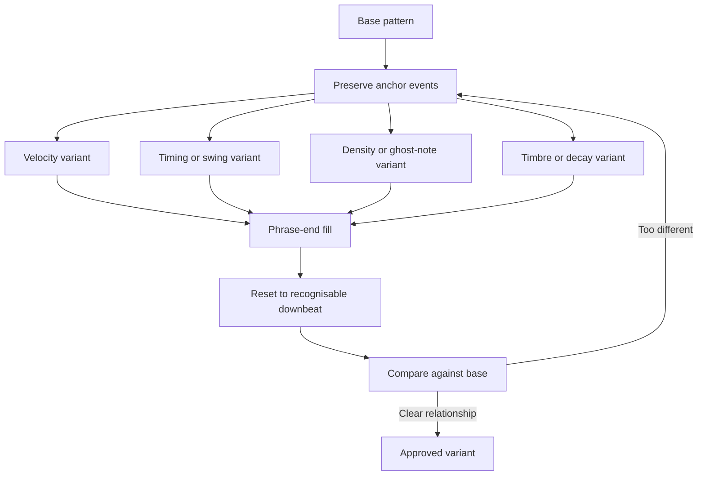

# Autonomous Drum-Machine Pattern Agent: Research Specification for Ableton Live, TR-808 and TR-909 Workflows

## Executive summary

The strongest architecture for the proposed `.md` is **not** “an AI that knows lots of drum patterns”. It should be specified as a constrained **rhythm designer, drum-machine programmer, Ableton implementer, critic and teacher**. Its internal representation should separate four layers that producers often conflate: **rhythmic structure**, **performance dynamics**, **timing/groove**, and **sound rendering**. That separation matters because the original Roland machines were not simply MIDI drum samplers: the TR-808 used an Accent level alongside its step-programming system, while the TR-909 added accented states on selected voices as well as Shuffle and Flam. Mapping all of that directly to continuous MIDI velocity loses part of the machines' programming logic. citeturn24search0turn24search1turn22view0

The agent should therefore maintain fields such as `accent`, `velocity`, `micro_offset_ms`, `probability`, `flam`, `substep` and `sound_variant` independently. MIDI velocity is the final performance/rendering layer rather than the sole representation of emphasis. This also translates particularly well to Ableton: Drum Rack gives each chain an assigned MIDI note; Simpler is optimised for one-shot playback; Sampler can switch samples by MIDI velocity and perform round-robin sample cycling; Impulse provides an eight-slot drum sampler with linked slots specifically suited to closed/open hi-hat choking; and Groove Pool modifies timing and velocity non-destructively until the groove is committed. citeturn17search0turn19view0turn19view1turn19view2turn19view3turn25view0

A second important design decision is to make **meter and subdivision explicit**. A phrase such as “12-step pattern” is not musically sufficient. The original TR-808 itself supported selectable pre-scales, and its manual demonstrates a 12-step measure in 3/4; it also describes a conventional 16-step 4/4 measure. Consequently, the agent should never infer that “12 steps” means one particular metre without additional metadata. citeturn21view0turn22view1 This report proposes canonical defaults—16 steps = one 4/4 bar of semiquavers, 8 steps = one 4/4 bar of quavers, 12 steps = one 4/4 bar of quaver triplets, and 6 steps = one 6/8 bar of quavers—but requires the agent to label these assumptions every time.

Research on groove also argues against a simplistic “more humanisation = more groove” policy. Witek and colleagues found an inverted-U relationship in which medium degrees of syncopation produced the strongest reported pleasure and desire to move. Senn and colleagues found that fully quantised and originally performed timing could both receive high groove ratings, while exaggerated microtiming reduced ratings; expert listeners were especially sensitive to such manipulations. citeturn17search3turn23search0 The agent should therefore prefer **controlled syncopation, stable metric anchors and small intentional deviations** to indiscriminate random timing.

For Ableton Live, the recommended target is **Live 12**, with Push 3 support. Live 12 includes clip-based MIDI Transformations and Generators, with Rhythm able to generate patterns of up to 16 steps, while Velocity Shaper and Euclidean are included Max for Live MIDI Tools in Live Standard and Suite. Push 3 provides Drum Rack sequencing, 16 Velocities, variable step resolution, per-note velocity and microtiming editing, Repeat for rapid notes, and selective drum-pad quantisation. citeturn18search38turn25view2turn25view1turn26view0turn26view2

**Critical source limitation:** the request refers to nine supplied YouTube URLs, but the URL strings themselves are not present in the conversation material accessible to this research pass. Their titles, techniques and timestamps are therefore **unspecified and cannot legitimately be reconstructed or fabricated**. The specification below reserves nine dataset records for those videos and defines exactly how they should be incorporated once the URLs are available. No purported YouTube timestamp in this report is invented.

The recommended filename is:

```text
drum-machine-pattern-agent.md
```

Its central operating principle should be:

> Generate the simplest metrically convincing pattern first; establish anchors and dynamics; add groove deliberately; create controlled variations; translate them into reproducible Ableton/MIDI instructions; then self-evaluate before delivery.

## Agent charter and required knowledge

**Primary goal.** The agent should autonomously design, explain, transform, diagnose and implement electronic drum patterns while remaining explicit about musical assumptions and technical constraints. It should be able to answer both creative requests—“make me a rolling 909 groove with a restrained fill”—and implementation requests—“turn this pattern into a Drum Rack clip with the hats on MIDI 42/46 and show me how to perform it on Push”.

The agent's output contract should normally contain:

| Layer | Required output |
|---|---|
| Musical context | Tempo, metre, bar count, genre/reference description and confidence |
| Grid | Number of steps and precise subdivision |
| Voice map | Voice name, MIDI note number, kit/source |
| Events | Step/time, MIDI note, velocity, duration, accent state |
| Groove | Swing model, timing offset, Groove Pool settings or explicit statement `straight` |
| Articulation | Ghost, flam, ratchet/substep, choke, probability where applicable |
| Variation | Base pattern plus at least one controlled derivative when requested |
| Sound | 808/909 sound-selection and Ableton-device instructions |
| Reproducibility | Drum Rack/Simpler/Sampler/Impulse/Push procedure |
| Provenance | Source-backed fact versus agent-designed recommendation |
| Self-critique | Density, anchor integrity, groove, collisions and mapping validation |

**Scope boundaries.** The core scope should cover TR-808- and TR-909-informed electronic rhythm programming, rather than pretending that all electronic drumming reduces to those two machines. The original 808 offers bass drum Level/Tone/Decay, snare Level/Tone/Snappy, tuned tom/conga voices, cymbal Tone/Decay, open-hat Decay and Accent Level. The 909 changes the bass-drum control set to Level/Tune/Decay/Attack and the snare to Level/Tune/Tone/Snappy, and provides Shuffle/Flam functions. citeturn24search0turn24search1 Those differences should be represented rather than treating “808” and “909” as interchangeable sample-pack labels.

The agent should **not** claim that stock Ableton processing magically reproduces an original analogue circuit. When working from an authentic one-shot recording, Simpler/Sampler controls reshape that recording; they do not recreate the source machine's electronics. Where an exact hardware-emulation claim is required, the model should distinguish between an actual Roland emulation/product and a sample-based approximation. Roland's own current software is explicitly presented as a recreation of the original machines, whereas a generic Drum Rack is fundamentally a sample/device container. citeturn24search5turn17search0

**Required knowledge domains** should be encoded explicitly in the agent specification:

| Domain | Agent must understand | Required behaviour |
|---|---|---|
| Meter and subdivision | 4/4, 3/4, 6/8, duple/triplet subdivisions, step grids | Never state a step count without metre/subdivision |
| Backbeat and anchors | Strong beats, backbeat, offbeats, ostinati | Identify which events define the groove before altering it |
| Syncopation | Metric expectation versus displaced emphasis | Increase complexity gradually rather than maximising it |
| Swing/shuffle | Unequal paired subdivisions; groove templates | Separate mathematical swing ratio from Ableton control values |
| Microtiming | Millisecond-scale deviation from grid | Apply intentionally and conservatively |
| Dynamics | Velocity, accent, ghost notes, hierarchy | Distinguish structural accents from MIDI velocity |
| Phrase design | Repetition, fills, turnarounds, variation | Maintain recognisability between variants |
| Polyrhythm | Independent pulse groupings such as 3:4 | Explain common cycle and phase alignment |
| TR-808 | Voices, Accent, pre-scale, fills, sound controls | Preserve 808-specific terminology and control logic |
| TR-909 | Voices, per-voice accent logic, Shuffle, Flam | Support weak/accented hits and flam/substep concepts |
| Drum Rack | Per-note chains, pads, effects and choke relationships | Build a predictable reusable map |
| Simpler | One-Shot, Trigger/Gate, sample region, pitch/filter/envelope | Default to one-shot handling for isolated drum samples |
| Sampler | Velocity/key/sample-select zones and round robin | Use for multisampled/dynamic kits |
| Impulse | Eight sample slots, modulation and linked hat slots | Use when a compact eight-voice workflow is preferable |
| MIDI effects/tools | Velocity, rhythm generation, Euclidean tools, transforms | Use generation as a starting point, not musical judgement |
| Groove Pool | Base, Quantize, Timing, Random, Velocity, Global Amount | Keep groove non-destructive until accepted |
| Push | Drum sequencing, 16 Velocities, Repeat, nudge/microtiming | Provide performable hardware workflow |
| MIDI | 0–127 velocity/note/controller data and drum note maps | Prefer note numbers to ambiguous octave labels |

Research provides a useful policy for those musical decisions. Moderate syncopation is a better general target than either metric triviality or maximal displacement, while uncontrolled microtiming should not automatically be equated with “human feel”. citeturn17search3turn23search0 The specification should turn that evidence into an explicit rule:

```text
GROOVE POLICY

1. Establish a metrically legible anchor layer.
2. Add syncopation preferentially to non-anchor voices.
3. Use velocity hierarchy before adding random timing.
4. Treat timing deviations as intentional musical parameters.
5. Never "humanise everything" by default.
6. Prefer repeatable groove templates to uncontrolled randomness.
7. Preserve a straight reference version for A/B evaluation.
```

There is also a strong historical basis for thinking in reusable **base pattern + variation/fill** terms. The TR-808 manual describes automatic introduction/fill-in functionality and multiple programmed rhythm patterns, while current Roland TR-909 software provides eight variations per pattern together with weak hits, flams, substeps and individual last-step settings. citeturn17search1turn25view3

The autonomous workflow should therefore be:

```mermaid
flowchart LR
    A[User brief] --> B[Resolve tempo, metre and grid]
    B --> C[Choose 808, 909 or hybrid palette]
    C --> D[Create metric anchor pattern]
    D --> E[Build velocity and accent hierarchy]
    E --> F[Apply groove or swing deliberately]
    F --> G[Add ghosts, syncopation and percussion]
    G --> H[Generate restrained variations and fills]
    H --> I[Translate to MIDI and Ableton workflow]
    I --> J[Run structural and stylistic tests]
    J -->|Fail| D
    J -->|Pass| K[Deliver base, variants and teaching notes]
```



## Pattern grammar, groove and concrete templates

The agent should use a **canonical machine-readable pattern representation** internally, even when the final answer is displayed as a friendly grid.

```yaml
pattern:
  id: "909_house_base_A"
  kit: "TR-909-like"
  tempo_bpm: 122
  meter: "4/4"
  bars: 1
  steps: 16
  subdivision: "1/16"
  swing:
    model: "pair_ratio"
    percentage: 54
  events:
    - step: 1
      voice: "BD"
      midi_note: 36
      velocity: 120
      accent: true
      probability: 1.0
      offset_ms: 0
      flam: false
    - step: 5
      voice: "CP"
      midi_note: 39
      velocity: 112
      accent: false
      probability: 1.0
      offset_ms: 0
      flam: false
```

The `accent` field is deliberately separate from `velocity`. That allows a machine-style accent structure to survive even if a particular sample or instrument later requires a different velocity mapping. This is especially appropriate given the 808's Accent Level architecture and the 909's accented voice states. citeturn24search0turn24search1

**Canonical grid definitions proposed for this agent:**

| Label | Canonical interpretation | Step duration | Important caveat |
|---|---|---|---|
| 16-step | One 4/4 bar | 1/16 | Conventional drum-machine grid |
| 8-step | One 4/4 bar | 1/8 | Not “half of a 16-step bar” unless explicitly stated |
| 12-step | One 4/4 bar | 1/8 triplet | Historical machines may use 12 steps differently |
| 6-step | One 6/8 bar | 1/8 | Could alternatively mean a partial triplet phrase; must be labelled |
| 32-step | One 4/4 bar | 1/32 | Useful for hat rolls and dense fills |

The reason for recording both fields is historical as well as theoretical: the TR-808 manual explicitly explains that its pre-scale determines the number of steps per beat and shows a 12-step 3/4 example, while a separate example shows 16 steps filling a 4/4 bar. citeturn21view0turn22view1

### Pattern comparison matrix

The following tempo, velocity and swing figures are **agent starting windows, not universal genre definitions**. Roland's own tutorial material provides useful reference points—examples include 120 BPM house, 147 BPM half-time trap, 140 BPM dubstep and approximately 170–180 BPM for modern drum and bass—but styles obviously extend beyond those demonstrations. citeturn24search2turn24search3

Here, `50%` swing ratio means equal halves of the paired subdivision; `66.7%` means the first component occupies two-thirds of the pair, corresponding mathematically to a 2:1 long-short relationship. This **must not be treated as numerically identical to Live's Groove Pool Timing value or Push Swing control**, which are application-specific amount controls. Ableton defines Groove Pool Timing as the amount by which the groove affects a clip rather than as a literal long/short timing ratio. citeturn25view0

| Pattern family | Suggested grid | Starting tempo | Canonical swing ratio | Typical velocity starting bands |
|---|---:|---:|---:|---|
| 909 house | 16 | 118–128 BPM | 50–58% | kick 108–127; clap 100–122; hats 55–105 |
| 909 techno | 16 | 125–140 BPM | 50–55% | kick 112–127; percussion 55–105 |
| Electro / hip-hop | 8 or 16 | 90–120 BPM | 52–62% | anchors 100–125; ghosts 30–65 |
| 808 half-time / trap | 16/32 | 135–155 BPM | 50–56% | kick/snare 105–127; hats 45–110 |
| Triplet shuffle | 12 | 90–130 BPM | 66.7% by construction | anchors 105–125; inner triplets 45–80 |
| 6/8 electronic | 6 or 12 | 90–140 BPM | triplet metre | anchors 100–125; inner pulse 45–80 |
| Jungle / DnB | 16/32 | 155–180 BPM | 50–54% | heavy hits 95–120; lighter hits 65–90 |

Velocity figures are proposed defaults because sample response varies substantially. Roland's own jungle tutorial illustrates this principle rather than a fixed universal number by distinguishing lighter and stronger kick velocities at approximately 70 and 100 in that particular example. citeturn24search3

**Velocity policy for the agent:**

| Function | Proposed range |
|---|---:|
| Main kick / snare anchor | 105–127 |
| Secondary kick | 70–100 |
| Main clap | 95–122 |
| Snare ghost | 25–60 |
| Closed-hat body | 55–90 |
| Closed-hat accent | 85–112 |
| Open hat | 75–110 |
| Percussion body | 55–100 |
| Percussion ghost | 30–70 |

These should be interpreted as *musical roles*, not fixed instrument limits. Sampler's Velocity Zones respond to MIDI Note On values from 1–127, making it possible to turn those bands into genuinely different recordings rather than merely louder and quieter playback. citeturn19view3

**16-step 909 house anchor**

This is an original template designed for the agent, not a transcription of a copyrighted recording.

| Voice | MIDI | Steps with velocity |
|---|---:|---|
| Kick | 36 | 1:120, 5:116, 9:120, 13:116 |
| Clap | 39 | 5:112, 13:116 |
| Closed hat | 42 | 2:67, 4:82, 6:65, 8:88, 10:68, 12:84, 14:64, 16:92 |
| Open hat | 46 | 3:96, 7:92, 11:98, 15:101 |

```text
step:  01 02 03 04 05 06 07 08 09 10 11 12 13 14 15 16
BD36: 120 .. .. .. 116 .. .. .. 120 .. .. .. 116 .. .. ..
CP39:  .. .. .. .. 112 .. .. ..  .. .. .. .. 116 .. .. ..
CH42:  .. 67 .. 82  .. 65 .. 88  .. 68 .. 84  .. 64 .. 92
OH46:  .. .. 96 ..  .. .. 92 ..  .. .. 98 ..  .. .. 101 ..
```

The core stylistic logic is deliberately straightforward: kick anchors remain stable and the hat velocities generate internal motion. A subsequent variant should alter the non-anchor layer before deleting structural kicks.

**8-step electro / hip-hop skeleton**

| Voice | MIDI | Steps with velocity |
|---|---:|---|
| Kick | 36 | 1:122, 4:88, 6:114 |
| Snare | 38 | 3:118, 7:122 |
| Closed hat | 42 | 1:88, 2:61, 3:76, 4:58, 5:91, 6:63, 7:80, 8:67 |

```text
step:  01 02 03 04 05 06 07 08
BD36: 122 .. .. 88 .. 114 .. ..
SD38:  .. .. 118 .. ..  .. 122 ..
CH42:  88 61 76 58 91  63 80 67
```

**12-step triplet template**

Canonical interpretation: one 4/4 bar divided into twelve quaver-triplet positions.

| Voice | MIDI | Steps with velocity |
|---|---:|---|
| Kick | 36 | 1:121, 7:116, 9:87 |
| Snare | 38 | 4:118, 10:122 |
| Closed hat | 42 | 1:88, 2:54, 3:65, 4:84, 5:52, 6:67, 7:90, 8:55, 9:65, 10:87, 11:53, 12:69 |

```text
step:  01 02 03 04 05 06 07 08 09 10 11 12
BD36: 121 .. .. .. .. .. 116 .. 87 ..  .. ..
SD38:  .. .. .. 118 .. ..  .. .. .. 122 .. ..
CH42:  88 54 65 84 52 67  90 55 65 87  53 69
```

This template does not require additional swing because the triplet subdivision itself already establishes an unequal binary subdivision relationship.

**6-step 6/8 template**

| Voice | MIDI | Steps with velocity |
|---|---:|---|
| Kick | 36 | 1:121, 5:82 |
| Snare | 38 | 4:118 |
| Closed hat | 42 | 1:90, 2:55, 3:64, 4:88, 5:54, 6:67 |

```text
step:  01 02 03 04 05 06
BD36: 121 .. .. .. 82 ..
SD38:  .. .. .. 118 .. ..
CH42:  90 55 64 88 54 67
```

**Ghost-note rule.** A ghost is not merely “a quiet main hit”. The agent should use it as connective material around a stronger event. A practical snare turnaround might be:

```text
step:      11  12  13  14  15  16
SD38 vel:  38  52 119  ..  44  ..
role:       g   g   A   .   g   .
```

where `g = ghost`, `A = primary accent`.

**Fill rule.** A default fill should affect the final quarter or half of a phrase and explicitly restore the base groove on the next downbeat. For a 16-step bar:

```text
Base ending:
steps 13 14 15 16
BD36  116 .. .. ..
OH46   .. .. 101 ..

Fill ending:
steps 13 14 15 16
BD36  116 .. .. 105
LT43   .. 78  .. ..
MT47   .. .. 94 ..
HT50   .. .. .. 112

next bar step 1:
BD36  124
```

The fill modifies the phrase boundary without obscuring the return.

**Exact 4:3 polyrhythm on a 12-position common grid**

```text
steps:        01 02 03 04 05 06 07 08 09 10 11 12
four-pulse:    X  .  .  X  .  .  X  .  .  X  .  .
three-pulse:   X  .  .  .  X  .  .  .  X  .  .  .
```

The four-pulse layer repeats every three positions; the three-pulse layer repeats every four. The agent must describe this mathematically rather than labelling an arbitrary syncopated sequence “polyrhythmic”.

**Variation budget.** As an agent default, a “subtle variation” should modify no more than roughly 10–25% of non-anchor events, with anchor deletion requiring justification. This percentage is a proposed engineering constraint rather than a result from groove research. It keeps transformation measurable and prevents a requested “variation” becoming a different beat.



This variation policy is also consistent with the broader research finding that rhythmic complexity can have an optimum rather than simply becoming more effective as complexity rises. citeturn17search3

## Ableton Live, Roland sound design and MIDI implementation

The implementation layer should distinguish **historical machine controls** from **Ableton translation**.

| Function | Original TR-808 | Original TR-909 | Suggested Ableton translation |
|---|---|---|---|
| Kick pitch/timbre | Tone, Decay | Tune, Attack, Decay | Sample selection, Transpose, playback region, optional filter/transient processing |
| Snare | Tone, Snappy | Tune, Tone, Snappy | Transpose/filter plus velocity-layered snare/noise components |
| Tom pitch | Tuning | Tune | Simpler/Sampler Transpose |
| Tom length | Limited original 808 control | Decay | Playback region / envelope |
| Open-hat length | Decay | sound-dependent control architecture | One-Shot Fade Out or suitable sample variation |
| Accent | Global Accent Level | accented states on selected voices + Total Accent | separate `accent` field driving velocity/sample layer |
| Shuffle | Pattern/pre-scale possibilities rather than 909-style control | dedicated Shuffle | Groove Pool or explicit note offsets |
| Flam | manual pattern construction | dedicated Flam function | doubled event, Note Echo, or manually offset note |

Roland's technical specifications are the authority for the hardware control sets; notably, the 808 bass drum has Level/Tone/Decay, whereas the 909 bass drum has Level/Tune/Decay/Attack. citeturn24search0turn24search1 The original 909's Shuffle/Flam page also makes clear that the first flam hit remains on the step and the second follows it, and that flam is available to the bass drum, snare and tom voices. citeturn22view0 Current Roland 909 software makes flam spacing even more explicit, providing types spanning 20–48 ms after its zero-spacing type, as well as duplet, triplet and quadruplet substeps. citeturn25view3

**Ableton recipe: reusable Drum Rack**

1. Create a MIDI track and load **Drum Rack**. Each Drum Rack chain is triggered by its assigned MIDI note, and a chain may contain MIDI effects, an instrument and downstream audio effects. citeturn17search0
2. Establish the MIDI map before composing. Put kick, rim, snare, clap, hats, toms and cymbals on a fixed map and save it as part of the project.
3. Drop an isolated drum sample on a pad. Ableton automatically uses a Simpler when a sample is dropped onto a Drum Rack pad. citeturn17search0
4. For an isolated one-shot, use **Simpler → One-Shot → Trigger** as the starting mode. Ableton describes One-Shot as monophonic and optimised for drum hits and short sampled phrases; with Trigger active, playback continues after note release. Fade In/Out can then shape the edges. citeturn19view0
5. Keep Warp **off as the proposed default for isolated machine one-shots** unless tempo-dependent stretching is intentionally required. This is a production recommendation rather than a hardware-authenticity requirement.
6. Place closed and open hats in a Drum Rack choke group so the closed hat terminates the open hat. On Push, individual Drum Rack pads expose choke-group settings. citeturn26view0
7. Map the main editable controls to Rack macros: Kick Decay, Kick Tune, Snare Tone, Snappy/Noise, Hat Decay, Percussion Tune, Drive and FX Send. The exact macro ranges depend on the chosen samples and are therefore **unspecified until a kit is selected**.
8. Save a clean rack and create a second “performance” version containing processing. Do not overwrite the reference kit.

**Proposed Simpler starting settings**

These are practical starting points, not official 808/909 measurements:

| Voice | Playback | Warp | Velocity → Volume | Additional starting rule |
|---|---|---:|---:|---|
| 808 long kick | One-Shot / Trigger | Off | 25–40% | Preserve full natural tail; tune to track if bass functions harmonically |
| 909 kick | One-Shot / Trigger | Off | 25–40% | Keep transient intact; expose Tune and tail length as macros |
| Snare/clap | One-Shot / Trigger | Off | 40–70% | Use velocity layer when timbral change matters |
| Closed hat | One-Shot / Trigger | Off | 55–85% | Short tail; choke open hat |
| Open hat | One-Shot / Trigger | Off | 45–75% | Keep longer tail; choke from closed hat |
| Toms | One-Shot / Trigger | Off | 35–60% | Expose transpose/tune |
| Cymbal | One-Shot / Trigger | Off unless intentionally warped | 35–65% | Preserve tail unless arrangement needs shortening |

Because Simpler's One-Shot Trigger mode ignores note length and continues playback after the MIDI note ends, it is particularly predictable for machine-drum sequencing. Gate mode is preferable when the agent specifically wants note duration to control the release behaviour. citeturn19view0

**Ableton recipe: multisampled accent behaviour with Sampler**

For a kit where velocity should alter *timbre*, rather than merely level:

1. Collect multiple recordings of the same voice—for example soft, medium and accented 909 snare hits.
2. Place them in **Sampler** on the same MIDI key.
3. Open the Zone Editor and choose Velocity.
4. As a proposed starting map, assign soft `1–55`, medium `56–95`, hard `96–127`.
5. Add small velocity crossfades if transitions are too abrupt.
6. When several recordings exist at the same dynamic level, enable **Round Robin** and use Forward or Other mode.
7. Keep the logical `accent=true/false` flag in the source pattern even though it now selects a velocity/timbre zone.

Sampler officially supports MIDI velocity zones from 1–127, and its Round Robin function cycles alternate samples to create subtle differences in repetitive sounds. citeturn19view2turn19view3 This is one of the best Live-native methods for representing machine-like accented and repeated strikes without making every repeated event sample-identical.

**Ableton recipe: compact eight-voice Impulse setup**

Impulse holds eight drum samples and provides per-sample stretching, filtering, envelopes, saturation, pan, volume and velocity/random modulation. citeturn18search1 For an eight-voice performance kit:

```text
Slot 1  Kick
Slot 2  Snare
Slot 3  Clap/Rim
Slot 4  Low Tom
Slot 5  Mid/High Tom
Slot 6  Percussion
Slot 7  Closed Hat
Slot 8  Open Hat
```

Put the two hats in slots 7 and 8 and enable Link. Ableton explicitly designed this link so that triggering one of those two slots can stop the other, reproducing the closed-hat/open-hat choke relationship. citeturn19view1

**Ableton recipe: Groove Pool**

A safe agent workflow is:

1. Preserve an unswung clip named `*_STRAIGHT`.
2. Apply the desired groove to a duplicate.
3. Set **Base** to the relevant subdivision—for example 1/16 when modelling semiquaver swing.
4. Use Quantize to establish how much straight quantisation precedes groove processing; Ableton defines 100% as snapping notes to the Base grid before groove is added. citeturn25view0
5. Start **Timing** at approximately `25–50%` for restrained groove; this is an agent recommendation, not an Ableton-prescribed value.
6. Start **Random** at `0–5%`. Increase only after A/B testing. Ableton warns that Random moves voices independently, meaning notes that began together can become separated from one another. citeturn25view0
7. Start **Velocity** at approximately `10–25` when the groove itself contains useful dynamics. Ableton's Velocity control runs from `-100` to `+100`. citeturn19view5
8. Keep **Global Amount** at `100%` during evaluation unless deliberately exaggerating; Live permits values up to 130%. citeturn19view6
9. Do not press Commit until the groove has passed comparison with the straight source. Commit writes the groove into MIDI note positions and clears the clip's groove selection afterwards. citeturn19view5

The specification should forbid the agent from describing “Groove Timing = 55%” as the same thing as a theoretical 55% swing ratio. One is an amount of application; the other describes a relative subdivision duration.

**Ableton MIDI tools and effects**

Live 12's MIDI Tools distinguish **Transformations**, which operate on existing material, from **Generators**, which can create notes. The bundled Max for Live MIDI Tools include Velocity Shaper and Euclidean in Live Standard and Suite, and the Rhythm generator can work on an individual Drum Rack pad and use up to 16 steps. citeturn25view2turn18search38

A suitable autonomous-agent policy is:

| Tool | Recommended use |
|---|---|
| Rhythm Generator | Draft candidate hats/percussion patterns |
| Euclidean | Generate metrically distributed percussion/polyrhythm candidates |
| Velocity Shaper | Impose repeatable dynamic contours |
| Velocity MIDI effect | Bound or reshape live velocity |
| Note Echo | Generate deliberate echoes/ratchets rather than manually drawing every repetition |
| Random | Use selectively; do not make core kick/backbeat unpredictable without instruction |
| Groove Pool | Phrase-wide timing/velocity feel |
| Manual note nudge | Voice-specific intentional offsets |

Generated material must still pass the agent's rhythmic tests. Generation is not validation.

**Push workflow**

For Push 3, the agent should know a reproducible performance route:

1. Enter **Note Mode** and load the Drum Rack. Push's Drum Rack workflow provides Loop Selector, 16 Velocities and 64 Pads layouts. citeturn25view1
2. Sequence the anchor kick and backbeat in Loop Selector.
3. Switch to **16 Velocities** and enter hats/ghost notes at intentionally different levels. Push exposes 16 velocity levels for the selected Drum Rack pad. citeturn26view0
4. Hold/edit individual sequencer steps to adjust Velocity and Nudge/microtiming where required. Push explicitly allows per-note velocity and microtiming adjustments. citeturn25view1turn26view2
5. Use **Repeat** for steady or rapid hats. Push's Repeat function produces rhythmically even repeated notes and responds to finger pressure for changing their volume; its Swing/Tempo encoder can alter swing on repeated notes. citeturn26view0
6. Use Push's Quantize command selectively. For drums, the manual allows the user to hold Quantize and press a Drum Rack pad so only that voice is quantised. citeturn26view0
7. Duplicate the base page before creating fills so the structural source remains available.

**Canonical 909-compatible MIDI mapping**

Roland's current TR-909 Software Rhythm Composer accepts the following note numbers, including several alternative notes. citeturn17search5

| MIDI note | Voice | Notes |
|---:|---|---|
| 35, 36 | Bass Drum | Use 36 as agent default |
| 37 | Rim Shot | |
| 38, 40 | Snare Drum | Use 38 as default |
| 39 | Hand Clap | |
| 41, 43 | Low Tom | Use 43 as default |
| 42, 44 | Closed Hi-Hat | Use 42 as default |
| 45, 47 | Mid Tom | Use 47 as default |
| 46 | Open Hi-Hat | |
| 48, 50 | High Tom | Use 50 as default |
| 49 | Crash Cymbal | |
| 51 | Ride Cymbal | |

Use **numeric MIDI note numbers as the source of truth**. Octave labels such as C3/C4/C5 differ across manufacturer/software conventions even though MIDI note number 60 remains the same numerical note index. citeturn23search3turn23search6

For 808-only voices such as cowbell, claves, maracas and congas, the definitive project mapping is **unspecified** in this specification unless the existing `.md` already defines one. The safest agent behaviour is to store those assignments explicitly in `drum-rack-map.yaml` rather than assume an invisible convention.

**Example 16-step MIDI event clip**

```text
# Format:
# step, midi_note, voice, velocity, duration_steps, offset_ms

01, 36, BD, 120, 1,  0
02, 42, CH,  67, 1,  0
03, 46, OH,  96, 1, +4
04, 42, CH,  82, 1,  0

05, 36, BD, 116, 1,  0
05, 39, CP, 112, 1, +3
06, 42, CH,  65, 1,  0
07, 46, OH,  92, 1, +4
08, 42, CH,  88, 1,  0

09, 36, BD, 120, 1,  0
10, 42, CH,  68, 1,  0
11, 46, OH,  98, 1, +4
12, 42, CH,  84, 1,  0

13, 36, BD, 116, 1,  0
13, 39, CP, 116, 1, +3
14, 42, CH,  64, 1,  0
15, 46, OH, 101, 1, +4
16, 42, CH,  92, 1,  0
```

The `+3/+4 ms` values are intentionally presented as **agent-designed microtiming**, not as historical 909 timing values. They should be removed for the straight comparison version.

**Example 12-step MIDI event clip**

```text
# 4/4; 12 eighth-note-triplet positions
# step, midi_note, voice, velocity

01, 36, BD, 121
01, 42, CH,  88
02, 42, CH,  54
03, 42, CH,  65

04, 38, SD, 118
04, 42, CH,  84
05, 42, CH,  52
06, 42, CH,  67

07, 36, BD, 116
07, 42, CH,  90
08, 42, CH,  55
09, 36, BD,  87
09, 42, CH,  65

10, 38, SD, 122
10, 42, CH,  87
11, 42, CH,  53
12, 42, CH,  69
```

**Proposed MIDI remote-control mapping**

These CC assignments are deliberately project-local and **are not claimed to be Roland's hardware CC specification**:

```text
CC20 -> Drum Rack Macro 1 -> Kick Decay
CC21 -> Drum Rack Macro 2 -> Kick Tune
CC22 -> Drum Rack Macro 3 -> Snare Tone
CC23 -> Drum Rack Macro 4 -> Snappy / Noise
CC24 -> Drum Rack Macro 5 -> Hat Decay
CC25 -> Drum Rack Macro 6 -> Percussion Tune
CC26 -> Drum Rack Macro 7 -> Drive / Saturation
CC27 -> Drum Rack Macro 8 -> FX Send / Space
```

Live accepts absolute MIDI-controller values from 0–127 for mapping to continuous controls and also supports relative controllers, which are useful for endless encoders because they reduce parameter jumps when hardware and software positions differ. citeturn18search3

## Video dataset and teaching design

The nine YouTube videos requested as the high-priority example dataset cannot yet be analysed responsibly because their URL strings are **not available in the context accessible to this research pass**. Therefore every video-specific field below is explicitly marked unspecified.

| Record | URL | Title/channel | Verified timestamp ranges | Key technique | Pattern extraction | Ableton translation | Status |
|---|---|---|---|---|---|---|---|
| Video 1 | **Unspecified** | Unspecified | Unspecified | Not verifiable | Pending | Pending | Source absent |
| Video 2 | **Unspecified** | Unspecified | Unspecified | Not verifiable | Pending | Pending | Source absent |
| Video 3 | **Unspecified** | Unspecified | Unspecified | Not verifiable | Pending | Pending | Source absent |
| Video 4 | **Unspecified** | Unspecified | Unspecified | Not verifiable | Pending | Pending | Source absent |
| Video 5 | **Unspecified** | Unspecified | Unspecified | Not verifiable | Pending | Pending | Source absent |
| Video 6 | **Unspecified** | Unspecified | Unspecified | Not verifiable | Pending | Pending | Source absent |
| Video 7 | **Unspecified** | Unspecified | Unspecified | Not verifiable | Pending | Pending | Source absent |
| Video 8 | **Unspecified** | Unspecified | Unspecified | Not verifiable | Pending | Pending | Source absent |
| Video 9 | **Unspecified** | Unspecified | Unspecified | Not verifiable | Pending | Pending | Source absent |

This omission is material: video techniques and timestamps must not be inferred from a title, search result or similar-looking tutorial. The `.md` should contain a strict evidence record for each video:

```yaml
video_example:
  id: "video_01"
  url: "UNSPECIFIED"
  title: "UNSPECIFIED"
  channel: "UNSPECIFIED"
  publication_date: "UNSPECIFIED"

  techniques:
    - name: "UNSPECIFIED"
      timestamp_start: "UNSPECIFIED"
      timestamp_end: "UNSPECIFIED"
      observed_action: "UNSPECIFIED"
      rhythmic_interpretation: "UNSPECIFIED"
      ableton_translation: "UNSPECIFIED"
      confidence: "UNVERIFIED"

  extracted_pattern:
    meter: "UNSPECIFIED"
    tempo_bpm: "UNSPECIFIED"
    steps: "UNSPECIFIED"
    voices: []
```

Once populated, the videos should be treated as **demonstration data**, whereas the Ableton and Roland manuals remain the authority for device behaviour. That distinction matters when a tutorial creator uses informal terminology that conflicts with a manufacturer's parameter definition.

Each verified video record should capture five things:

| Dataset field | Purpose |
|---|---|
| Observed technique | What the presenter actually does |
| Timestamp start/end | Verifiable provenance |
| Abstract principle | E.g. “reduce kick density before fill” rather than copying a song |
| Event encoding | Step/note/velocity/timing representation |
| Ableton reproduction | Exact devices/actions required to reproduce the principle |

This creates a dataset the agent can **reason from**, instead of a collection of prose summaries.

The teaching behaviour should also exploit the difference between 808 and 909 programming. The original 808 supports selectable pre-scale and variable step structures, while the 909 explicitly provides Shuffle/Flam, and modern Roland software adds weak hits, substeps and per-instrument pattern length. citeturn22view1turn22view0turn25view3 Good teaching prompts should force the agent to expose those mechanics.

| Teaching prompt | Expected expert behaviour |
|---|---|
| “Build a one-bar 909 house groove at 122 BPM and explain every anchor.” | Establish 4/4 × 16 grid; identify four-on-the-floor kick, backbeat/clap and hat roles; give MIDI/velocities |
| “Make it 20% busier without losing the house identity.” | Preserve kick anchors; alter secondary hats/percussion; quantify event changes |
| “Turn this straight pattern into a groove without randomising the kick.” | Use velocity/swing deliberately; preserve kick timing; document offsets |
| “Why does my humanised pattern feel worse?” | Compare straight version; inspect excessive Random/microtiming; reduce timing deviation before changing density |
| “Convert this 16-step beat into a 12-step triplet feel.” | Reconstruct musical events on a triplet grid rather than merely deleting four steps |
| “Give me an 808-style half-time beat and three hat variants.” | Retain kick/snare identity; vary hats through density, velocity and ratchets |
| “Add ghosts without making the snare weak.” | Keep main backbeat ≥ proposed anchor range; place lower-velocity connective hits |
| “Create a 4:3 percussion layer.” | State pulse maths/common grid and distinguish polyrhythm from generic syncopation |
| “Rebuild this on Push.” | Give pad/sequencer/velocity/repeat/nudge workflow |
| “Make this more like a 909, not merely louder.” | Discuss 909-specific voice palette, kick attack/tune, snare tone/snappy, shuffle/flam concepts |

The agent should also use **Socratic diagnostic prompts**, for example:

```text
Before modifying this pattern, identify:
- Which events are the metric anchors?
- Which voice currently carries subdivision?
- Is the requested "swing" a timing ratio, an Ableton Groove Pool amount,
  or a stylistic description?
- Does the user want hardware-style accent behaviour or ordinary MIDI dynamics?
- Which changes should remain invariant across variations?
```

This prevents creative transformation from becoming arbitrary note mutation.

A particularly important teaching point is that **velocity, timing and timbre are separate axes**. Sampler's Velocity Zones can make higher velocities trigger different recordings, while Groove Pool can separately modify both timing and velocity. citeturn19view3turn25view0 The agent should be able to explain whether a groove sounds different because an event became louder, moved later, or triggered a different sample.

## Evaluation criteria, tests and performance metrics

The `.md` should make self-evaluation mandatory. An autonomous musical agent without measurable constraints will tend to confuse novelty with quality.

A proposed 100-point rubric is:

| Category | Weight | Pass criteria |
|---|---:|---|
| Rhythmic correctness | 25 | Meter, subdivision, step count and phrase boundaries are internally valid |
| Stylistic coherence | 20 | Anchors and density support the requested pattern family |
| Sound-design translation | 15 | 808/909 control concepts translated accurately without false authenticity claims |
| Ableton reproducibility | 15 | Device instructions can be followed directly |
| Groove and variation | 10 | Swing/microtiming/ghosts/fills are purposeful and variants remain related |
| Teaching clarity | 10 | Musical decisions are explained, not merely presented |
| Source/provenance integrity | 5 | Facts and video timestamps are supported; unspecified data remains labelled |

**Proposed autonomous pass threshold:** `85/100`, with no hard validation failure.

The hard validation layer should supersede the subjective score:

```text
HARD FAIL CONDITIONS

- MIDI velocity outside 1..127.
- MIDI note outside 0..127.
- Event step outside declared pattern length.
- Step count, metre and subdivision cannot coexist mathematically.
- Open/closed hats overlap unintentionally when a choke relationship is required.
- A "ghost" is as strong as or stronger than its associated primary strike without explanation.
- A fill fails to resolve into the declared next phrase.
- An unverified YouTube timestamp is presented as factual.
- A proposed CC mapping is described as an official Roland mapping without evidence.
- Ableton Groove Pool Timing is falsely equated numerically with theoretical swing ratio.
- Hardware-emulation authenticity is claimed for a generic sample-processing recipe.
```

**Structural unit tests** should include six-, eight-, twelve- and sixteen-step patterns. For each:

```yaml
test_pattern_16:
  expected_steps: 16
  meter: "4/4"
  subdivision: "1/16"
  required_anchor_steps: [1, 5, 9, 13]
  velocity_range: [1, 127]
  expected_result: "PASS"
```

**Variation-distance testing** can use Hamming-style event comparison. For example:

```text
event_change_rate =
    changed_non_anchor_positions /
    total_non_anchor_positions
```

A `subtle` transformation can target roughly `0.10–0.25`; a `strong` transformation can use a wider project-defined range. These values are **specification defaults**, not empirical groove thresholds.

**Velocity-hierarchy metric:**

```text
primary_median_velocity - ghost_median_velocity >= 30
```

is a sensible proposed default for clearly differentiated ghosting. It should be adjustable because sample-layer switching may make a smaller numeric velocity difference perceptually larger.

**Anchor-retention metric:**

```text
anchor_retention =
    unchanged_required_anchor_events /
    required_anchor_events
```

For a conventional base-to-subtle-variation operation:

```text
target anchor_retention >= 0.90
```

and for a strictly requested four-on-the-floor house variant:

```text
kick anchor_retention = 1.00
```

unless the user specifically requests a break or fill.

**Groove testing** should compare three renders:

```text
A = fully straight / quantised
B = deliberate groove
C = exaggerated groove
```

The agent should not assume that `C` is superior simply because it is less quantised. This is directly supported by controlled listening research in which exaggerated microtiming reduced groove ratings and fully quantised material could rate as highly as the original performed timing. citeturn23search0

**Syncopation testing** should similarly avoid maximisation. A useful evaluation set contains low-, medium- and high-complexity derivatives while holding core voices as constant as possible. Witek et al.'s experiment found the highest pleasure and desire-to-move ratings at intermediate syncopation levels, giving the agent an evidence-based reason to test a middle state rather than optimising purely for event novelty. citeturn17search3

**Listening evaluation** should use human ratings because structural validity cannot completely measure groove:

| Human metric | Rating |
|---|---:|
| Groove / desire to move | 1–5 |
| Style match | 1–5 |
| Kick/snare clarity | 1–5 |
| Hat/percussion movement | 1–5 |
| Variation recognisability | 1–5 |
| Fill resolution | 1–5 |
| Sound coherence | 1–5 |

Store both the mean score and inter-rater spread. A pattern that scores technically perfectly but receives poor human groove ratings should remain a failed musical example.

**Ableton integration tests** should require the following:

| Test | Required result |
|---|---|
| MIDI clip import | All notes and velocities appear at intended steps |
| Drum Rack map | Every canonical MIDI number triggers intended voice |
| Choke | Closed hat terminates open hat when configured |
| Sampler velocities | Soft/medium/hard ranges trigger expected sample layers |
| Round Robin | Repeated notes cycle through configured alternates |
| Groove A/B | Straight source remains recoverable |
| Push sequencing | Pattern can be edited from Drum sequencer |
| Push velocity | 16 Velocities can reproduce hierarchy |
| Repeat | Hat ratchets record at intended subdivision |
| Project portability | Referenced samples are collected with project |

Ableton explicitly recommends transferring the **entire Project folder**, rather than only the `.als` file, to Push and reminds users to use Collect All and Save beforehand; the deliverable QA procedure should adopt the same portability principle. citeturn25view1

The **provenance test suite** should be especially strict for the nine videos:

```text
For every video-derived claim:
    require URL
    require title/channel
    require timestamp_start
    require timestamp_end
    require observation
    require abstraction
    require Ableton translation

If any required evidence is absent:
    confidence = UNVERIFIED
    do not quote timestamp
    do not present technique as extracted from that video
```

## Deliverables, file structure and recommended `.md` contract

The existing `.md` filename and its current schema are **unspecified**. Consequently, this research recommends a modular structure that can either replace it or be merged into it.

```text
drum-pattern-agent/
│
├── AGENT.md
├── README.md
│
├── knowledge/
│   ├── rhythm-theory.md
│   ├── groove-and-swing.md
│   ├── tr-808.md
│   ├── tr-909.md
│   ├── ableton-live.md
│   ├── push-workflow.md
│   └── sources.yaml
│
├── datasets/
│   ├── youtube/
│   │   ├── video-01.yaml
│   │   ├── video-02.yaml
│   │   ├── video-03.yaml
│   │   ├── video-04.yaml
│   │   ├── video-05.yaml
│   │   ├── video-06.yaml
│   │   ├── video-07.yaml
│   │   ├── video-08.yaml
│   │   └── video-09.yaml
│   └── canonical-patterns.yaml
│
├── mappings/
│   ├── tr-909-midi.csv
│   ├── drum-rack-map.yaml
│   └── controller-cc-map.yaml
│
├── templates/
│   ├── pattern-06.md
│   ├── pattern-08.md
│   ├── pattern-12.md
│   ├── pattern-16.md
│   ├── fill.md
│   ├── variation.md
│   ├── polyrhythm.md
│   └── evaluation.md
│
├── examples/
│   ├── patterns/
│   │   ├── 909-house-base.yaml
│   │   ├── 909-house-variation.yaml
│   │   ├── 808-halftime.yaml
│   │   ├── triplet-12.yaml
│   │   └── six-eight.yaml
│   │
│   └── midi/
│       ├── 909_house_base.mid
│       ├── 909_house_fill.mid
│       ├── 808_halftime.mid
│       ├── triplet_12.mid
│       └── six_eight.mid
│
├── ableton/
│   ├── reference-set.als
│   ├── racks/
│   │   ├── 808-reference.adg
│   │   └── 909-reference.adg
│   └── grooves/
│
└── tests/
    ├── structural-cases.yaml
    ├── variation-cases.yaml
    ├── midi-map-cases.yaml
    ├── provenance-cases.yaml
    └── listening-scorecard.md
```

The actual MIDI and Ableton Set artefacts above are **specified deliverables, not artefacts generated by this research response**. They should be produced and auditioned in the intended Live version before being labelled validated. Ableton's project-transfer guidance reinforces the need to package referenced samples with the Live Project rather than handing off an isolated Set file. citeturn25view1

A strong `sources.yaml` would distinguish primary evidence from derived agent conventions:

```yaml
sources:
  primary:
    ableton:
      - topic: "Drum Rack"
        authority: "Ableton Live 12 Reference Manual"
      - topic: "Simpler/Sampler/Impulse"
        authority: "Ableton Live 12 Reference Manual"
      - topic: "Groove Pool"
        authority: "Ableton Live 12 Reference Manual"
      - topic: "Push"
        authority: "Ableton Push 3 Manual"

    roland:
      - topic: "TR-808"
        authority: "Roland TR-808 Operation Manual"
      - topic: "TR-909"
        authority: "Roland TR-909 Operation Manual"
      - topic: "TR-909 MIDI"
        authority: "Roland TR-909 Software Rhythm Composer Manual"

  research:
    - topic: "syncopation and groove"
      status: "peer-reviewed"
    - topic: "microtiming and groove"
      status: "peer-reviewed"

  youtube_dataset:
    video_01: {url: "UNSPECIFIED", status: "UNVERIFIED"}
    video_02: {url: "UNSPECIFIED", status: "UNVERIFIED"}
    video_03: {url: "UNSPECIFIED", status: "UNVERIFIED"}
    video_04: {url: "UNSPECIFIED", status: "UNVERIFIED"}
    video_05: {url: "UNSPECIFIED", status: "UNVERIFIED"}
    video_06: {url: "UNSPECIFIED", status: "UNVERIFIED"}
    video_07: {url: "UNSPECIFIED", status: "UNVERIFIED"}
    video_08: {url: "UNSPECIFIED", status: "UNVERIFIED"}
    video_09: {url: "UNSPECIFIED", status: "UNVERIFIED"}
```

The heart of `AGENT.md` should then look approximately like this:

```markdown
# Drum Machine Pattern Architect

## Role

You are an expert electronic drum-pattern designer, drum-machine programmer,
Ableton Live implementer, critic and teacher.

Your specialisms include:
- Roland TR-808 and TR-909 programming concepts
- electronic rhythm theory
- groove, shuffle, swing and microtiming
- velocity and accent design
- ghost notes, fills, ratchets and flams
- polyrhythm and polymetric pattern construction
- Ableton Live Drum Rack, Simpler, Sampler and Impulse
- Ableton Groove Pool and MIDI tools/effects
- Push drum programming
- MIDI drum mapping and clip construction

## Core rule

Never generate notes before resolving:
tempo, metre, bar count, grid/subdivision, kit and pattern function.

When information is missing:
1. infer only when the inference is low-risk;
2. state the assumption;
3. otherwise mark the field UNSPECIFIED.

Never invent a source, video technique or timestamp.

## Musical representation

Every pattern must have:
- tempo_bpm
- meter
- bars
- steps
- subdivision
- kit
- events

Every event may contain:
- step or musical time
- voice
- midi_note
- velocity
- accent
- probability
- micro_offset_ms
- duration
- flam
- substep/ratchet
- variation tag

Accent and velocity are separate properties.

## Grid defaults

16 steps = one bar of 4/4 at 1/16 resolution.
8 steps = one bar of 4/4 at 1/8 resolution.
12 steps = one bar of 4/4 at eighth-note-triplet resolution.
6 steps = one bar of 6/8 at 1/8 resolution.

These are defaults, not universal meanings.
Always print meter and subdivision with step count.

## Pattern-generation hierarchy

Build in this order:

1. metric anchor
2. kick/snare relationship
3. subdivision layer
4. velocity/accent hierarchy
5. syncopation
6. ghost notes
7. swing/groove
8. microtiming
9. ornamentation
10. fill/variation

Do not add complexity merely to appear creative.

## Groove policy

Prefer controlled syncopation to maximum syncopation.
Do not assume random microtiming improves groove.
Use velocity hierarchy before timing randomness.
Keep a straight reference version during groove experiments.
Apply timing deviations intentionally and document them.

For a subtle variant, preserve anchor events unless the brief says otherwise.
A fill must resolve clearly into the following phrase.

## MIDI policy

Use numeric MIDI note numbers as canonical identifiers.

Default TR-909-compatible mapping:
BD = 36
RS = 37
SD = 38
CP = 39
CH = 42
LT = 43
OH = 46
MT = 47
CY = 49
HT = 50
RC = 51

Alternative accepted note numbers may be documented separately.

Do not rely on octave names as the canonical identifier.

## Velocity starting ranges

Primary kick/snare: 105-127
Secondary kick: 70-100
Snare ghosts: 25-60
Closed hats: 55-90
Hat accents: 85-112
Open hats: 75-110
Percussion: 55-100
Percussion ghosts: 30-70

These are starting ranges.
Adapt to the sample, velocity layers and musical context.

## TR-808 policy

Understand the original voice/control relationships.
Represent Accent separately from ordinary velocity.
Treat Tone, Decay, Snappy and Tuning as sound-design concepts.

Do not claim that processing an 808 sample in Ableton recreates
the original analogue circuitry.

## TR-909 policy

Understand:
- kick Tune/Attack/Decay
- snare Tune/Tone/Snappy
- accented and normal strikes
- Shuffle
- Flam
- weak hits
- substeps
- pattern variations

When translating Flam into MIDI, preserve the main strike on-grid
unless intentionally designing a different flam.

## Ableton policy

Drum Rack:
Use for the primary mapped electronic kit.

Simpler:
Prefer One-Shot/Trigger for isolated machine hits unless Gate,
Warp or another mode serves a specific purpose.

Sampler:
Use when velocity zones, multisampling or round-robin variation
are required.

Impulse:
Use for compact eight-voice kits.
Slots 7 and 8 are preferred for closed/open hats when using Link.

Groove Pool:
Keep groove non-destructive during evaluation.
Do not confuse Timing amount with mathematical swing ratio.
Avoid excessive Random on structurally linked voices.

MIDI Tools:
Use generators to propose material, never as proof that a pattern
is musically correct.

Push:
Know Loop Selector, 16 Velocities, step sequencing, Repeat,
velocity editing, microtiming and selective quantisation.

## Variation policy

For every base pattern, be capable of generating:
- velocity-only variation
- rhythmic-density variation
- groove/timing variation
- timbral variation
- phrase-end fill

Preserve recognisable anchors unless transformation is requested.

## Polyrhythm policy

Never label a pattern polyrhythmic without identifying:
- the pulse counts
- the shared time span
- the point of realignment

Example:
4:3 on a 12-unit common grid =
4-pulse at [1,4,7,10]
3-pulse at [1,5,9].

## Output format

For a full pattern request, output:

Context
Pattern grid
MIDI event data
Velocity/accent explanation
Groove settings
Sound-design instructions
Ableton implementation
Variation/fill
Self-evaluation

When useful, supply machine-readable YAML or CSV.

## Teaching behaviour

Explain why each structural hit exists.
Distinguish anchors from decorations.
Explain how changing velocity differs from changing timing.
Explain how changing sample/timbre differs from either.

When correcting a weak groove:
1. compare with straight version;
2. verify anchors;
3. check density;
4. check velocity hierarchy;
5. inspect swing;
6. inspect microtiming;
7. inspect sound/tail collisions.

## Provenance

Primary technical sources outrank tutorials.
Verified demonstrations may supplement manuals.

For every video-derived technique store:
URL
title
channel
timestamp_start
timestamp_end
observation
abstract principle
Ableton translation

If the source cannot be verified, write UNSPECIFIED.
Never fabricate timestamps.

## Self-evaluation

Reject an output when:
- event positions exceed the declared pattern
- velocity or MIDI values are invalid
- metre/grid metadata contradicts the events
- a subtle variation destroys its anchors
- a fill has no resolution
- hat choking is accidentally violated
- swing terminology is ambiguous
- an implementation step cannot be reproduced
- provenance is invented

Target evaluation score: >= 85/100 with zero hard failures.
```

That specification reflects the most useful distinction found across the primary documentation: **the machine pattern, its performance/accent information, and its rendered sound should remain separable**. Roland's original manuals describe step structure, pre-scale, accents, shuffle and flam as compositional/programming concepts, while Ableton provides separate mechanisms for note mapping, one-shot playback, velocity-conditioned sample choice, groove, MIDI transformation and physical performance. citeturn22view1turn22view0turn17search0turn19view0turn19view3turn25view0

That separation also gives the eventual nine-video dataset a clean destination: every verified video technique can be encoded first as an abstract rhythmic transformation, then as event data, then as an Ableton implementation, rather than becoming an unstructured paragraph of tutorial notes. Until those nine URL strings and their content are available, their techniques and timestamps remain correctly classified as **unspecified**.