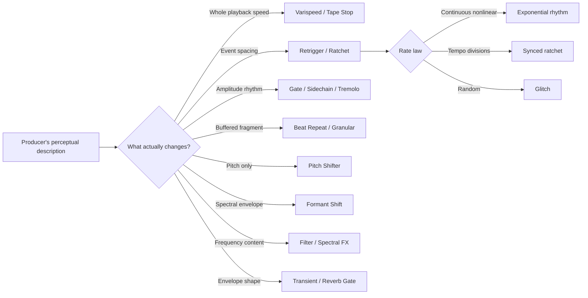
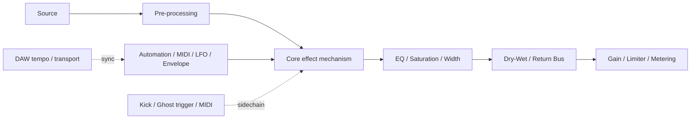
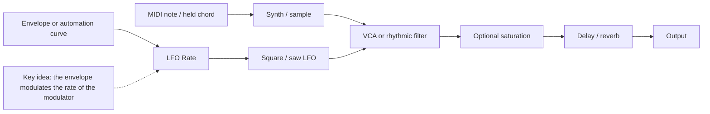
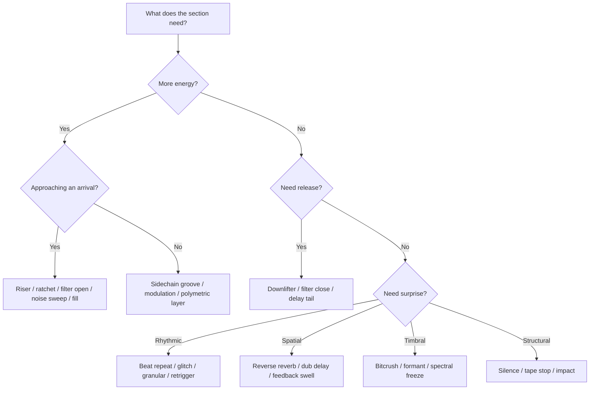

# Expert EDM Effects and Advanced Rhythm Codex for a Production Agent

## Executive summary

An expert electronic-music production agent should not treat effects as a list of plug-in names. It should reason from **perception → mechanism → signal flow → control strategy → musical function**. The same perceptual result can often be built with audio editing, MIDI, modulation, buffering, spectral processing or dynamics, and conversely two effects that sound superficially similar can work by completely different mechanisms. Ableton, Apple, Image-Line and iZotope documentation all reinforce this modular view: contemporary DAWs expose repeat buffers, variable-rate effects, sidechains, LFOs, gates, pitch processors and spectral tools as separately controllable building blocks. citeturn16search0turn7search0turn14search5turn16search1

The sound originally described in this conversation as an **“electronic roulette wheel slowing down”** is best represented in the codex as **exponential ratcheting / LFO-rate modulation / retrigger deceleration**. The discriminating feature is that the **rate of repeated events changes**. In a tape stop, by contrast, the *playback speed of the audio itself* decreases, so duration and pitch fall together. Modern ratchet-lead tutorials explicitly build the first family with LFOs, envelopes, MIDI note repeats, macros and automation; ODESZA-style tutorials specifically automate the rate of an LFO controlling a synth parameter. citeturn17search4turn17search3turn16search1

The agent should therefore learn this diagnostic distinction:

| Heard cue | Most likely mechanism | Key diagnostic |
|---|---|---|
| `brrrrrr → br-br → br… br…` | Retrigger deceleration / exponential rhythm | **Intervals between events increase** |
| `br… br… → br-br-br → brrrrr` | Ratchet acceleration | **Intervals between events shrink** |
| Whole mix goes `wheeeooow ↓` | Tape stop / varispeed brake | **Pitch and time of the entire signal move together** |
| Steady sound becomes `ta-ta-ta-ta` | Tempo-synchronised gate | Rate is normally fixed to a rhythmic division |
| Tiny audio fragment becomes a buzz | Beat repeat / granular stutter | Audio is being **buffered and replayed** |
| Wash appears *before* a vocal/hit | Reverse reverb | Wet envelope rises into the dry transient |

This codex uses 26 effect families. That is intentional: some are related but should remain separate because their **control models differ**. In particular, beat repeat, granular stutter, glitch editing, ratcheting and retrigger deceleration should not be collapsed into a single “stutter” label.

For rhythm theory, the agent should use the current research distinction that a **polyrhythm** superimposes non-harmonically related pulse streams sharing a common cycle, whereas a **polymeter** maintains two or more metric cycles over the same underlying beat. A 2026 peer-reviewed scoping review recommends essentially this terminology, while recent *Music Theory Online* scholarship emphasises that timbre, register and perceptual stream segregation affect whether simultaneous metric layers are actually heard independently. citeturn19search8turn19search1

A particularly important training rule is that electronic-production literature sometimes calls unequal-length loops “polyrhythmic”. Ableton's *Making Music* does this when describing differently sized loops that eventually realign; under the stricter contemporary distinction, many such examples are better classified as **polymetric or asynchronous loops**. An expert agent should understand both vocabularies rather than blindly correcting the producer. citeturn19search2turn19search8

The full machine-readable effect database accompanying this report contains all 26 effects, construction steps, parameter priors, plug-in examples and timestamped listening references:

**[Download the complete EDM effects codex JSON](sandbox:/mnt/data/edm_effects_codex.json)**

The ranges in this report should be interpreted as **useful production starting points**, not immutable standards. Where a manufacturer specifies an exact operating range, that distinction is stated explicitly.

## Agent ontology and operating rules

The most useful internal representation is not “effect = plug-in”. It is:

> **Effect = perceptual transformation + mechanism + control law + time scale + musical purpose**

For example, “make it slow down like a roulette wheel” should cause the agent to test several hypotheses rather than immediately recommend Tape Stop.



**The first diagnostic question is “what variable appears to be moving?”** Pitch, playback speed, repetition rate, amplitude, filter cutoff, feedback, grain position and spectral content are different variables even when they all produce a perceived “transition”. Logic's Remix FX, for example, separately exposes tape stop, reverse, filtering, gating, downsampling and repeating because those operations genuinely use different processing models. citeturn7search0turn7search4

**The second question is “is the control continuous, stepped or probabilistic?”** A roulette-like slowdown normally benefits from a continuous rate curve. Beat Repeat instead uses rhythmically defined capture intervals and grids; Ableton specifies capture intervals from 1/32 through four bars, plus gate duration, probability, grid size and pitch-decay behaviour. iZotope's Stutter Edit 2 goes further by allowing rate ranges and editable time-varying curves so repeats can explicitly speed up, slow down or do both within a gesture. citeturn16search0turn16search1

**The third question is “is the source itself being replayed?”** Beat repeat and granular processing operate on captured audio. A conventional LFO gate may instead repeatedly open and close a VCA/filter around a continuously running synth. Grain-based processing slices sound into short grains whose position, timing and pitch can be manipulated independently; Ableton and Eventide both expose grain-related pitch/time manipulation for this purpose. citeturn16search21turn16search32turn16search34

**The fourth question is “is tempo synchronisation musically essential?”** Free-rate Hz modulation produces continuous physical-feeling acceleration and deceleration; beat-synchronised rate changes preserve explicit relationships to the grid. An advanced implementation can deliberately move between them: begin at 1/8, accelerate through 1/16 and 1/32, then uncouple into free Hz so the repetitions merge into a buzz.

**The fifth question is “what is the effect doing to energy?”** The agent should tag every gesture with an energy function:

| Energy function | Typical devices |
|---|---|
| Accumulate tension | riser, ratchet acceleration, noise sweep, filter opening, feedback swell |
| Signal imminent arrival | reverse cymbal, reverse reverb, fill, fast retrigger |
| Establish arrival | impact, sub hit, transient emphasis |
| Release tension | downlifter, filter closing, delay tail |
| Create forward pulse | sidechain, gating, polyrhythm |
| Destabilise | glitch, granular stutter, bitcrush, spectral freeze |
| Create space | dub delay, reverb, transient sustain reduction |
| Withhold energy | filtering, silence, tape stop, thinning arrangement |

That framing prevents an agent from offering effects merely because they are fashionable.

**Evidence discipline is also part of expertise.** An agent should distinguish three types of assertion:

1. **Documented production fact** — a producer, engineer, manual or credible technical source says an effect was used.
2. **Auditory identification** — the result strongly resembles a known process, but the exact session method is undocumented.
3. **Reconstruction recipe** — one technically plausible way of obtaining the sound, not necessarily the original method.

This distinction matters because it is usually impossible to identify a specific plug-in from a mastered record alone. Sound On Sound, for example, documents reverse-reverb processing on *Closer* and strong sidechain ducking in *One More Time*, giving unusually high confidence for those examples. citeturn15search17turn15search0

The following generic architecture should be part of the agent's mental model:



It should also know when **parallel architecture** is preferable. Reverb, dub delay and extreme distortion often work better on returns; sidechain compression generally belongs on the signal being ducked; tape stop may be easiest on a dedicated transition bus; granular/glitch processing often benefits from a parallel chain so the source remains recognisable. Ableton's rack architecture explicitly supports serial and parallel device chains for precisely this type of compound processing. citeturn14search5

## Effects codex

**Reading convention.** Parameter values below are training priors: sensible ranges from which the agent should begin, then adjust by ear and tempo. “D” means a production source specifically supports the example or technique; “A” means an auditory reference useful for teaching the sound, **not a claim about the exact plug-in or session method**. Timestamp windows are approximate and can move between radio, extended, remastered and video versions.

| ID / effect | Perceptual cue and architecture | Useful starting parameters | Typical tools | Listening references |
|---|---|---|---|---|
| **Tape stop** — tape brake, vinyl brake, spin-down | Entire source progressively slows and drops in pitch. `source → variable-rate/resampling playback → optional LPF/saturation`. Logic explicitly includes Tape Stop in Remix FX; modern tutorials describe it as the digital recreation of slowing physical tape. citeturn7search0turn17search1 | Stop 0.25–2 s; exponential/S curve; linked pitch/time; usually 100% wet for a clean transition. | Logic Remix FX; FL Gross Beat; Kilohearts Tape Stop; TimeShaper. | **A:** Avicii – *Levels*, transition passages. **A:** 3LAU – *How You Love Me*, transition passages. These have also been used as tape-stop production-study examples. |
| **Exponential ratchet** — exponential rhythm, ratchet lead, roulette stutter | Repetition frequency accelerates/decelerates non-linearly. `source → VCA/filter/retrigger → rate controlled by envelope/macro`. ODESZA-style tutorials automate the rate of an LFO controlling filter/noise, while Sonic Academy demonstrates LFO, modulation-envelope, MIDI and note-repeat implementations. citeturn17search3turn17search4 | About 2–40 Hz free-rate or 1/4→1/64 synced; 10–70% gate duty; 0.5–4-bar rate ramp. | Serum/Vital LFOs; Bitwig modulators; Stutter Edit 2; Ableton LFO/Auto Pan. | **A/user anchor:** Grum & Amba Shepherd – *Slow Motion*, prominent transition gestures. citeturn8search36 **D-style reconstruction:** ODESZA – *The Last Goodbye*, ~1:35–1:50. citeturn8youtube48turn17search3 |
| **Retrigger deceleration** — slowing repeat, repeat ramp-down | A fragment/note is repeatedly retriggered while the *gap between triggers expands*. `buffer/note → repeat clock → increasing period → short envelope`. | Slice 10–100 ms; interval ~20→500 ms; 4–16 repetitions; optional 0→−12 st pitch decay. | Stutter Edit 2; Beat Repeat; Bitwig Note Repeats; Ableton MIDI Retrigger. | **A:** ODESZA – *The Last Goodbye*, ~1:35–1:50. **A:** BT – *Somnambulist*, recurring micro-edit gestures, especially first ~45 s. citeturn18youtube33 |
| **Reverse reverb** — pre-verb, backwards reverb | Reverb rises *before* the source. Traditional construction is `reverse source → reverb → print → reverse print → align before dry`. Sound On Sound describes exactly this historical tape workflow. citeturn15search3turn15search6 | Reverb 1–8 s; wet print 100%; 0–50 ms predelay before rendering; HPF around 100–300 Hz where necessary. | Any DAW reverse command + reverb; Logic Space Designer; Hybrid Reverb; Valhalla. | **A/production-education:** deadmau5 – *Ghosts ’n’ Stuff*, lead/intro arrivals. citeturn8search0 **D:** The Chainsmokers – *Closer*, three lead-ins into Drew Taggart's hook; the mix engineer described making them from a reversed vocal/reverb process. citeturn15search17 |
| **Riser** — uplifter, build-up FX | Pitch, brightness, loudness and/or density rise to increase expectation. `osc/noise/sample → pitch/filter automation → spatial/distortion growth`. | +7→+24 st; 2–16 bars; cutoff perhaps ~200 Hz→10–18 kHz; increasing reverb/send toward destination. | Any synth; Serum; Vital; Operator; Alchemy. | **A:** Avicii – *Levels*, build sections. **A:** deadmau5 – *Ghosts ’n’ Stuff*, major builds. |
| **Downlifter** — downer, falling sweep | Falling counterpart of a riser, usually releasing energy after an arrival. | −7→−24 st; 0.5–8 bars; 0.5–8 s amplitude/tail decay. | Sampler automation; Shifter; Pitch Shifter; synth envelopes. | **A:** Avicii – *Levels*, post-arrival transitions. **A:** deadmau5 – *Ghosts ’n’ Stuff*, post-impact tails. |
| **Impact** — hit, drop hit | Very short structural punctuation, commonly layered as transient + body/noise + low-frequency boom. | Sub ~40–80 Hz; low tail 0.3–1.5 s; broadband tail 0.5–5 s; layer offsets ideally small enough not to flam. | Drum Rack; Quick Sampler; Kontakt; any sampler. | **A:** Avicii – *Levels*, main drop entries. **A:** deadmau5 – *Ghosts ’n’ Stuff*, structural arrivals. |
| **Fill** — turnaround, pre-drop fill | Temporary increase/change in rhythmic information at a phrase boundary. MIDI Retrigger tools explicitly support repeated notes with velocity and time shaping. citeturn19search3 | ½–2 bars; 1/8→1/32 subdivisions; velocity contour rather than flat maximum; optional pitch 0→+12 st. | Piano roll; MIDI Retrigger; Beat Repeat; Step Sequencer; Gross Beat. | **A:** BT – *Somnambulist*, recurring micro-fills. citeturn18youtube33 **A:** Squarepusher – *My Red Hot Car*, 0:00–0:45 and recurring programmed breaks. citeturn18youtube34 |
| **Gated reverb** — gated ambience | Large reverb is terminated by a gate: `dry hit → reverb/room compression → gate → return`. It produces apparent size without filling the entire inter-hit space. citeturn15search3 | Reverb ~0.8–3 s before gating; gate attack 0–5 ms; hold ~80–400 ms; release ~20–150 ms. | Any reverb + gate; Space Designer + Noise Gate; Hybrid Reverb + Gate. | **D:** Peter Gabriel – *Intruder*, opening drums; the technique predates the famous Collins use. **D:** Phil Collins – *In the Air Tonight*, drum entrance at about **3:40**. citeturn17search2 |
| **Dub delay** — echo throw, feedback echo | A send-based delay becomes performative: individual sounds are thrown into filtered/saturated feedback rather than continuously washed. Classic dub practice centred on real-time manipulation of sends, echoes, reverb and filtering. citeturn3search3turn3search13 | 1/8, dotted 1/8, 1/4 useful starts; 35–75% feedback; temporary 80–95% swells; HPF ~150–500 Hz, LPF ~3–8 kHz. | Ableton Echo; Logic Tape Delay; EchoBoy; tape-delay hardware/emulations. | **D/historical reference:** Augustus Pablo & King Tubby – *King Tubby Meets Rockers Uptown*, throughout. citeturn3search13 **D-style reference:** King Tubby – *Everybody Needs Dub*, opening minute/throughout. citeturn3search5 |
| **Sidechain ducking** — pumping compression | External trigger controls gain reduction: `music → compressor/VCA`, `kick/ghost → detector`. Ableton's compressor supports external sidechain input and filtering. citeturn10view6 | Attack 0–10 ms for strong clearing; release ~80–300 ms at common EDM tempi; ratio 4:1→∞; roughly 2–10 dB reduction depending on effect. | Ableton Compressor; Logic Compressor; Fruity Limiter; LFO Tool; VolumeShaper. | **D:** Daft Punk – *One More Time*, audible throughout; Sound On Sound specifically calls it a well-known ducking example. citeturn15search0turn13youtube42 **A:** Avicii – *Levels*, drop/groove sections. |
| **Granular stutter** — grain repeat, grain glitch | Short grains are captured and repeated with independent position/pitch/time controls. Randomising grain pitch and timing can detach the result dramatically from the source. citeturn10view1turn16search34 | Grain ~5–80 ms; 10–100 grains/s; position spray 0–100 ms+; pitch ±12–24 st; moderate feedback first. | Grain Delay; Granulator; Eventide granular algorithms; Portal; EFX FRAGMENTS. | **A:** BT – *Somnambulist*, recurring micro-edits. **A:** Squarepusher – *My Red Hot Car*, first 45 s and throughout. These are aesthetic references, not claims that a specific grain plug-in was used. citeturn18youtube33turn18youtube34 |
| **Beat repeat** — loop roll, buffer repeat | Recent input is captured and looped on a rhythmic grid. Ableton Beat Repeat provides capture Interval, Offset, Chance, Gate, Grid, Variation and pitch-decay controls. citeturn16search0 | Grid often 1/8→1/64; device supports wider capture intervals; gate from a very short burst to several 16ths; probability 0–100%. | Ableton Beat Repeat; Logic Remix FX Repeater; Stutter Edit 2. | **A:** BT – *Somnambulist*, recurring throughout. **A:** Squarepusher – *My Red Hot Car*, repeated micro-slices throughout. citeturn18youtube33turn18youtube34 |
| **Glitch edit** — micro-edit, digital glitch | Rhythmic discontinuity produced by repeats, reverses, mutes, pitch jumps, time edits and digital degradation. Simple stuttering can literally be created by repeatedly duplicating the same fragment. citeturn15search30 | Slice ~5–250 ms; ±12 st or more; 4–12-bit degradation; 2–24 kHz effective sample rate; moderate edit probability rather than constant chaos. | Stutter Edit 2; Beat Repeat; Redux; Remix FX; Glitchmachines. | **D/aesthetic lineage:** BT – *Somnambulist*; Stutter Edit itself was developed around BT's signature editing approach. citeturn15search39turn16search24 **A:** Squarepusher – *My Red Hot Car*. citeturn18youtube34 |
| **Pitch-shift sweep** — pitch ramp, pitch dive | Pitch moves while duration can remain fixed, unlike authentic varispeed. | ±12–24 st common; 0.25–8 bars; 20–100% wet; cents-scale movement for subtler tension. | Ableton Shifter; Logic Pitch Shifter; Eventide; Little AlterBoy. | **A:** deadmau5 – *Ghosts ’n’ Stuff*, transition/lead effects. **A:** BT – *Somnambulist*, pitch-based edits. |
| **Formant shift** — vocal-tract shift, formant bend | Spectral envelope moves so the source seems larger/smaller or darker/brighter without necessarily changing fundamental pitch. Ableton's Auto Shift now exposes pitch and formant processing as related but distinct controls. citeturn5search24 | About −12→+12 semitone-equivalent is a useful conceptual range where the processor permits it; 10–50% parallel for subtle colour, 100% for obvious design. | Auto Shift; Little AlterBoy; Logic Vocal Transformer; MAutoPitch. | **A:** SOPHIE – *Faceshopping*, processed vocal passages. **A:** Aphex Twin – *Windowlicker*, manipulated voice textures. These are timbral references, not exact processor attributions. |
| **Spectral freeze** — FFT freeze, spectral hold | Analysis captures a spectral instant and sustains it. Ableton Spectral Time combines freezing with spectral delay and can hold transient or interval material for extended periods. citeturn12search7turn5search0 | Fade 20–500 ms; 30–100% wet; manual or rhythmic retriggering; trade temporal sharpness against frequency resolution. | Ableton Spectral Time; spectral-resynthesis tools; FFT-based processors. | **D/demo:** Ableton's own Spectral Time demonstrations. citeturn12search7 **A:** Autechre – *Xylin Room*, ~0:20 onward as a spectral/glitch listening reference, not proof of spectral freeze. |
| **LFO-rate modulation** — rate ramp, nested modulation | One modulator changes an audible parameter while a second envelope/macro changes the *speed of that modulator*. This is the central architecture behind many modern ratchet leads. citeturn17search3turn17search4 | ~0.1–30+ Hz depending on device; roulette zone roughly 2–40 Hz; 1/4→1/64 for stepped sync; 30–100% modulation depth. | Serum/Vital; Ableton LFO/Auto Pan; Bitwig modulators; Logic Modulator. | **D-style reconstruction:** ODESZA – *The Last Goodbye*, ~1:35–1:50. citeturn17search3 **A/user anchor:** Grum & Amba Shepherd – *Slow Motion*. citeturn8search36 |
| **Tempo-synchronised gating** — trance gate, chopper | Sustained audio is turned on/off according to a tempo-grid pattern. Ableton Gate can take an external sidechain and use one source's rhythm to impose amplitude structure on another. citeturn11view1turn11view2 | 1/8→1/32; duty 20–70%; attack 0–10 ms; release 5–80 ms; add triplets/swing selectively. | Logic Step FX; Ableton Gate/LFO; LFO Tool; VolumeShaper; Gross Beat. | **A:** BT – *Somnambulist*, chopped passages. **A/tutorial family:** ODESZA – *The Last Goodbye*, ~1:35–1:50. |
| **Transient shaping** — envelope shaping, transient designer | Alters attack and sustain independently of absolute signal level. Logic's Enveloper can increase drum snap by boosting attack or dry a reverberant signal by attenuating its release; Apple suggests roughly 20 ms attack and 1500 ms release as an initial Enveloper setting. citeturn14search0 | Start with ±10–50% attack/sustain adjustment; attack-analysis region around 5–30 ms is often useful; always level-match. | Logic Enveloper; SPL Transient Designer; NI Transient Master; Drum Buss transient control. | **A:** Phil Collins – *In the Air Tonight*, ~3:40 onward for extreme transient/room-envelope perception. **A:** Squarepusher – *My Red Hot Car*, opening for sharp programmed transients. |
| **Bitcrush / downsample** — digital reduction, sample-rate reduction | Bit reduction creates quantisation distortion; downsampling creates aliasing. Logic's Bitcrusher exposes 1–24-bit resolution and independent downsampling, while Ableton Redux provides comparable reduction stages. citeturn14search1turn10view2 | 4–12 bits for obvious character; ~2–24 kHz effective sample-rate region for obvious downsampling; 10–100% wet; post-filter harsh alias products as needed. | Logic Bitcrusher; Redux; Decimort; Kilohearts Bitcrush. | **A:** BT – *Somnambulist*, digital micro-edit passages. **A:** Squarepusher – *My Red Hot Car*, digital artefact aesthetic. |
| **Filter sweep** — cutoff sweep, DJ filter | Bandwidth/brightness opens or closes continuously. Often the cleanest way to create transition movement because it changes spectral energy without necessarily changing rhythm. | Cutoff roughly 100 Hz→18 kHz as required; Q around 0.5–4 as a sensible initial region; 1–16 bars; optional drive. | Auto Filter; Logic AutoFilter; Love Philter; Pro-Q/Volcano. | **A:** Daft Punk – *One More Time*, filtered dance texture. **A:** deadmau5 – *Ghosts ’n’ Stuff*, intro/build transitions. |
| **Phaser / chorus modulation** — mod FX, ensemble | Chorus mixes dry sound with short modulated delays; phasers create frequency-dependent phase shifts and moving notches. Apple's documentation makes this distinction explicitly. citeturn7search9 | Chorus delay ~5–30 ms; LFO ~0.05–2 Hz; depth 10–80%; feedback 0–40%; phaser 4–12 stages as common design territory. | Chorus-Ensemble; Phaser-Flanger; Logic Chorus/Phaser; PhaseMistress. | **A:** Daft Punk – *One More Time*, animated processed textures. **A:** deadmau5 – *Ghosts ’n’ Stuff*, moving synth textures. |
| **Delay-feedback swell** — feedback throw, echo bloom | Feedback climbs towards near self-oscillation, generating increasing density/energy. Sound On Sound warns that high feedback can cause levels to rise rapidly, which is why an expert recipe includes a safety gain/limiter. citeturn15search34 | Feedback ~50–95%; time 1/8→1/2; filtered feedback path; automate send and return level as well as feedback. | Echo; Tape Delay; EchoBoy; Valhalla Delay. | **D/historical reference:** *King Tubby Meets Rockers Uptown*, throughout. citeturn3search13 **A:** BT – *Somnambulist*, transition echoes. |
| **Reverse cymbal** — cymbal suck, reverse crash | Reversed decay rises into an impact. `crash sample → reverse → trim/fade/EQ → align endpoint`. | 0.5–4 s; HPF ~100–500 Hz if needed; endpoint exactly on or just before target transient. | Any DAW reverse command; audio editor; sampler. | **A:** Avicii – *Levels*, pre-arrival transitions. **A:** deadmau5 – *Ghosts ’n’ Stuff*, transitional swells. |
| **White-noise sweep** — noise riser, filtered-noise sweep | Broadband hiss becomes motion through level and filter automation. Unlike a tonal riser it need not imply harmony. | 1–8 bars; cutoff ~200 Hz→10–18 kHz or reverse; often HPF ≥150–300 Hz; modest resonance. | Synth noise oscillator + filter; Operator; Alchemy; Serum/Vital. | **A:** Avicii – *Levels*, builds. **A:** deadmau5 – *Ghosts ’n’ Stuff*, transition passages. |

Several relationships in that table deserve to be made explicit.

**Tape stop versus pitch sweep.** A real tape stop is a **varispeed** phenomenon: decreasing transport speed stretches time and lowers pitch together. A pitch shifter is capable of lowering pitch while leaving the event's duration approximately unchanged. Logic therefore treats tape-stop and pitch-shifting functions separately. citeturn7search0turn7search3

**Beat repeat versus granular stutter.** A conventional beat repeat loops a rhythmically defined captured section. Granular processing breaks material into much shorter grains whose location, timing and pitch may become independent. At very short repeat lengths, however, the perceptual boundary blurs: Ableton explicitly notes that small Beat Repeat grids can become sonic artefacts rather than recognisable rhythmic loops. citeturn16search0

**Ratchet versus retrigger.** “Ratchet” is the broader musical idea of multiple articulations inside a span. Retrigger is a mechanism. Exponential ratcheting adds another level: **the retrigger clock itself changes speed**.

A robust roulette-wheel patch therefore looks like this:



For **deceleration**, Rate should fall. For **acceleration**, it rises. A linear parameter ramp often sounds more synthetic; a logarithmic/exponential mapping makes the perceived spacing change more dramatically near one end. iZotope's Stutter Edit 2 formalises this idea with editable parameter curves and a repeat range capable of accelerating and decelerating. citeturn16search1turn16search8

A more literal sampled-audio version is:

```text
incoming audio
     │
     ▼
[circular buffer] ── capture 20–80 ms ──► [repeat slice]
                                            │
                 automation ──► repeat interval
                                            │
                                  20 ms → 40 → 80
                                      → 160 → 320 ms
                                            │
                                     short amp envelope
                                            │
                                      optional pitch ↓
```

That is **retrigger deceleration**. It is not a tape stop unless the playback speed of each source fragment is itself changing.

## Advanced rhythmic theory

The agent's baseline terminology should follow the clearest current research distinction. The 2026 *Annals of the New York Academy of Sciences* scoping review recommends defining polyrhythm as the **superposition of two or more non-harmonically related pulses sharing a common cycle**, and polymeter as simultaneous meters that maintain their own cycle structures while sharing an underlying beat. The review synthesised 64 studies comprising 96 experiments, so it is a much stronger terminology source than casual producer usage. citeturn19search8

A practical translation is:

| Concept | What stays common? | What differs? | Simple example |
|---|---|---|---|
| **Polyrhythm** | Total cycle duration | Number/rate of pulses inside cycle | 3 evenly spaced hits against 2 over the same span |
| **Polymeter** | Underlying beat/tempo | Bar or pattern length | 3/4 loop against 4/4 loop |
| **Syncopation** | Meter remains one meter | Accents move away from expected strong beats | Offbeat clap in 4/4 |
| **Tuplet** | Metric context | Subdivision | Five equal notes in one beat |
| **Asynchronous loop** | May share approximate tempo | Cycle length/phase not necessarily commensurate | Unequal tape loops |
| **Euclidean rhythm** | Step grid | Distribution of N hits over K steps | 5 hits across 16 steps |

The distinction matters in a DAW because the implementation is different.

**A 3:2 polyrhythm.** Choose one common time span. Put two equally spaced notes across it on one instrument and three equally spaced notes across the *same* span on another. Their first attacks coincide and the patterns realign at the end of every shared cycle.

In normalized time:

```text
2-pulse layer:  X-----------X-----------
3-pulse layer:  X-------X-------X-------
cycle:           |----------------------|
```

The exact grid can be realised with tuplets, note stretching or tick-based MIDI. Andrew Huang's widely circulated tutorial demonstrates a general DAW method: create *n* evenly spaced notes for one stream and *m* for the other, then scale both note sets so they occupy the same total span. citeturn20search7

**A 3-versus-4 polymeter.** Here the beat duration is the same, but one pattern resets after three beats while the other resets after four:

```text
3-beat loop:  X . . | X . . | X . . | X . . |
4-beat loop:  X . . . | X . . . | X . . . |
              ^                         ^
          align                      realign
```

The complete composite realigns after the least common multiple:

\[
\operatorname{LCM}(3,4)=12 \text{ beats}
\]

So this combination repeats after four three-beat cycles or three four-beat cycles.

Ableton's *Making Music* gives a production-oriented variant in which a four-sixteenth pattern and a five-sixteenth pattern phase against one another and realign after 20 sixteenth notes. It also suggests using automation loops or LFOs of still another length, creating slow higher-order evolution from simple material. citeturn19search2

The terminology there is worth flagging for an expert agent: Ableton calls the phenomenon “asynchronous or polyrhythmic loops”, but under the 2026 research definition a pair of loops maintaining the same pulse yet resetting at different cycle lengths is usually closer to **polymeter**. The agent should answer in the producer's vocabulary while gently explaining the stricter term when it matters. citeturn19search2turn19search8

**MIDI implementation patterns.**

For an \(a:b\) polyrhythm over a common cycle of duration \(C\):

\[
t_{a,i} = i\frac{C}{a}, \qquad
t_{b,j} = j\frac{C}{b}
\]

where \(i=0,\ldots,a-1\) and \(j=0,\ldots,b-1\).

For a one-bar 4/4 cycle at 120 BPM, the bar lasts 2 seconds. A 3:2 pattern therefore gives:

```text
Three-stream: 0.000 s, 0.667 s, 1.333 s
Two-stream:   0.000 s, 1.000 s
Reset:        2.000 s
```

For polymetric patterns of \(a\) and \(b\) equal-duration steps, the composite cycle is:

\[
L=\operatorname{LCM}(a,b)
\]

A five-step sequence against a seven-step sequence therefore evolves for 35 steps before both phase origins coincide again.

Ableton's official MIDI Tools pack now makes both approaches directly programmable: its **Polyrhythm** generator can produce polymetric and polyrhythmic material using multiple generators including Euclidean modes, while **Retrigger** can create repeated MIDI notes with time and velocity shaping. citeturn19search3

**Groove and perceptual hierarchy.** An EDM producer normally does not want every layer fighting for metric authority. A strong four-on-the-floor kick can remain the perceptual anchor while percussion, arpeggios or modulation create cross-cycles above it. Recent *Music Theory Online* research argues that concurrent pulse streams are more likely to be heard as separate when they are differentiated by timbre, register or related auditory-stream cues. citeturn19search1

That gives the agent an actionable production rule:

> **Anchor the body; complicate the surface.**

Keep kick/sub relationships simple when dance-floor stability matters, and put the 3-, 5-, 7- or 11-step cycle in hats, percussion, plucks, texture, delay or modulation. If the goal is deliberate disorientation, then let competing low/mid layers acquire equal metric weight.

**Polyrhythm feels different from polymeter.** A compact polyrhythm often produces an “inside the beat” push-pull because all streams repeatedly resolve to the same cycle boundary. A polymeter creates a **longer narrative of phase relationships**: the same two parts meet differently on successive bars until the super-cycle resets. The latter is especially powerful in minimal techno because the source patterns can remain extremely simple while their interaction evolves. Ableton explicitly recommends unequal loop lengths for avoiding static repetition in loop-based electronic music. citeturn19search2

**Tempo-change synchronisation.** The conversion the agent should know by heart is:

\[
\text{quarter-note duration in ms} = \frac{60,000}{\text{BPM}}
\]

For a straight \(1/n\) note:

\[
t_{1/n}=\frac{60,000}{\text{BPM}}\times\frac{4}{n}
\]

Then:

\[
t_{\text{dotted}}=1.5t,\qquad
t_{\text{triplet}}=\frac23t
\]

At 120 BPM:

| Division | Duration |
|---|---:|
| 1/4 | 500 ms |
| 1/8 | 250 ms |
| 1/8 dotted | 375 ms |
| 1/8 triplet | 166.7 ms |
| 1/16 | 125 ms |
| 1/32 | 62.5 ms |

For tempo automation, beat-relative MIDI and sync-mode LFO/delay parameters preserve their musical subdivision as BPM moves. A free-running LFO measured in Hz or a delay measured in milliseconds does **not** automatically preserve that relationship. Ableton's modulation architecture explicitly offers both tempo-synchronised and free-rate behaviour on relevant devices, and recorded MIDI/audio can remain beat-aligned as project tempo changes. citeturn5search2turn16search27

This distinction becomes musically useful for ratcheting:

- **Grid-locked build:** 1/8 → 1/16 → 1/32 → 1/64.
- **Physical roulette build:** 4 Hz → 7 Hz → 12 Hz → 22 Hz.
- **Hybrid build:** begin rhythmically at 1/8 and 1/16, then cross into free Hz so the repetitions stop sounding like subdivisions and become timbre.

For networked devices/software, Ableton Link is designed to maintain shared musical timing across applications or devices on a local network, making it appropriate for synchronised multi-device rhythmic systems. citeturn5search34

**Listening references for advanced rhythm.** Four Tet is often used in production pedagogy to illustrate rhythmic ambiguity; Native Instruments' analysis of *Circling* importantly notes that a 3/4-like impression can actually come from triplets aligned with the kick rather than true polymeter, demonstrating why an expert should inspect cycle structure rather than classify by feel alone. citeturn20search14 Autechre's *Xylin Room* is another useful electronic reference for rhythmically dense, stuttering material; contemporary critical analysis points to the uptempo polyrhythmic/stutter texture beginning around 0:20. citeturn9news53

The request also asks that a **provided YouTube link** be included as a source. No such URL is present in the conversation content available to this report, so no link has been invented or silently substituted. A closely relevant practical teaching source is Andrew Huang's *POLYRHYTHMS vs POLYMETERS* (`https://www.youtube.com/watch?v=htbRx2jgF-E`), whose worked examples distinguish unequal phrase lengths at a common pulse from different pulse counts occupying the same span. citeturn20search7

For an AI teacher, the following sequence builds understanding efficiently:

| Exercise | Producer task | What the AI should assess |
|---|---|---|
| **Hear 3:2** | Kick plays two equal attacks while rim plays three over same cycle. | Can the student tap each stream separately and hear common reset? |
| **Build 4:3** | Draw four straight pulses and stretch three equally across the same span. | Are the total cycle durations identical? |
| **Build 3/4 over 4/4** | Use equal quarter-note durations but different loop braces. | Does the student identify this as polymeter rather than polyrhythm? |
| **Predict the reset** | Run five-step percussion against seven-step pluck. | Student should predict 35 steps before checking playback. |
| **Anchor danceability** | Four-on-floor kick plus five-step hat loop. | Can complexity increase without losing the 4/4 bodily anchor? |
| **Separate streams** | Move one cycle up an octave/change its timbre. | Does the alternative meter become easier to perceive? This directly tests stream segregation. citeturn19search1 |
| **Modulation polymeter** | Four-beat notes, five-beat filter-automation loop. | Does student understand that modulation itself can carry a metric cycle? Ableton suggests independent automation/LFO cycle lengths for exactly this purpose. citeturn19search2 |
| **Roulette transformation** | Start with fixed 1/16 gating, then automate the rate continuously downward. | Can student explain why the result has ceased to be merely tempo-synchronised gating and become rate modulation/retrigger deceleration? |

## Production strategy and teaching practice

The effects become much more useful when organised around **arrangement time** rather than alphabetically.


This is not a mandatory EDM form. It is a **decision model**: every effect should either prepare, emphasise, sustain, destabilise or release a structural event.

**Tension is usually more powerful when multiple parameters point in the same perceptual direction.** A riser can simultaneously rise in pitch, open in filter cutoff, become wider, increase in distortion and send more strongly to reverb. A ratchet can accelerate while the source rises in pitch and the noise layer grows. Conversely, if every parameter moves at once in every build, the effect becomes predictable. The agent should therefore recommend two or three correlated dimensions first, not ten.

**Silence is part of the effects vocabulary.** A quarter-beat or eighth-beat gap before an impact can create more contrast than another riser layer. This is particularly important when the preceding effect already contains increasing spectral density. The production principle is comparative: an impact seems stronger when preceding material is reduced, filtered or momentarily removed.

**Low-frequency discipline is critical.** Risers, white-noise FX, reverse reverbs and delay-feedback swells generally do not need to compete with kick/sub energy. High-pass filtering their return often increases apparent clarity without reducing the intended transition. Sidechain can additionally carve temporary room, but the agent should not use sidechain to compensate for fundamentally overcrowded low-frequency arrangement.

**Sidechain release should be treated as groove, not merely dynamics.** Sound On Sound notes that longer release times make pumping more pronounced and that release can be balanced to the track tempo. citeturn15search0turn15search21 A useful starting calculation is to compare the compressor's recovery with 1/8- and 1/4-note durations, then tune by ear rather than blindly typing the mathematical value.

At 128 BPM:

\[
1/4 \approx 468.75\text{ ms}, \qquad
1/8 \approx 234.38\text{ ms}, \qquad
1/16 \approx 117.19\text{ ms}
\]

A 100–250 ms pump therefore lives approximately in the 1/16-to-1/8 recovery region at this tempo, although compressor envelope behaviour means the numerical release parameter is not always identical to the time required for full audible recovery.

**Use effect returns for theatrical effects.** Dub delay, gated reverb, reverse-reverb fragments and feedback swells are easier to automate and EQ when separated from the dry signal. A 100%-wet return also makes “throw” automation intuitive: the dry sound remains stable while only selected events enter the effect.

**Protect feedback loops.** Delay feedback near unity can become unstable very quickly. Sound On Sound explicitly warns that high feedback values may cause processed level to increase rapidly. citeturn15search34 A good agent should therefore suggest filtering, saturation or limiting in the return path and a mapped “kill” control whenever it recommends near-self-oscillation.

**Glitch should respect information hierarchy.** The best glitch passage does not necessarily contain the most edits. Keep enough unprocessed transients, vocal syllables or phrase boundaries that the listener retains a reference frame. Then an isolated 1/64 repeat or 20 ms grain sounds radical by comparison.

**Spectral effects require perceptual anchoring.** Spectral freeze can transform a transient or vowel into an apparently static texture, while normal drums or bass beneath it preserve motion. Ableton describes Spectral Time as combining a freezer and spectral delay and explicitly presents sustained/frozen material as a creative transformation rather than conventional reverb. citeturn12search7turn5search0

**Transient shaping should be level-matched.** Apple's Enveloper documentation points out that large attack/release boosts alter overall output and provides an output-level control for compensation. citeturn14search0 The agent should therefore ask the producer to compare processed and bypassed versions at similar loudness; otherwise louder will routinely be mistaken for better.

**Bitcrushing should usually be followed by a spectral decision.** Reducing bit depth and sample rate deliberately introduces distortion and aliasing. Logic documents these as distinct Bitcrusher operations, with downsampling leaving playback speed and pitch unchanged. citeturn14search1 That final point is useful for diagnosis: a crunchy sound with unchanged timing is not automatically a tape/varispeed effect.

**Use automation hierarchy.** A useful EDM project can have three layers of control:

```text
Macro level:       8–32 bars   arrangement energy
                   filter opening, send level, width, density

Phrase level:      1–8 bars    transition gestures
                   risers, reverse FX, ratchet-rate curves

Micro level:       5–500 ms    sound identity / groove
                   grains, transients, retriggers, glitches
```

An expert agent should not recommend micro-editing when the actual problem is an eight-bar arrangement plateau.

**Rate automation should match the physical metaphor.** For the roulette-wheel effect, ask: does the producer want a **mechanical deceleration**, a **musically quantised roll**, or a **hybrid**?

A mechanical version:

```text
rate
40 Hz |\
      | \
      |  \
      |   \
 4 Hz |    \____
      +------------ time
```

A musically quantised version:

```text
1/64 ─────┐
          └── 1/32 ─────┐
                       └── 1/16 ─────┐
                                    └── 1/8
```

The first behaves more like a physical object losing speed. The second communicates rhythmic subdivision. Neither is inherently superior.

**Gated reverb should be understood as envelope design.** Its historic success came from creating enormous apparent room energy and then forcibly truncating it; it is not simply “a large reverb preset”. Sound On Sound's treatment explains why the resulting contrast can make drums seem powerful without filling all the gaps between hits. citeturn15search3

**Dub delay should be performed.** King Tubby-style practice is important pedagogically because it shifts the agent's conception of delay from a static insert to an instrument controlled with send faders, filters and feedback in real time. Historical accounts of dub production emphasise precisely this live manipulation of mixing-console and effect parameters. citeturn3search3turn3search13

**An effect-selection decision tree for the agent:**



For teaching, the agent should favour **A/B transformations**. Rather than telling a producer “use exponential LFO-rate modulation”, it should produce a conceptual experiment:

> Hold one chord. Gate it at fixed 1/16 first. Then automate the gate rate continuously from ~20 Hz to ~3 Hz. Finally apply a tape stop to the same chord. Compare what changes in each version: event spacing in the second, global playback speed/pitch in the third.

That exercise teaches three concepts by perception rather than terminology.

It should likewise teach polymeter by making the producer **predict the realignment point before pressing play**. This transforms least-common-multiple arithmetic into aural understanding rather than abstract theory.

## Machine-readable deliverable and source notes

The complete JSON file is available here:

**[Download `edm_effects_codex.json`](sandbox:/mnt/data/edm_effects_codex.json)**

It contains **26 effect objects**, each with the requested machine-oriented structure:

```json
{
  "id": "exponential_ratchet",
  "name": "Exponential ratchet",
  "alt_names": [
    "ratchet lead",
    "exponential rhythm",
    "accelerating/decelerating stutter",
    "roulette-wheel stutter"
  ],
  "perceptual_description": "A repeated or gated tone speeds up or slows down continuously...",
  "construction_steps": [
    "Create a sustained/plucked source and gate its amplitude or filter...",
    "Map a macro/envelope to the LFO/retrigger rate.",
    "Draw a nonlinear rate ramp...",
    "Optionally automate resonance, pitch, noise level and reverb..."
  ],
  "key_parameters": {
    "rate": "roughly 2–40 Hz in free mode, or 1/4 to 1/64 in sync mode",
    "gate_duty": "10–70%",
    "ramp": "0.5–4 bars common"
  },
  "plugin_examples": [
    "Serum LFO + macro/envelope",
    "Bitwig modulators/Note Repeat",
    "iZotope Stutter Edit 2",
    "Ableton Auto Pan/LFO or MIDI Retrigger tools"
  ],
  "track_examples_with_timestamps_and_urls": [
    {
      "track": "Grum & Amba Shepherd – Slow Motion",
      "timestamp": "main synth transitions; exact point varies by mix/edit",
      "url": "https://grumartist.bandcamp.com/track/slow-motion-extended-mix",
      "evidence": "user-supplied anchor/reference"
    },
    {
      "track": "ODESZA – The Last Goodbye (feat. Bettye LaVette)",
      "timestamp": "~1:35–1:50",
      "url": "https://www.youtube.com/watch?v=GpuUOl6ddVI",
      "evidence": "tutorial-documented LFO-rate style reference"
    }
  ]
}
```

The core primary/software references for training the agent should be kept separate from commercial-track listening examples. **Ableton's Live 12 manual** is particularly strong for Beat Repeat, sidechaining, gates, granular processing, modulation and spectral processing. Beat Repeat's official implementation demonstrates why “stutter” should be decomposed into capture timing, slice/grid size, gate duration, probability, filtering and pitch behaviour rather than represented as one opaque effect. citeturn16search0

**Apple's Logic Pro documentation** is particularly useful for distinguishing processing mechanisms. Remix FX explicitly separates filter, gater, downsampler, reverse, scratch and tape-stop operations; Bitcrusher separates resolution reduction from downsampling; Enveloper separates attack and release manipulation; and Apple's modulation documentation distinguishes short modulated-delay chorus from all-pass-based phasing. citeturn7search0turn14search1turn14search0turn7search9

**iZotope Stutter Edit 2 documentation** is a particularly valuable model for the agent's “gesture” ontology. Its Stutter module controls slice repetition speed, Buffer controls which audio is stored/replayed, MIDI or automatic gestures trigger transformations, and its Curve Editor can make parameters evolve over the duration of a gesture. That architecture maps closely onto the recommended agent representation of **mechanism + control law + gesture duration**. citeturn16search1turn16search4turn16search8

**Sound On Sound** provides unusually useful production provenance for effects that are otherwise hard to infer reliably from masters: its material documents kick-triggered sidechain pumping and specifically identifies Daft Punk's *One More Time* as a prominent example; explains traditional reverse-reverb construction; documents reverse reverb in *Closer*; covers the perceptual advantage of gated reverb; and warns about runaway delay feedback. citeturn15search0turn15search3turn15search17turn15search34

For advanced rhythm, the preferred theoretical authority is the 2026 peer-reviewed review by Nijhuis, Møller, Bamford and Stupacher, which synthesises the experimental literature and explicitly proposes terminology for polyrhythm and polymeter. citeturn19search8 Lina Tabak's 2026 *Music Theory Online* article is valuable for the next level of agent reasoning because it treats polymeter as a perceptual phenomenon as well as a notational one and discusses how timbre/register can make concurrent streams easier to segregate. citeturn19search1

For electronic-production implementation, Ableton's official *Making Music* discussion of unequal loops and its MIDI Tools pack are complementary: the first shows how phase relationships between loop lengths create long composite structures, and the second exposes dedicated polyrhythm/polymeter generation and retrigger transformations in a modern MIDI workflow. citeturn19search2turn19search3

The final operational knowledge hierarchy for the Codex agent should therefore be:

```text
PERCEPTION
"What does it sound/feel like?"
        ↓
MECHANISM
buffer / varispeed / VCA / filter / FFT / dynamics / delay
        ↓
CONTROL LAW
fixed / tempo-synced / linear ramp / exponential ramp /
step-sequenced / probabilistic / sidechain-triggered
        ↓
IMPLEMENTATION
audio edit / MIDI / automation / LFO / envelope / return bus
        ↓
MUSICAL FUNCTION
tension / arrival / release / groove / destabilisation / space
        ↓
MIX SAFETY
headroom / feedback / low-end masking / mono / transient integrity
        ↓
EVIDENCE
documented fact / auditory inference / reconstruction
```

That hierarchy is the crucial difference between an agent that merely knows the names of EDM effects and one capable of **diagnosing an unfamiliar sound, explaining why it works, reproducing it in any major DAW, distinguishing neighbouring techniques such as tape stop versus ratchet deceleration, and teaching the rhythmic theory underlying the result**.