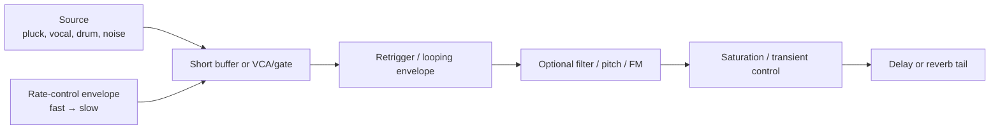
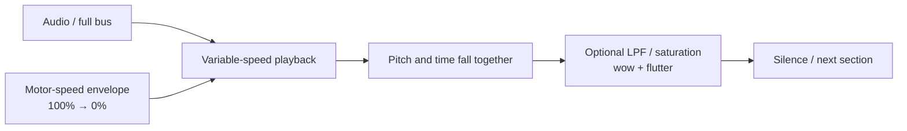
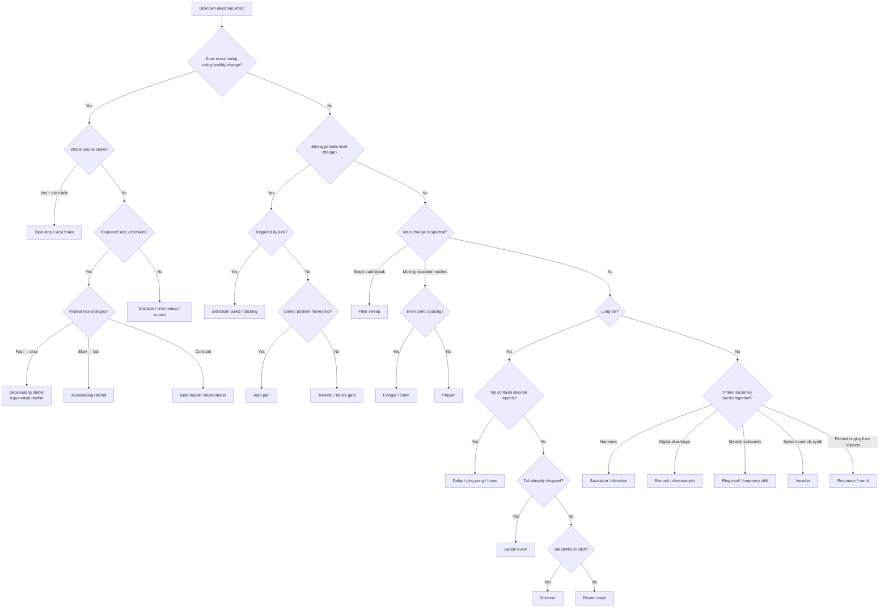

# Electronic-Music Effects: A Production Field Guide

## Executive summary

Electronic-music “effects” are easiest to understand not as a list of plug-ins, but as **families of signal transformations**. Most of the sounds producers describe informally as a “whoosh”, “zipper”, “roulette wheel”, “robot voice”, “underwater filter”, “pump”, “glitch”, “wash” or “vinyl slowdown” reduce to a fairly small set of processes: **repetition and time remapping; amplitude modulation; filtering; dynamics; delay/reverb; pitch/frequency manipulation; modulation; distortion/degradation; and spectral/granular resynthesis**. Ableton, Logic and FL Studio consequently implement many apparently different dance-music effects with overlapping building blocks rather than one bespoke processor per sound. citeturn17search0turn16search5turn16search2

The effect you originally described — **an electronic roulette wheel apparently slowing down** — is best classified as a **decelerating retrigger**, **decelerating stutter**, **exponential rhythm**, or, more loosely, **ratcheting**. A fragment, oscillator, envelope or gate is repeatedly triggered while the repetition frequency falls, so individual pulses become progressively farther apart:

> **brrrrrrrr → br-br-br-br → br… br… br…**

A particularly useful forum reference calls comparable sounds in Worakls’ *Cloches* and Slam Duck’s *Intergalactic* “zipper”, “croaky” or “exponential rhythm” sounds; one suggested reconstruction is a looping amplitude envelope whose decay/rate is changed while the note plays. citeturn13search0 Modern stutter processors formalise the same principle: iZotope Stutter Edit 2 animates stutter, gate, pan and other parameters along user-defined curves, while Logic Beat Breaker divides an incoming buffer into slices that can independently be repeated and time-remapped. citeturn16search3turn16search9

That is **not the same thing as tape-stop**. In a true tape/vinyl stop, playback velocity itself decreases, meaning **time stretches and pitch falls together continuously** until playback ceases. Kilohearts explicitly describes its Tape Stop as a tape-speed simulation with adjustable stop time and motor-speed curve; Cableguys TimeShaper similarly manipulates a virtual playhead for slowdowns, scratching and tape-stop effects. citeturn13search2turn13search11

A practical diagnostic is therefore:

| What you hear | Most likely class |
|---|---|
| Pulses get farther apart, but each hit retains roughly the same pitch | **Decelerating stutter / exponential rhythm** |
| Pulses get closer together | **Accelerating ratchet / stutter build** |
| Entire programme material slows and falls in pitch | **Tape-stop / vinyl brake** |
| A tiny fragment repeats at a constant rate | **Beat repeat / micro-stutter** |
| Audio rhythmically disappears without a repeated buffer | **Gate / trance gate / tremolo** |
| Whole mix ducks after every kick | **Sidechain pump / volume shaping** |
| Tone gets brighter/darker while timing is unchanged | **Filter sweep** |
| Texture rises/falls independently of the musical source | **Riser / downlifter** |
| One word or note sprouts echoes | **Delay throw** |
| Sound dissolves into tiny clouds/fragments | **Granular processing** |

The remainder of this guide treats **twenty-five production effects**, including the closely related effects most likely to be confused with your roulette sound.

A note on the listening references: timestamps marked **≈** are intentionally approximate and refer to commonly available album/official versions; radio edits, extended mixes, remasters and streaming versions can move the event. A **†** indicates that the cited source itself explicitly associates the recording or timestamp with the technique. Where no production documentation exists, the track is offered as an **aural reference**, not as a claim that a particular named plug-in was used.

## Taxonomy, tools and production priorities

The three main DAWs already cover most of this territory. Ableton Live 12 supplies Beat Repeat, Auto Filter, Auto Pan–Tremolo, Chorus-Ensemble, Phaser-Flanger, Delay/Echo, Grain Delay, Hybrid Reverb, Saturator, Shifter, Resonators and Vocoder among other processors. citeturn17search0 Logic combines conventional processors with Beat Breaker, Step FX and Remix FX; Apple explicitly positions the latter two for dance-floor gating, slicing, reverse, downsampling, scratching and tape-stop effects. citeturn16search5turn16search1 FL Studio's Gross Beat keeps a rolling two-bar buffer under time and volume envelopes for beat-synchronised glitch, stutter, repetition, scratching and gating. citeturn16search2

The CPU ratings below are **relative production heuristics rather than benchmarks**: actual load depends on oversampling, channel count, sample rate, plug-in implementation, convolution length, grain count and hardware.

| Effect | Main purpose | Complexity | Relative CPU | Particularly useful tools |
|---|---|---:|---:|---|
| Decelerating stutter / exponential rhythm | Rhythm/transition | Medium | Low–medium | Beat Repeat, Beat Breaker, Gross Beat, Stutter Edit, ShaperBox |
| Tape-stop / vinyl brake | Transition/time | Low–medium | Low–medium | Kilohearts Tape Stop, TimeShaper, Gross Beat, Logic Remix FX |
| Beat repeat / micro-stutter | Glitch/rhythm | Low | Low | Beat Repeat, Beat Breaker, Gross Beat, Stutter Edit |
| Trance gate / rhythmic gate | Rhythm | Low | Very low | Auto Pan–Tremolo, Step FX, VolumeShaper |
| Sidechain pump | Groove/mixing | Low | Very low | Compressor, VolumeShaper |
| Filter sweep | Transition/timbre | Low | Very low | Auto Filter, automation, FilterShaper |
| Noise riser | Build/transition | Low | Very low | Any synth/noise generator + filter |
| Downlifter | Release/transition | Low | Very low | Synth/sample + pitch/filter envelope |
| Impact / sub-drop | Section punctuation | Low | Very low | Sampler/synth + saturation/reverb |
| Reverse reverb / swell | Anticipation | Medium | Low–medium | Reverb + bounce/reverse |
| Delay throw | Phrase punctuation | Low | Low | EchoBoy, stock delay/Echo |
| Ping-pong / stereo delay | Space/rhythm | Low | Low | EchoBoy, Ableton Delay/Echo |
| Reverb wash / bloom | Space/transition | Low–medium | Medium–high | Hybrid Reverb, Blackhole, VintageVerb |
| Gated reverb | Percussive space | Medium | Low–medium | Reverb → gate |
| Shimmer reverb | Harmonic ambience | Medium | Medium–high | ValhallaShimmer, Hybrid Reverb |
| Chorus / ensemble | Width/thickening | Low | Low | Chorus-Ensemble |
| Flanger | Sweeping comb motion | Low | Low | Phaser-Flanger |
| Phaser | Sweeping spectral notches | Low | Low | Phaser-Flanger |
| Tremolo / auto-pan | Repeating amplitude/stereo motion | Low | Very low | Auto Pan–Tremolo, Tremolator/PanMan |
| Saturation / distortion | Harmonics/aggression | Low | Low–medium | Saturator, Decapitator, Thermal |
| Bitcrush / downsample | Digital degradation | Low | Very low | Redux, Bitcrusher |
| Ring modulation / frequency shift | Metallic/inharmonic sound design | Medium | Low | Shifter/RingShifter |
| Vocoder | Spectral cross-synthesis | Medium | Medium | Ableton Vocoder, Logic EVOC/Vocoder |
| Granular processing | Fragmentation/texture | Medium–high | Medium–high | Grain Delay, Portal, Granulator |
| Resonator / comb filtering | Tonalise/percussive resonance | Medium | Low–medium | Resonators/Corpus, comb filters |

Several distinctions matter particularly for ear training. Chorus generally combines a source with short, slowly modulated delayed copies; flanging uses a much shorter modulated delay and therefore produces a conspicuous moving **comb-filter** pattern; a phaser instead uses all-pass stages to create moving notches. Ableton's Phaser-Flanger documentation explicitly distinguishes the modulated-delay architecture of flanging from the all-pass-filter architecture of phasing, while iZotope gives the same fundamental distinction. citeturn6view2turn21search2turn21search52

Likewise, “sidechain” is not itself a sound. A sidechain is a **control-routing mechanism**. The classic dance-music pump happens when a kick controls gain reduction on another signal; it can be achieved by a compressor or reproduced deterministically with an envelope/LFO volume shaper. Ableton documents kick-controlled ducking as a dance-music application of its Compressor, while Cableguys VolumeShaper provides sample-accurate drawn gain curves and external sidechain triggering. citeturn10view1turn19search15

## The roulette-wheel effect and tape-stop in depth

### Decelerating stutter, exponential rhythm and ratcheting

There is no single industry-standard name. **Decelerating stutter** is the clearest functional term; **exponential rhythm** is useful when the spacing changes continuously rather than stepping through fixed note values; **ratcheting** is broader and is often used for multiple retriggers per note; “zipper” and “bouncing-ball rhythm” are useful descriptive terms. The KVR discussion around Worakls’ *Cloches* is important precisely because several experienced users recognise the sound but describe it in different vocabulary. citeturn13search0

The essential topology is:



The crucial parameter is **event spacing**. Let the repetition frequency be \(f(t)\). A convincing deceleration can be represented conceptually as

\[
f(t)=f_0e^{-kt}
\]

and therefore

\[
T(t)=\frac{1}{f(t)}
\]

where \(T(t)\) is the interval between repeats. As \(f\) falls, the interval gets progressively longer. The ear interprets this widening spacing as rotational or mechanical deceleration.

For a continuous “roulette” effect, useful starting values are **20–40 retriggers per second at the beginning, falling to roughly 2–5 per second over 0.5–4 seconds**. Keep the individual amplitude envelope very short — roughly **0.5–5 ms attack and 5–80 ms release/decay** for clicky/plucked material — and let the retrigger mechanism determine the rhythm. These numbers are production starting points, not standards.

At 128 BPM, a quantised staircase gives approximately:

| Grid | Interval | Retriggers/s |
|---|---:|---:|
| 1/64 | 29.3 ms | 34.1 |
| 1/32 | 58.6 ms | 17.1 |
| 1/16 | 117.2 ms | 8.53 |
| 1/8 | 234.4 ms | 4.27 |
| 1/4 | 468.8 ms | 2.13 |

So simply changing a retrigger from

**1/64 → 1/32 → 1/16 → 1/8 → 1/4**

already creates a recognisable stepped slowdown. A curved, free-running Hz modulation sounds more like an actual spinning mechanism.

**Synth method.** Start with a saw, pulse, FM pluck or noise burst. Route a square/pulse LFO to VCA level or filter cutoff at near-100% depth. Use another envelope/MSEG or direct automation to pull the LFO rate from roughly 20–40 Hz to 2–4 Hz. A downward-sloping amplitude envelope inside every cycle turns the raw square-wave gate into discrete “ticks”. The KVR reconstruction of the *Cloches* sound similarly suggests a looping volume envelope with short attack and adjustable decay/time. citeturn13search0

**Buffer method.** Capture roughly 10–100 ms of incoming audio and repeatedly replay it. Change the replay interval while leaving the captured slice approximately constant. Ableton Beat Repeat supplies variable slice grids, gate length, decay and per-repeat pitch behaviour; Logic Beat Breaker can divide incoming audio into slices and assign repeat counts independently; Stutter Edit provides continuously animated stutter curves and gesture timing. citeturn6view0turn16search9turn16search3

**Sample-editing method.** Cut a transient, vocal consonant or synth attack, make many copies, and progressively increase the gaps. This gives maximum control and no plug-in dependence. For an exponential feel, do **not** increase each gap by the same number of milliseconds; multiply it, for example 25 → 35 → 50 → 72 → 105 → 155 → 230 ms.

**Musical applications.** Progressive house, melodic techno, trance, future bass, IDM and cinematic electronic production use it particularly well at the end of fills, before or after a drop, as the attack of a bass/synth patch, or as a recurring “mechanical” motif. Stutter Edit's own design explicitly targets electronic rhythmic effects, transitions and animated stutters. citeturn16search3turn21search12

**Variations.** Reverse the curve for an accelerating build; modulate pitch downward simultaneously for a hybrid roulette/tape-stop; run only high frequencies through the stutter while passing bass dry; randomise every second/third repeat; add delay after the gate; or shift the slice on every repeat. FL Gross Beat and Cableguys TimeShaper are particularly suited to hybrid buffer/time-remapping forms. citeturn16search2turn13search11

**Common mistakes.** A linear automation line on a poorly scaled Hz control often spends too much of its travel at the fast end and then appears suddenly to “fall apart”. Use a curved automation law. Very short slices without fades click; overly long release times blur the individual ticks. Tempo-synchronised LFO modes may also prohibit smooth rate modulation, in which case switch to free-Hz mode or use stepped divisions deliberately.

**Reference listening.** Worakls – *Cloches*, **2:33 onward†**; Slam Duck – *Intergalactic*, **0:08, ≈1:18 and ≈3:18†**. Those exact points are the ones identified by the original KVR poster discussing the zipper/exponential-rhythm sound. citeturn13search0 **Grum & Amba Shepherd – *Slow Motion*** is your modern reference; the official Anjunabeats upload is the 3:43 version released on **17 April 2026**. I would treat the roulette-like transitions there as a perceptual classification rather than claim a particular unpublished Grum signal chain. citeturn13search1turn13search4

### Tape-stop, vinyl brake and spin-down

A tape-stop changes the **playhead speed itself**:



If playback rate is \(r\), every frequency in the recording is also multiplied by \(r\). At **50% speed**, pitch is one octave lower; at **25%**, two octaves lower. That coupling between **slower time and lower pitch** is what distinguishes tape-stop from ordinary pitch automation.

Kilohearts’ current Tape Stop provides separate stop time, start time and motor-curve controls; Cableguys TimeShaper exposes the virtual-playhead trajectory so the speed curve can be drawn directly. citeturn13search2turn13search11 Apple describes Logic Remix FX as able to “stop” the song alongside DJ-style scratching, reverse and downsampling, while Image-Line describes Gross Beat as manipulating playback position, pitch and time from its rolling buffer. citeturn16search1turn16search2

Useful starting ranges are:

| Parameter | Fast/dramatic | Typical | Long/cinematic |
|---|---:|---:|---:|
| Stop duration | 100–350 ms | 0.5–1.5 s | 2–4 s |
| Musical length | 1/8–1/4 | 1/2–1 bar | 2–4 bars |
| Speed | 100 → 0% | 100 → 0% | 100 → 0% |
| Optional LPF | 18 kHz → 6 kHz | 16 kHz → 3 kHz | 12 kHz → 1 kHz |
| Saturation | 0–3 dB | 2–6 dB | taste |
| Wet amount | usually 100% during stop | usually 100% | often automated |

A tape-stop is especially effective immediately before **silence**, because the removal of both high-frequency content and forward motion creates a vacuum into which the next kick/drop can land. Attack Magazine demonstrates exactly this arrangement use: automate the stop at the end of a four-bar phrase, with stop time/curve controlling how abruptly the motor winds down. citeturn22search0

**Do not confuse tape-stop with a spinback.** A brake moves progressively forwards at decreasing speed; a spinback/reverse rapidly moves backwards. The two produce very different pitch trajectories.

**Ableton recipe.** The quickest reliable version is Kilohearts Tape Stop on the desired bus: automate its play/stop control and set Stop Time around **0.4–1.2 s**. For deeper editing, TimeShaper provides drawn playhead motion. A stock/manual approach is to resample the phrase and play it from an **unwarped sampler mode where pitch remains tied to sample playback rate**, then automate playback/transposition downward; render once it sounds right. Dedicated time-remapping tools are preferable if you need the whole stereo mix to reach an exact stop point. Kilohearts is currently free as part of its Essentials collection. citeturn13search2turn13search11

**FL Studio recipe.** Put Gross Beat on the track/group or master, use a Time envelope/preset that bends playback progressively towards a stop, then automate activation only for the target phrase. Gross Beat's two-bar rolling buffer and time-mapping envelopes are specifically designed for such speed, position, stutter and scratching transformations. citeturn16search2

**Logic recipe.** Put Remix FX on the stereo bus or target channel, trigger **Stop**, then record the gesture as automation; Apple explicitly recommends Touch automation for performance-style Remix FX gestures. citeturn16search1

**Reference listening.** Tape-stop is harder to document from released masters because a pitch dive can be produced several ways. Flume's *Helix* and Porter Robinson's *Goodbye to a World* are useful listening references for tape-stop-like/pitch-decay transitions, but I would classify those **by ear rather than claim verified tape-machine provenance**. For a source-controlled reference, Attack Magazine's tape-stop production demonstration is preferable because its processor and automation are explicitly documented. citeturn22search0

## Production field guide

**Beat repeat / micro-stutter / buffer repeat.**  
**Sound:** a tiny slice of existing audio repeats — “ka-ka-ka-ka” — usually at 1/8 to 1/64 divisions. **Use:** fills, glitch percussion, vocal chops, IDM, trance transitions, dubstep/future-bass ear candy. **Build:** source → short capture buffer → repeat at 1/16 or 1/32 → set gate length → optionally decay volume/pitch → filter → reverb/delay. Ableton Beat Repeat exposes Grid, Gate, Decay and Pitch/Pitch Decay; Logic Beat Breaker's own stutter tutorial uses four slices and sets repeat counts independently on selected slices. citeturn6view0turn16search9 **Tools:** Beat Repeat, Beat Breaker, Gross Beat, Stutter Edit 2. **Variations:** pitch each repeat down, reverse alternating slices, narrow the processed frequency band. **Mistakes:** stuttering everything destroys groove; leave the low end or main transient intact where possible. Logic itself suggests bypassing frequencies below roughly 200 Hz for full-mix Beat Breaker work. citeturn16search9 **Listening:** BT – *Somnambulist (Simply Being Loved)*, stutter-edit passages throughout; ODESZA – *The Last Goodbye*, **≈1:40**, as a modern stutter/wobble listening cue. BT is the co-creator of Stutter Edit and iZotope explicitly describes the processor as implementing his signature stutter-edit approach. citeturn16search3

**Trance gate / rhythmic gate / chopper.**  
**Sound:** a sustained pad, vocal or noise source is chopped into a repeated on/off rhythm without necessarily replaying a buffer. **Use:** trance pads, techno pulses, progressive-house beds, rhythmic vocals. **Build:** sustained source → VCA/gain → square/step LFO at 1/8–1/16 → attack 1–10 ms and release 5–50 ms → delay/reverb after gate. Cableguys calls this class “rhythmic gating/stuttering” or trance gating; Logic Step FX has three independent 128-step modulators capable of dance-floor gating. citeturn19search44turn16search5 **Tools:** VolumeShaper, Auto Pan–Tremolo, Step FX, Love Philter/Gross Beat volume slots. **Variations:** dotted/triplet patterns, velocity levels rather than binary gating, gate only mids/highs. **Mistakes:** zero attack/release can click; putting a long reverb before the gate creates a very different chopped ambience from putting it after. **Listening:** Faithless – *Insomnia*, **≈2:18 onward**, for the general gated/pulsed synth language; classic trance records often use related gated-pad structures rather than a single identifiable “trance-gate plug-in”.

**Sidechain pump / ducking / volume shaping.**  
**Sound:** pads, bass or the entire mix appear to inhale after every kick. **Use:** French house, EDM, future bass, techno, modern pop; both groove and kick/bass separation. **Build:** kick → compressor sidechain; put compressor on bass/music bus; start around 4:1–10:1, fast attack, then tune release so level recovers rhythmically before the next kick. Alternatively draw the desired gain envelope directly with a volume shaper. Ableton documents exactly this kick-versus-bass/main technique, and Sound On Sound identifies Daft Punk's *One More Time* as a famous example of extreme kick-driven ducking. citeturn10view1turn21search27 **Tools:** Compressor, Glue Compressor, VolumeShaper, LFO Tool, Duck. **Variations:** ghost-trigger kick, multiband ducking, filter ducking, reverb ducking. **Mistakes:** attack too long leaves excessive overlap; release too short chatters, too long drains the groove. **Listening:** Daft Punk – *One More Time*, **≈0:34 onward†**, pumping around virtually every kick; Doja Cat – *Say So*, where mix engineer Neal Avron described deliberately adding a Daft-Punk-style kick-fed compressor pump. citeturn21search27turn21search29

**Filter sweep / cutoff sweep / DJ filter.**  
**Sound:** audio gradually becomes muffled or progressively brighter; resonant sweeps add a moving whistle/peak. **Use:** builds, breakdowns, intros/outros, acid/techno motion, DJ-style transitions. **Build:** source → low-pass or high-pass filter → automate cutoff over 1–16 bars → optionally increase resonance near the transition → follow with saturation/reverb. Ableton Auto Filter supports LP/HP/BP/notch and other modes plus LFO/envelope modulation and drive. citeturn5view0 **Tools:** Auto Filter, Logic AutoFilter/Step FX, Fruity Filter/Love Philter, FilterFreak, FilterShaper. **Variations:** band-pass telephone sweep, formant/vowel filter, resonant self-oscillation. **Mistakes:** excessive resonance produces huge peaks; filter automation that begins too early can remove all musical information from a long build. **Listening:** Daft Punk – *Da Funk*, **≈0:00–0:40 and recurring**, for evolving filtered synth timbre; deadmau5 – *Strobe*, especially the long **≈5:00–6:30** development, for progressive filter-opening language.

**Noise riser / uplifter / sweep-up.**  
**Sound:** hiss/air/noise gains brightness, level and often pitch until a transition. **Use:** almost every EDM-derived genre, particularly build-to-drop structure. **Build:** white noise → LP/BP filter → automate cutoff upwards over 1–16 bars → automate gain +3–12 dB → optional pitch or resonance rise → long reverb → hard cut at drop. Attack's transition guide explicitly treats white-noise and pitch-based rises as core dance-music transition devices; its synth method combines pitch movement with reverb. citeturn14search4turn14search38 **Tools:** any subtractive synth, noise oscillator, sampler, Transit. **Variations:** tonal saw riser, Shepard-style rise, feedback rise, reverse cymbal. **Mistakes:** too much full-band noise masks hats/vocals; high-pass the riser and automate its level rather than simply piling it over the mix. **Listening:** Swedish House Mafia – *Greyhound*, pre-drop builds; deadmau5 – *Ghosts 'n' Stuff*, transition builds. These are listening references for the production vocabulary rather than verified individual preset chains.

**Downlifter / faller / sweep-down.**  
**Sound:** the inverse of a riser: pitch, cutoff and/or noise energy falls away after a structural hit. **Use:** exiting drops, entering breakdowns, calming energy without leaving dead air. **Build:** noise or tonal oscillator → pitch envelope down one to several octaves → LP cutoff downward → volume decay 0.5–8 s → reverb. The same transition-synthesis principles used for risers work in reverse. citeturn14search4 **Tools:** synth, sampler, pitch shifter, transition libraries. **Variations:** reverse riser sample; tonal “laser” fall; filtered reverb downwash. **Mistakes:** downlifters carrying too much sub compete with the bass/kick that follows. **Listening:** Skrillex – *Bangarang*, around major post-drop transitions; Knife Party – *Bonfire*, around drop exits — useful high-contrast examples of the broader down-sweep language.

**Impact / hit / sub-drop / boom.**  
**Sound:** one large attack followed by a bass-heavy tail, often layered with noise, metal, reverb or a descending sine. **Use:** drop arrival, new sections, cinematic techno, trailer-influenced EDM. **Build:** transient hit + sine around 40–80 Hz → rapid pitch envelope downward → saturation/compression → optional 1–5 s reverb on the upper layer; keep the clean sub comparatively dry. **Tools:** sampler, Operator/Serum/Vital, Drum Buss, distortion/reverb. **Variations:** reverse-into-impact, kick-derived boom, metallic industrial hit. **Mistakes:** a long reverberant sub tail destroys low-end headroom; split the impact into sub and upper-FX layers. **Listening:** Skrillex – *Scary Monsters and Nice Sprites*, **≈0:40** at the first major drop; Knife Party – *Bonfire*, **≈0:55**, for layered drop punctuation.

**Reverse reverb / reverb swell / ghost tail.**  
**Sound:** an ambience seems to emerge from silence and suck itself into the upcoming vocal/note. **Use:** vocal entrances, breakdowns, cinematic tension, dark techno and ambient transitions. **Build:** duplicate the target word/note → reverse it → apply a long 100%-wet reverb → render/bounce → reverse the rendered file → align its peak with the dry event. iZotope documents essentially this procedure: reverse the target, reverberate it, bounce and reverse again so the tail rises into the original event. citeturn11search3 **Tools:** any reverb plus DAW reverse command; convolution reverbs make unusual versions. **Variations:** reverse delay, pitch-shifted reverse tail, gated reverse. **Mistakes:** failing to align the peak precisely makes the entrance feel late; retain a little gap before a kick if maximum impact is desired. **Listening:** Burial – *Archangel*, vocal transitions throughout as a useful ghost-swell aesthetic reference; many trance vocals use the same pre-entry principle.

**Delay throw / echo throw.**  
**Sound:** only one selected word, snare, synth note or phrase suddenly echoes while the rest stays dry. **Use:** vocal phrase endings, fills, dub, house, pop/EDM transitions. **Build:** source send → delay at 100% wet → HP/LP filter → feedback 25–70%; automate the send up only on the chosen event, then back to −∞. **Tools:** Ableton Delay/Echo, Logic Tape Delay/Stereo Delay, Fruity Delay 3, EchoBoy. EchoBoy offers single, dual, ping-pong and multi-tap rhythm modes; Ableton's Delay likewise supports independent stereo delay lines, sync/free timing, filtering and modulation. citeturn19search16turn10view2 **Variations:** 1/4 throw, dotted-1/8 throw, dub feedback runaway, pitch-changing throw. **Mistakes:** leaving the send open muddies every phrase; high-pass the repeats to preserve the centre. **Listening:** Disclosure – *Latch*, around vocal phrase endings; Flume – *Never Be Like You*, phrase-transition echoes.

**Ping-pong delay / cross delay.**  
**Sound:** echoes bounce left–right–left–right. **Use:** sparse leads, vocal ad-libs, melodic techno plucks, psychedelic/ambient electronica. **Build:** mono/centred source → stereo delay in ping-pong mode → 1/8D, 1/4 or 1/4T time → feedback 20–60% → low/high-cut wet return. Soundtoys' EchoBoy officially supplies Ping-Pong mode, while its Rhythm mode expands the idea to as many as sixteen taps. citeturn19search16turn19search43 **Tools:** EchoBoy, Ableton Echo/Delay, Logic Stereo Delay, Fruity Delay 3. **Variations:** different left/right note values, filtered tape-style echoes, automated feedback. **Mistakes:** wide bass echoes can destabilise low-end mono compatibility; high-pass the delay. **Listening:** Jean-Michel Jarre – *Oxygène Part IV*, recurring spatial synth echoes; many deadmau5 pluck/lead productions provide modern tempo-synchronised stereo-delay references.

**Reverb wash / bloom / infinite ambience.**  
**Sound:** a source dissolves into a dense cloud, often outlasting the original note until harmony becomes almost environmental. **Use:** ambient, melodic techno breakdowns, shoegaze-influenced electronic music, cinematic transitions. **Build:** send → long hall/algorithmic reverb 4–30 s → low-cut 150–500 Hz → high-cut 5–12 kHz → optional modulation → automate send/decay/freeze. Ableton Hybrid Reverb combines convolution and algorithmic engines and explicitly supports highly transformative/drone-like processing; Eventide Blackhole is designed for unusually large algorithmic spaces and effectively infinite/frozen tails. citeturn10view5turn9search7 **Tools:** Hybrid Reverb, Blackhole, ValhallaVintageVerb, Space Designer/ChromaVerb. **Variations:** freeze, reverse, ducked wash, pitch-shifted wash. **Mistakes:** full-range long reverb consumes enormous headroom; EQ both before and after it. **Listening:** Jon Hopkins – *Abandon Window*, throughout, for source-to-space dissolution; Burial – *Archangel*, for reverb as part of the rhythmic atmosphere.

**Gated reverb / gated ambience.**  
**Sound:** a huge reverb blooms after a transient and then stops unnaturally abruptly. **Use:** oversized snares/kicks, synth stabs, 1980s-derived synthwave, industrial/electronic percussion. **Build:** drum → medium/large room or plate → gate; key the gate from the dry drum; fast attack, roughly 200 ms–1.5 s hold/release shape, then abrupt closure. Sound On Sound describes the canonical topology as reverb followed by a sidechain-triggered gate. citeturn14search9 Hugh Padgham recounts the effect's accidental origin from heavily compressed room/listen-mic sound, followed by experimenting with a noise gate, first on Peter Gabriel's *Intruder* and later famously on Phil Collins. citeturn20search2 **Tools:** any reverb + Gate; dedicated gated algorithms. **Variations:** non-linear reverb, keyed gate, gated reverse reverb. **Mistakes:** too slow a gate release just sounds like ordinary reverb. **Listening:** Peter Gabriel – *Intruder*, **from the opening†**; Phil Collins – *In the Air Tonight*, especially the famous drum entrance at **≈3:40†**. citeturn20search2

**Shimmer reverb / octave reverb.**  
**Sound:** reverberation climbs into an ethereal, glassy upper octave and can keep generating higher harmonics. **Use:** ambient, trance breakdowns, cinematic pads, post-rock-influenced electronica, vocal atmospheres. **Build:** source → long reverb → +12-semitone pitch shifter → feed some shifted result back into reverb. Valhalla's designer describes exactly this topology: a feedback loop containing a +1-octave pitch shift and long reverb; ValhallaShimmer integrates those blocks internally. citeturn19search6 A strong starting patch is +12 semitones, high diffusion around 0.9 and enough feedback for the octave to build without runaway resonance. citeturn19search2 **Tools:** ValhallaShimmer, Ableton Hybrid Reverb's Shimmer algorithm, Eventide processors. Ableton's Shimmer likewise places pitch shifting in a diffuse-delay feedback structure. citeturn17search0 **Variations:** −12 “dark shimmer”, ±12 dual shimmer, fifths. **Mistakes:** unlimited bright feedback quickly becomes piercing; darken each loop. **Listening:** Brian Eno – *Deep Blue Day†*, a reference Valhalla explicitly invokes for the orchestral shimmer style; Eno/Lanois/U2 productions are historically central to the effect. citeturn19search2turn19search5

**Chorus / ensemble / dimension.**  
**Sound:** one instrument appears to become several slightly detuned performances; stereo width and gentle movement increase. **Use:** synth pads, bass, vocals, synthwave, ambient, disco strings. **Build:** dry signal + one or more roughly 5–30 ms delayed copies → slow LFO around 0.1–2 Hz → small delay modulation → stereo phase offset → mix 10–50%. Ableton Chorus-Ensemble uses multiple delay lines and can range from subtle thickening to vibrato/string-ensemble effects. citeturn10view0 **Tools:** Chorus-Ensemble, TAL-Chorus-LX, Dimension-type hardware/emulations. **Variations:** ensemble, vibrato at 100% wet, microshift/doubling. **Mistakes:** too much modulation on bass makes tuning and mono sum unstable; restrict chorus to upper bands. **Listening:** Boards of Canada – *Roygbiv*, synth texture throughout as an ensemble/analogue-width reference; M83 – *Midnight City*, opening synth layers for large chorus-like width. These are perceptual references rather than documented single-processor chains.

**Flanger / jet flange / through-zero flange.**  
**Sound:** a pronounced hollow “whoooosh” whose peaks and cancellations sweep together, often jet-like. **Use:** transition sweeps, percussion, acid/electro synths, psychedelic sound design. **Build:** split source → one path delayed roughly 0.1–10 ms → modulate delay slowly → recombine → add feedback for resonance. Ableton states that Flanger mode uses a time-modulated delay to generate comb filtering; SOS similarly distinguishes delay-based flanging from all-pass phasing. citeturn6view2turn14search13 **Tools:** Phaser-Flanger, Instant Flanger emulations, FL Flangus, Soundtoys-style modulation effects. **Variations:** through-zero, negative feedback, stereo flange. **Mistakes:** excessive feedback can produce screaming peaks; monitor mono. **Listening:** Daft Punk – *Robot Rock*, throughout as an aggressive moving-filter/electro reference; The Chemical Brothers – *Setting Sun*, distorted sweeping processing throughout. For forensic classification, look for **harmonically/evenly spaced moving comb teeth**, rather than merely a “swirl”.

**Phaser / phase shifter.**  
**Sound:** smoother, more liquid swirling than a flanger; notches move through the spectrum but without the same strictly harmonic comb pattern. **Use:** pads, Rhodes, techno loops, disco/electro synths, psychedelic transitions. **Build:** dry source + cascade of modulated all-pass filters → LFO 0.05–2 Hz → feedback 0–60% → wet/dry mix. Ableton describes the phaser as modulated all-pass filters producing wandering notches. citeturn6view2 **Tools:** Phaser-Flanger, PhaseMistress, Logic Phaser. **Variations:** four-stage vintage phase, twelve-stage deep phase, envelope-followed phaser. **Mistakes:** confusing it with flanging; inspect a spectrogram — phaser notch spacing is characteristically different from a short-delay comb. **Listening:** Jean-Michel Jarre – *Oxygène Part IV*, recurring swirling synthesiser textures; Daft Punk – *Human After All*, various moving-filter/modulation passages as a more aggressive electro reference.

**Tremolo / amplitude modulation / auto-pan.**  
**Sound:** volume repeatedly rises and falls; auto-pan performs a related modulation across the stereo field. At high rates tremolo becomes buzzing sidebands and eventually overlaps conceptually with ring modulation. **Use:** pulsing pads, techno drones, chopped synths, rhythmic ambience, stereo movement. **Build:** source → VCA/panner → sine/triangle/square LFO; 1/8–1/16 synced for rhythmic effects or roughly 0.2–8 Hz free-running for traditional tremolo. Ableton's Auto Pan–Tremolo uses an LFO to modulate stereo position or amplitude and supports smooth through hard-edged waveforms. citeturn5view0 Its Shifter documentation also notes that sub-audio ring-mod frequencies below roughly 20 Hz create tremolo. citeturn17search0 **Tools:** Auto Pan–Tremolo, Tremolator, PanMan, Step FX. **Variations:** square-wave chop, stereo ping movement, envelope-followed pan. **Mistakes:** excessive hard autopan is fatiguing on headphones and can vanish strangely in mono. **Listening:** Aphex Twin – *Xtal*, stereo/pulsing ambience as an ear-training reference; Four Tet – *Two Thousand and Seventeen*, subtle rhythmic stereo motion.

**Saturation / overdrive / distortion / clipping.**  
**Sound:** harmonics are added as the waveform bends or clips, ranging from warmth and density to obvious fuzz/aggression. **Use:** virtually every electronic genre: drum glue, louder bass, techno crunch, distorted leads, parallel colour. **Build:** source → optional pre-EQ → saturator/distortion → oversampling where available → post-EQ → output-match to dry level. Ableton Saturator is explicitly a nonlinear waveshaper whose Drive sets level into the shaping curve. citeturn10view7turn17search0 **Tools:** Saturator, Decapitator, Thermal, Trash, analogue mixer/pedals. **Variations:** soft clip, hard clip, wavefolding, tube/tape, parallel distortion, multiband distortion. **Mistakes:** louder nearly always sounds “better” in an unfair comparison; level-match. Distorting sub frequencies indiscriminately can flatten punch. **Listening:** Justice – *Genesis*, **opening onward**, for heavily saturated electronic timbre; Gesaffelstein – *Pursuit*, bass/lead material throughout for controlled industrial distortion.

**Bitcrush / bit-depth reduction / sample-rate reduction / decimation.**  
**Sound:** grainy digital fizz, stair-stepped quantisation, aliasing and old-sampler/game-console character. **Use:** IDM, industrial techno, lo-fi house, chiptune, glitch, aggressive percussion. **Build:** source → bit-depth reduction from 16/24 bits towards 8, 6 or 4 → sample-rate reduction → post-low-pass to manage aliasing → blend dry/wet. Ableton Redux is explicitly a bit-crusher/downsampling processor, while Logic includes Bitcrusher and downsampling inside its effects ecosystem. citeturn17search2turn16search5 **Tools:** Redux, Logic Bitcrusher, Decimort, CrushShaper. **Variations:** bitcrush only highs; automate sample rate; parallel crush. **Mistakes:** very low sample rates generate intense aliasing and can wreck cymbals; filtering afterwards is often essential. **Listening:** Aphex Twin – *Vordhosbn*, where Attack's deconstruction specifically identifies percussion/melodic material being processed with bit-crushing†; Autechre – *Eutow*, whose reconstruction likewise uses converter/bitcrusher character to approach the original texture. citeturn21search21turn21search30

**Ring modulation / frequency shifting.**  
**Sound:** bells, robots, metallic clangs and inharmonic sidebands; subtle shifts of only a few hertz can instead produce strange phasing. **Use:** IDM, industrial, experimental techno, metallic percussion, alien vocals. **Build for ring-mod:** multiply signal by sine oscillator; try 30–1,000 Hz carrier; tune musically if you want stable bell tones. **Build for frequency shift:** shift every partial by a fixed number of hertz rather than a musical interval. Ableton Shifter provides separate Pitch, Frequency and Ring modes; it notes that small frequency shifts can create subtle phasing while larger ones become dissonant/metallic. citeturn17search0 **Tools:** Shifter, Logic RingShifter, modular ring modulators. **Variations:** envelope-follow carrier frequency, stereo ± shifts, ring-mod before distortion. **Mistakes:** frequency shifting is **not pitch shifting**: a harmonic series will generally cease to be harmonic because every component moves by the same Hz quantity. **Listening:** Autechre – *Gantz Graf*, metallic timbres throughout as an ear-training reference; Lynyn's production notes document Logic's stock ring mod being used on a bass at **4:26†** in the discussed album track. citeturn21search24

**Vocoder / spectral cross-synthesis / robot voice.**  
**Sound:** the rhythm/formants of speech control a harmonically rich synth, producing intelligible pitched robot speech. **Use:** electro, synth-pop, French house, techno, cinematic voices. **Build:** voice = **modulator** → filter-bank envelope analysis; saw/chord/noise = **carrier** → corresponding filter bank; multiply each carrier band by its modulator envelope → sum bands → compression/EQ. Ableton recommends a harmonically rich carrier such as a saw and explicitly describes its Vocoder as a bank-based carrier/modulator processor. citeturn6view4 **Tools:** Ableton Vocoder, Logic EVOC/Vocoder, FL Vocodex, hardware vocoders. **Variations:** noise carrier for whispered robots, chord carrier, drum-as-modulator, formant shifting. **Mistakes:** a pure sine carrier lacks enough harmonics for intelligibility; consonants often need extra noise/high-frequency emphasis. **Listening:** Daft Punk – *Around the World*, vocal hook throughout; Sound On Sound specifically describes Daft Punk's robot vocals and identifies vocoding as central to their sound. citeturn21search11turn21search22 Afrika Bambaataa & Soulsonic Force – *Planet Rock*, **≈0:25 onward†**, whose production history explicitly identifies the vocoder as part of its futuristic sound. citeturn21search9

**Granular processing / grain cloud / granular delay / freeze.**  
**Sound:** audio fragments into microscopic pieces that can smear, freeze, spray, pitch-shift, reverse or reorganise into clouds. **Use:** experimental electronica, future bass, ambient, glitch, IDM, modern cinematic textures. **Build:** capture audio → divide into grains → set grain length/density → move playhead/position → randomise pitch/position → stereo spread → feedback/reverb. Ableton Grain Delay slices incoming material into grains that can each be delayed and pitch-shifted; Output Portal offers tempo-synchronised grain delay and scale-based pitch manipulation. citeturn10view4turn19search8 **Starting ranges:** 5–30 ms grains for buzz/spectral textures; 30–150 ms for recognisable fragments; longer grains retain obvious source character. **Variations:** freeze, pitch-cloud chords, granular stutter, random grain spray. **Mistakes:** too much randomisation loses pitch and rhythm simultaneously; constrain at least one dimension — scale, position, timing or density. **Listening:** O'Flynn & Frazer Ray – *Love Fading*, whose creators specifically cite granular synthesis as part of the track's finishing process†; EPROM's documented workflow includes bouncing tracks and passing them wholesale through Granulator to discover new fragments. citeturn21search38turn21search23

**Resonator / comb filter / Karplus–Strong-like resonance.**  
**Sound:** a non-tonal hit or noise acquires a pitched, ringing, string/tube-like note. A short feedback delay behaves like a tuned resonator. **Use:** melodic techno percussion, IDM, metallic sound design, converting drums/noise into pitched material. **Build:** transient/noise → very short delay/comb → feedback 50–95% → tune delay period to pitch → damping LPF in feedback → saturation. Ableton Resonators consists of five parallel tuned resonators capable of imparting pitched/vocoder-like character; comb filtering also appears as a creative module in Stutter Edit. citeturn10view9turn16search3 **Tools:** Resonators, Corpus, comb filters, Mimeophon, physical-modelling delays. **Variations:** five-note resonator chords, envelope-followed resonance, Karplus–Strong plucks. **Mistakes:** feedback close to unity can explode in level; tune or high-pass resonators so low modes do not overwhelm the mix. **Listening:** Jon Hopkins – *Open Eye Signal*, percussive tonal resonance as a listening reference; Lynyn's documented Make Noise Mimeophon experiments explicitly used a Karplus–Strong-style approach in the production of *Lexicon*. citeturn21search24

A useful conceptual point follows from these last few effects: **comb filtering, flanging, resonators and Karplus–Strong synthesis are relatives**. All exploit delayed copies and feedback; the perceptual category changes largely with delay time, modulation and feedback. A moving millisecond-scale delay reads as flange; a fixed, strongly fed-back delay becomes a pitched resonator.

## Practical construction patterns and failure modes

Most electronic effects become easier to reproduce once the **ordering** is correct. Effects that share the same ingredients can sound radically different when rearranged; Ableton explicitly notes that device order changes the resulting sound. citeturn17search12

For a clean transition workflow, a robust architecture is:

```text
SOURCE
  ↓
timing / pitch manipulation
  ↓
filter or spectral shaping
  ↓
distortion / saturation
  ↓
dynamics / gain shaping
  ↓
delay
  ↓
reverb
  ↓
final EQ / limiter
```

That is not a rule, however. **Reverb → gate** is the defining topology of gated reverb; **reverb → pitch shifter → feedback** creates shimmer; **distortion before a filter** creates a very different spectral movement from distortion after it; **gate before reverb** leaves a smooth tail whereas **reverb before gate** chops the ambience itself. The gated-reverb and shimmer architectures are documented examples where effect order is fundamental rather than cosmetic. citeturn14search9turn19search6

The following recipes cover the most reusable combinations.

| Desired result | Fast recipe | Starting point |
|---|---|---|
| Roulette slowing | retrigger/gate → automate rate downward | 30 Hz → 3 Hz over 1–2 s |
| Roulette accelerating | same, reverse rate automation | 3 Hz → 30 Hz |
| Stepped roulette | change synced divisions | 1/64 → 1/32 → 1/16 → 1/8 |
| Tape stop | speed/resampling curve | 100% → 0% in 0.3–1.5 s |
| Trance gate | volume square LFO | 1/16 or 1/8, 50–90% depth |
| House pump | kick-trigger gain reduction | 4:1–10:1, fast attack, tempo-tuned release |
| Noise build | noise → LPF → reverb | cutoff ~500 Hz → 15 kHz |
| Delay throw | 100%-wet send | 1/4 or dotted 1/8, feedback 30–60% |
| Gated snare | room reverb → sidechain gate | 0.3–1.2 s audible ambience |
| Shimmer | reverb + +12-st feedback | +12 st, dark feedback path |
| Chorus pad | modulated delay copies | 5–30 ms, 0.1–2 Hz |
| Flange | very short mod delay | ~0.1–10 ms + feedback |
| Phaser | all-pass stages + LFO | 0.05–1 Hz for slow sweep |
| Bitcrush | lower bits/sample rate | start 8–12 bit, blend |
| Metallic ring mod | sine multiplier | carrier 50–1,000 Hz |
| Granular cloud | grains + random position/pitch | 20–100 ms grains |

A few recurring mistakes account for a surprising proportion of failed recreations.

**Confusing event rate with pitch.** At very fast retrigger rates, repetition itself enters the audible-frequency domain. A 30-Hz repeated click begins to sound like a low pitched buzz. That is why a roulette/exponential rhythm can appear to “pitch down” even when every repeated slice has identical pitch: you are hearing the repetition frequency become resolvable as rhythm. The KVR *Cloches* discussion explicitly notices this ambiguity between low oscillator frequency, clicks and exponential rhythm. citeturn13search0

**Using pitch automation for tape-stop without slowing time.** That produces a pitch dive, not a genuine brake. Tape-speed emulations deliberately couple both dimensions. citeturn13search2turn14search29

**Modulating too many dimensions simultaneously.** If rate, pitch, filter, pan, distortion and reverb all move aggressively, the ear loses the cue that identifies the effect. Establish the principal gesture first, then embellish it.

**Ignoring transients.** A stutter based on an indistinct pad fragment may sound like tremolo; a sharp consonant, click, pluck or drum transient makes the individual retriggers legible. Conversely, granular processing often becomes smoother when transient identity is deliberately destroyed.

**Leaving effects full-range.** Beat repeat, distortion, stereo delay, reverb and granular processors often work better when the sub remains dry. Logic even gives Beat Breaker a bass-bypass workflow specifically so kick and bass can pass unchanged while higher material is manipulated. citeturn16search9

**Ignoring clicks at edit boundaries.** Buffer jumps, hard gates and sample edits require tiny fades, zero-crossing edits or processor smoothing. Cableguys TimeShaper explicitly includes smoothing intended to reduce clicks/crackles during time jumps. citeturn13search11

**Using too much feedback.** Delay, comb filtering, shimmer and resonators are all feedback systems. Near-unity gain can produce runaway resonances. Put EQ, damping, saturation or a limiter inside/after experimental feedback networks.

For hardware, the same principles remain valid. A **tape machine or turntable** physically performs variable-speed playback; **BBD/tape delays** naturally give delay modulation and saturation; an analogue **phaser** provides cascaded all-pass stages; ensemble/chorus units provide modulated short delays; modular VCAs/LFOs/envelopes are excellent for exponential rhythms because one modulation source can control the rate of another. Software mostly packages these same topologies more conveniently.

## Codex-agent checklist and identification decision tree

For an agent analysing an unknown effect from audio, the crucial task is to infer the **control variable that is moving**, rather than guessing a plug-in name.

A compact analysis checklist is:

1. **Locate the dry reference.** Compare the effected event with the same voice, synth or drum elsewhere in the track.
2. **Separate rhythm from pitch.** Are events getting closer/farther apart, or is the waveform itself changing pitch?
3. **Check whether timing changes.** Coupled slowdown + downward pitch strongly indicates variable-speed playback/tape-stop.
4. **Check amplitude periodicity.** Regular disappearance with no repeated waveform suggests gate/tremolo/sidechain rather than stutter.
5. **Inspect spectral movement.** One moving cutoff suggests filtering; many moving notches suggest phase/flange/comb effects.
6. **Inspect tails.** Discrete repetitions imply delay; dense decaying energy implies reverb; abruptly truncated ambience implies gated reverb.
7. **Look for new harmonics.** Harmonic overtones suggest saturation; aliases/non-harmonic digital components suggest bitcrushing/downsampling; sum/difference sidebands suggest ring/frequency modulation.
8. **Test a minimum viable reconstruction.** Reproduce the signature with one primitive process before adding embellishments.

The decision tree can be expressed as:



For automated analysis, extract at least four feature streams: **onset spacing**, **fundamental/pitch contour**, **spectral centroid/notch trajectories**, and **amplitude envelope**. A decelerating stutter should present increasing onset intervals while the repeated fragment's local spectral fingerprint remains comparatively stable. A tape-stop should instead show the entire spectral pattern contracting downwards in frequency while temporal features stretch. A sidechain pump should show periodic amplitude minima tightly correlated with kicks, while a filter sweep changes spectral centroid without equivalent timing changes.

For the specific **roulette-vs-tape-stop classifier**, the agent can reduce the problem to:

```text
IF repeated transients remain individually similar
AND Δ(inter-onset interval) > 0
AND local pitch of each transient is approximately stable
    => decelerating stutter / exponential rhythm

ELSE IF essentially every spectral component moves downward
AND programme timing stretches
AND the sound converges towards silence/zero speed
    => tape-stop / vinyl brake

ELSE IF repeated transients are constant-rate
    => beat repeat / stutter

ELSE IF amplitude pulses without buffer repetition
    => tremolo / gate
```

The most important classification caveat is that **hybrids are common**. Gross Beat, TimeShaper and Stutter Edit can simultaneously alter buffer position, repetition, pitch, filter, gating and other parameters, so a released record may legitimately be “roulette stutter + pitch fall + delay”, rather than one pure textbook category. Gross Beat's design explicitly combines time-position and volume mapping, while Stutter Edit intentionally couples stutter gestures to multiple time-varying effects. citeturn16search2turn16search3

For your original reference, I would therefore label the sound in a sample library, project or Codex taxonomy as:

**`Rhythmic FX → Stutter/Ratchet → Decelerating → Exponential/roulette`**

with secondary tags such as **`LFO-rate modulation`**, **`retrigger slowdown`** and, only where pitch/time themselves fall, **`tape-stop hybrid`**. That terminology cleanly separates it from **`Time FX → Variable-speed → Tape-stop/Vinyl brake`**, while remaining compatible with the vocabulary producers actually use in Beat Repeat, Beat Breaker, Gross Beat, Stutter Edit and time-shaping workflows. citeturn13search0turn16search9turn16search2turn16search3