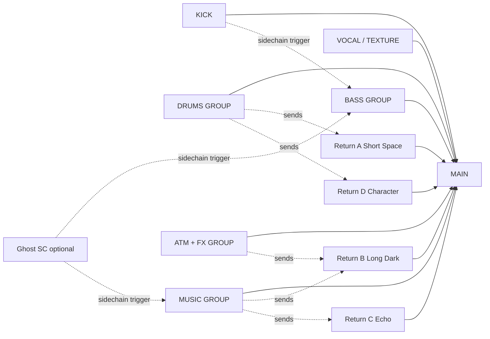
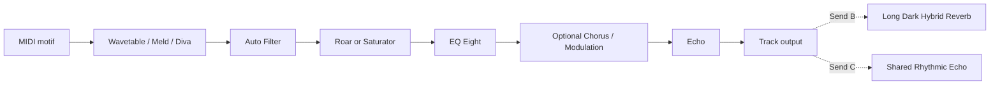
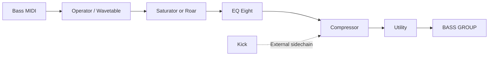
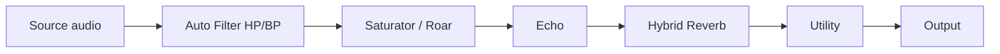
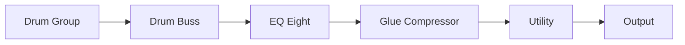

# Melodic Techno Expert Profile for an Ableton Codex Agent

## Executive summary

This document specifies a **Melodic Techno production expert for an Ableton-focused Codex agent**. It is intended to function both as a production reference and as an operational `.md` agent profile: the agent should be able to analyse reference tracks, infer a production grammar from them, construct Ableton Live projects, generate MIDI and device settings, create reusable Racks, and produce arrangements whose development comes from controlled changes in rhythm, timbre, harmony, space and density rather than simply adding more layers.

There is one important evidence limitation. **The prompt refers to 12 provided YouTube tracks, but no YouTube URLs are present in the material available in this conversation.** It would therefore be methodologically unsound to invent BPM, key, section timestamps or track-specific production details. The twelve-track comparison matrix below is consequently left explicitly unresolved rather than populated with guessed data. Everything else in the report—the musical model, Ableton mapping, templates, MIDI patterns, Rack designs, automation strategy and Codex instructions—is complete and can be used immediately. The track-analysis protocol is designed so that the missing twelve rows can later be populated without changing the expert architecture.

The Ableton version was also unspecified. This profile therefore treats **Ableton Live as version-flexible but uses Live 12 as the primary implementation target**. As of 3 October 2026, Ableton's published Live 12 release notes list **Live 12.4.6, dated 15 September 2026**; the profile consequently exploits current Live 12 instruments and effects where useful while identifying simpler substitutions for older installations. citeturn2search1turn2search0

The central production philosophy is deliberately more specific than “make dark techno with big reverbs”. Direct artist evidence supports a model built around **few strong components, recognisable melodic identity, detailed velocity and parameter variation, rhythmic melody, deliberately evolving synthesis, space between events and personal sound design**. Recondite describes manually varying note velocity to alter bass attacks and groove, regards melody as a principal carrier of a track's identity and emotion, and describes building much of his sound from basic Ableton devices, especially Operator. Mathew Jonson similarly emphasises rhythmic melodies, subtle modulation, suspended harmony, occasional notes outside a strict scale and constant small changes in filtering, level and synthesis; he also warns against adding unnecessary layers merely to create energy. citeturn8view1turn8view2

Accordingly, the expert should default to a **126–132 BPM production window**, with **128 BPM as the neutral starting point**, unless a reference track establishes otherwise. This is a production heuristic for this profile, not a claimed measurement of the absent twelve-track corpus. It should favour minor/modal tonal centres, sparse suspended or add-note harmony, four-on-the-floor kick foundations, syncopated percussion, tightly controlled bass, one unmistakable melodic motif, gradual timbral evolution, and long-form tension curves constructed in blocks of 8, 16 and 32 bars.

The strongest stock Ableton palette is:

| Function | Preferred Ableton implementation | Role in the expert |
|---|---|---|
| Sub / mono bass | Operator, Wavetable or Drift | Stable low fundamental plus controllable harmonics |
| Main lead | Wavetable or Meld | Moving timbre, modulated oscillator/filter structure |
| Pluck / arp | Operator or Wavetable | Short envelopes, rhythmic melodic material |
| Pads / atmospheric harmony | Meld, Wavetable, Granulator III | Slow movement and textural depth |
| Drums | Drum Rack + Simpler | Modular kick, clap, hats and percussion |
| Filtering | Auto Filter | Transitions, tonal motion, rhythmic modulation |
| Character | Roar / Saturator | Harmonic density and controlled aggression |
| Drum bus | Drum Buss | Cohesion, transient shaping and optional low enhancement |
| Ducking | Compressor sidechained from kick or ghost pulse | Kick/bass separation and rhythmic breathing |
| Delay | Echo | Rhythmic spatial repetition |
| Reverb | Hybrid Reverb | Short rooms through large, modulated atmospheric tails |
| Utility | EQ Eight + Utility | Frequency and stereo management |
| Macro system | Instrument/Audio Effect Racks | Codex-facing abstraction layer |

Ableton explicitly designs Racks for combining instruments/effects into reusable units with Macro controls; Live allows up to **16 Rack Macros**, and Drum Racks support their own return chains. This makes a Rack-centric architecture particularly appropriate for an automated agent because Codex can manipulate a small, semantically meaningful set of controls rather than hundreds of underlying parameters. citeturn0search0turn9search10

The agent should also adopt one discipline from Recondite's workflow: **do not mistake expensive plug-ins for musical identity**. Third-party software should be optional. Diva is valuable when analogue-modelled oscillators and filters are specifically desired; Serum 2 when extensive wavetable, granular, spectral or sample synthesis is useful; FabFilter Pro-Q 4 when detailed dynamic/spectral EQ workflow materially helps; and Valhalla VintageVerb when a particular vintage-digital spatial character is wanted. None is required to produce the core style. citeturn3search0turn10view2turn10view0turn3search1


## Scope, evidence and track corpus

### Corpus integrity

The requested reference corpus consists of twelve YouTube tracks, but the actual URLs are absent from the supplied conversation. The correct state of the analysis table is therefore:

| ID | YouTube URL | BPM | Key / mode | Arrangement | Drums / percussion | Bass | Synth / harmony / motif | FX / dynamics | Section timestamps |
|---|---|---:|---|---|---|---|---|---|---|
| T01 | **Not supplied** | unresolved | unresolved | unresolved | unresolved | unresolved | unresolved | unresolved | unresolved |
| T02 | **Not supplied** | unresolved | unresolved | unresolved | unresolved | unresolved | unresolved | unresolved | unresolved |
| T03 | **Not supplied** | unresolved | unresolved | unresolved | unresolved | unresolved | unresolved | unresolved | unresolved |
| T04 | **Not supplied** | unresolved | unresolved | unresolved | unresolved | unresolved | unresolved | unresolved | unresolved |
| T05 | **Not supplied** | unresolved | unresolved | unresolved | unresolved | unresolved | unresolved | unresolved | unresolved |
| T06 | **Not supplied** | unresolved | unresolved | unresolved | unresolved | unresolved | unresolved | unresolved | unresolved |
| T07 | **Not supplied** | unresolved | unresolved | unresolved | unresolved | unresolved | unresolved | unresolved | unresolved |
| T08 | **Not supplied** | unresolved | unresolved | unresolved | unresolved | unresolved | unresolved | unresolved | unresolved |
| T09 | **Not supplied** | unresolved | unresolved | unresolved | unresolved | unresolved | unresolved | unresolved | unresolved |
| T10 | **Not supplied** | unresolved | unresolved | unresolved | unresolved | unresolved | unresolved | unresolved | unresolved |
| T11 | **Not supplied** | unresolved | unresolved | unresolved | unresolved | unresolved | unresolved | unresolved | unresolved |
| T12 | **Not supplied** | unresolved | unresolved | unresolved | unresolved | unresolved | unresolved | unresolved | unresolved |

A production agent should treat this distinction between **measured**, **heard/inferred** and **recommended** information as fundamental. BPM measured from a reference is evidence; “128 BPM is a good starting point” is a design recommendation. The latter must never silently overwrite the former.

### Required track-analysis pass

For every reference URL, the Codex expert should generate a record with the following schema:

```yaml
track:
  id:
  artist:
  title:
  youtube_url:
  version:
  duration:
  bpm:
    value:
    confidence:
    method:
  tonality:
    tonic:
    mode:
    confidence:
    ambiguous_with:
  sections:
    - name:
      start_timestamp:
      start_bar:
      end_timestamp:
      end_bar:
      energy_0_to_10:
      active_elements:
      transition_event:
  drums:
    kick_pattern:
    clap_snare_pattern:
    hats:
    percussion:
    swing_or_microtiming:
  bass:
    register:
    rhythm:
    note_set:
    articulation:
    timbre:
    kick_relationship:
  harmony:
    chord_progression:
    pedal_tones:
    voicing:
  lead:
    motif_notes:
    rhythm:
    register:
    repetition_variants:
  synthesis:
    lead_timbre:
    bass_timbre:
    pads:
    texture:
  fx:
    reverb:
    delay:
    modulation:
    distortion:
    transition_fx:
  dynamics:
    intro:
    first_peak:
    breakdown:
    final_peak:
    outro:
  ableton_mapping:
    instruments:
    effects:
    macros:
  evidence_notes:
```

BPM should be established from several consecutive kick/transient positions rather than a single tap. A candidate tempo should then be checked against section boundaries: if apparent 8-, 16- and 32-bar transitions consistently fall close to musical boundaries at that tempo, confidence rises.

Key analysis should distinguish a **tonal centre** from conventional major/minor harmony. A techno track can hold a stable tonic while using suspended intervals, drones, chromatic tension, modal notes or ambiguous thirds. This is especially relevant to this style. Mathew Jonson discusses his attraction to suspended chords and the usefulness of occasional out-of-scale notes for tension, while Recondite explicitly associates melody with the emotional and identifiable personality of his techno. citeturn8view1turn8view2

Each track should be marked at every materially important transition, not merely labelled “intro / breakdown / drop”. A suitable event vocabulary is:

`DJ intro → groove establish → bass entry → motif tease → primary statement → tension rise → breakdown → re-entry → peak variation → deconstruction → DJ outro`

The timestamps must come from the actual track version in the supplied URL. A radio edit, album version, extended mix and live recording are not interchangeable references.

### Evidence hierarchy

For the final agent, source preference should be:

**The supplied recording itself → artist/label statements about the track → Ableton documentation for implementation → artist production interviews → verified instrument/plugin documentation → secondary production commentary only when primary evidence is unavailable.**

Ableton's own artist material is particularly useful here. Its Recondite interview contains direct descriptions of velocity variation, melody, Operator and basic sound-design philosophy; its Mathew Jonson interview covers rhythmic melody, subtle modulation, suspended harmony and template design; and its Abayomi production feature specifically describes constructing a detailed melodic techno track through a project template, sound design, sequencing and unique presets. citeturn8view1turn8view2turn8view0


## Melodic-techno musical model

### Rhythm and groove

The default rhythmic skeleton should be a stable **four-on-the-floor kick**, because it creates a reference grid against which syncopation in bass, hats, percussion and melodic envelopes can operate. The expert should not humanise every element equally. Keep the kick highly stable; derive motion mainly from hats, percussion, velocity and selective note placement.

A useful hierarchy is:

| Layer | Default rhythmic role | Variation policy |
|---|---|---|
| Kick | Quarter-note anchor | Very little variation; transitional omission at selected bars |
| Clap/snare | Backbeat or sparse punctuation | Drop individual hits around transitions |
| Closed hat | 8th/16th propulsion | Velocity variation, subtle timing/groove |
| Open hat | Off-beat lift | Change decay, velocity and density across sections |
| Shaker/top loop | Continuous micro-rhythm | Groove more strongly than kick |
| Low percussion | Syncopated call | Sparse, often answers bass |
| High percussion | Detail/forward motion | Introduce at energy rises |
| Ride | Peak-energy brightness | Reserve for later sections |
| FX percussion | Structural punctuation | Use at 8/16/32-bar boundaries |

Live's Groove system can apply timing and velocity characteristics to audio or MIDI clips and allows those characteristics to be scaled in the Groove Pool, so the agent can treat groove as a controllable parameter rather than permanently displacing every MIDI note. citeturn1search3

The preferred Codex instruction is therefore:

> **Grid the foundation; groove the ornamentation.**

This avoids a mechanically identical 16th-note texture while protecting kick/bass stability.

Recondite offers an especially relevant micro-groove principle: he describes manually changing velocities in longer sequences because differences in velocity alter bass attacks and produce variation in the groove. The agent should therefore treat velocity as part of synthesis and articulation, not only loudness. citeturn8view1

### Bass vocabulary

The default melodic-techno bass should be **monophonic, rhythmically interlocked with the kick and harmonically simple**. A root/pedal structure usually serves the arrangement better than a constantly changing bass melody.

The expert should maintain three conceptual bass layers even when one patch produces all of them:

| Component | Approximate role | Design |
|---|---|---|
| Fundamental | Weight | Sine/triangle-dominant, mono |
| Body | Translation | Controlled low-mid harmonic content |
| Articulation | Rhythmic identity | Filter envelope, transient, saturation or upper harmonic movement |

Operator is particularly strong here because it combines FM with subtractive/additive synthesis and four oscillators, while Wavetable provides two wavetable oscillators, analogue-modelled filters and a modulation system. citeturn7view0turn6view4

Recommended bass rhythm behaviour is **negative-space driven**: do not place a long bass note directly underneath every kick unless the reference demands it. Let the sidechain envelope and note gaps become part of the groove.

The bass should normally be sidechained from the kick. Ableton itself documents kick-triggered Compressor ducking as a way of making room for kick attack and controlling competing low-frequency content. citeturn7view1

### Harmony and melodic identity

The expert should **bias** towards minor/modal material, not enforce it. Suitable starting vocabularies include:

`i – VII – VI – VII`

`i(add9) – VImaj7 – III – VII(sus2)`

`i pedal + moving upper structures`

or a single tonic drone with melodic tension generated by `2`, `4`, `♭6`, `♭7` and occasional chromatic approach notes.

A D-minor example:

`Dm(add9) | C | Bbmaj7 | C(sus2)`

A less overtly “song-like” version keeps D in the bass:

`Dm(add9)/D | Bb/D | C/D | Dm/D`

The second method is often preferable for this agent because it preserves a hypnotic tonal centre while the upper structure creates emotional development.

Avoid turning every section into a new chord sequence. **One harmonically economical loop with evolving voicing, inversion, filtering, octave and reverb can be more stylistically coherent than eight unrelated chords.** This recommendation aligns with Jonson's emphasis on subtle evolving elements and his warning that excessive layering can obscure the important details of individual sounds. citeturn8view2

Melodic motifs should generally be short enough to remain identifiable after transformation. An effective motif may contain only 3–7 distinct pitches. Variation can come from:

`octave → rhythm → last note → velocity → gate length → timbre → delay response → register`

before completely changing the notes.

This reflects Recondite's view that melody strongly establishes track personality, while Jonson describes melody and rhythmic accent as closely interconnected. citeturn8view1turn8view2

### Timbre

The agent should think in **functional timbre classes**, not brand names:

| Timbre | Synthesis tendency | Musical role |
|---|---|---|
| Round mono bass | Sine/triangle + low saw content | Foundation |
| Dark saw/pulse lead | 1–2 oscillators, resonant LP/BP filter | Primary identity |
| Metallic FM accent | Simple FM ratios | Contrast/punctuation |
| Short filtered pluck | Fast attack, 150–500 ms decay | Arp/groove |
| Wide detuned pad | Saw/multisaw or complex wavetable | Harmonic atmosphere |
| Noise/drone bed | Noise, field recordings, granular source | Continuity |
| Resonant stab | Short envelope + filter resonance | Rhythmic harmony |
| Spectral/processed tail | Freeze, granular or long reverb | Transitions |

Meld is particularly well suited to the less conventional entries because it combines two independent macro-oscillator engines, each with its own filtering, envelopes, LFOs and modulation facilities. Wavetable suits controllable evolving oscillator movement. Operator is especially effective for sparse FM bells, metallic accents, subs and compact plucks. citeturn6view5turn6view4turn7view0

### Space, modulation and effects

Reverb should be treated as an **arrangement dimension** rather than permanent decoration. The dry/wet relationship can tell the listener whether a sound is foreground or background.

Hybrid Reverb is especially useful because it combines convolution and algorithmic reverberation, includes multiple routing modes and provides algorithms including Dark Hall, Quartz, Shimmer, Tides and Prism. Ableton explicitly recommends setting Hybrid Reverb to 100% wet when it is placed on a return track. citeturn6view0

Recommended spatial hierarchy:

| Return | Function | Starting design |
|---|---|---|
| A — Short Space | Drum/percussion cohesion | Short room/Prism, filtered lows |
| B — Long Dark | Leads/pads/breakdowns | Dark Hall, long decay |
| C — Rhythmic Echo | Leads/plucks/FX | Tempo-sync delay, filtered feedback |
| D — Character | Parallel colour | Roar / saturation / unusual reverb |
| E — Optional Shimmer | Transitional highs | Sparingly automated |

Auto Filter should be a major motion tool rather than only corrective filtering. It supplies multiple filter types, analogue-inspired circuits, LFO and envelope-following modulation, including external sidechain control. citeturn7view2

Roar should be used selectively for evolving harmonic intensity. Ableton describes it as a saturation/colouration effect offering up to three processing stages with flexible routing, filters, feedback and a built-in compressor. citeturn6view2

### Dynamics and energy curve

The expert should not equate energy with track count. Instead define:

\[
E \approx D + B + H + S + T
\]

where:

- `D` = rhythmic density,
- `B` = bandwidth/brightness,
- `H` = harmonic/melodic prominence,
- `S` = spatial intensity,
- `T` = transitional expectation.

This is a **creative control model**, not an acoustic formula.

Thus a breakdown can feel highly tense despite having fewer tracks because filter opening, rising feedback, harmonic suspension and increasing reverb may keep `T` high.

A recommended 192-bar curve at 128 BPM—which lasts exactly six minutes—is:

| Bars | Function | Energy | Principal change |
|---:|---|---:|---|
| 1–16 | DJ intro | 2/10 | Kick + texture |
| 17–32 | Groove establish | 4/10 | Hats/percussion |
| 33–48 | Low-end statement | 5/10 | Bass enters |
| 49–64 | Motif tease | 6/10 | Partial lead |
| 65–80 | First build | 7/10 | Brightness + sends rise |
| 81–96 | Breakdown | 4→6/10 | Kick removed, motif exposed |
| 97–128 | Main release | 8/10 | Full kick/bass/motif |
| 129–144 | Reset / variation | 5/10 | Elements subtract |
| 145–176 | Final peak | 9/10 | Ride/counter-detail/lead full |
| 177–192 | DJ outro | 6→2/10 | Lead/bass then percussion removed |

This is a template, not an empirical claim about the missing references.


## Ableton Live implementation map

### Version strategy

Because the requested Ableton version is unspecified, the expert should use a **capability hierarchy** rather than assume every user owns Live Suite.

Current Live 12 includes newer creative facilities such as Meld and Roar; Ableton's current product material also highlights Live 12 MIDI transformations/generators and Granulator III, while the edition-comparison documentation warns that device availability differs by edition. citeturn2search0turn1search1turn1search4

The agent's fallback logic should be:

| Preferred | Fallback |
|---|---|
| Meld | Wavetable → Operator → user's third-party synth |
| Wavetable | Operator / Analog / Drift |
| Roar | Saturator |
| Hybrid Reverb | Reverb |
| Granulator III | Simpler with texture samples |
| Max for Live LFO/Shaper | Clip or Arrangement automation |
| Drum Buss | Compressor + Saturator + EQ Eight |

Never return a preset that depends on an unavailable device without stating the dependency.

### Sound-to-device mapping

| Musical requirement | Primary Live choice | Recommended construction |
|---|---|---|
| Clean sub | Operator | Sine fundamental; mono; short/medium release |
| Moving bass | Wavetable | Simple table, LP filter, envelope-to-cutoff |
| Analogue lead | Drift / Wavetable | Saw/pulse, mild detune, resonant LP |
| Complex signature lead | Meld | Dual engine, asymmetrical modulation |
| FM bell / accent | Operator | 2–3 oscillator FM network |
| Dark pluck | Wavetable / Operator | Fast attack, short decay, Echo send |
| Pad | Meld / Wavetable | Slow envelope; restrained high end |
| Texture | Granulator III / Simpler | Field/foley source, long envelope |
| Kick and percussion | Drum Rack | Dedicated chains per sound |
| Drum character | Drum Buss | Moderate drive/transient shaping |
| Tonal movement | Auto Filter | Automation + LFO |
| Saturated intensity | Roar | Automate Drive/amount rather than leave static |
| Ducking | Compressor | Kick external sidechain |
| Long space | Hybrid Reverb | Return track at 100% wet |
| Width control | Utility | Width or Bass Mono management |

Drum Buss combines analogue-style drum processing with distortion, transient controls and a tunable low-frequency enhancement section, while Utility can control overall width and includes a Bass Mono function with an adjustable crossover. citeturn6view3turn7view4

### Recommended custom preset library

Rather than depending heavily on factory preset names that may vary by Live installation, the agent should create and save its own stable `.adg` vocabulary.

| Preset | Core chain | Primary purpose |
|---|---|---|
| `MT_Bass_RoundDuck.adg` | Operator → Saturator → EQ Eight → Compressor → Utility | Main mono bass |
| `MT_Bass_MovingSaw.adg` | Wavetable → Auto Filter → Roar → Compressor | More aggressive bass |
| `MT_Lead_GlassPulse.adg` | Wavetable → Auto Filter → Roar → Echo | Signature lead |
| `MT_Lead_DualMotion.adg` | Meld → Auto Filter → Echo | Evolving main motif |
| `MT_Pluck_DarkEcho.adg` | Operator → Auto Filter → Echo | Arp / syncopated melodic part |
| `MT_Pad_DeepAir.adg` | Meld/Wavetable → EQ Eight → Chorus/Ensemble | Atmospheric harmony |
| `MT_Texture_GrainBed.adg` | Granulator III → Auto Filter → EQ Eight | Background movement |
| `MT_Drums_TightBus.adg` | Drum Buss → EQ Eight → Glue Compressor | Drum subgroup |
| `MT_FX_TransitionThrow.adg` | Auto Filter → Echo → Hybrid Reverb | Fills and transitions |
| `MT_Return_LongDark.adg` | Hybrid Reverb → EQ Eight → Utility | Shared deep reverb |

Racks are explicitly intended by Ableton to encapsulate device combinations and expose essential controls through Macros, making this custom-preset vocabulary well aligned with Live's architecture. citeturn0search0turn9search15

### Third-party plug-ins

Third-party tools should be **optional enhancements**, not prerequisites.

**u-he Diva** is the strongest recommendation for analogue-oriented bass, leads and pads. u-he describes five oscillator models, five filter models, host-synchronised LFOs and more than 1,200 factory presets, with oscillators and filters modelled after classic hardware. Use it when the desired identity depends specifically on rich analogue-modelled behaviour rather than simply because it is popular. citeturn3search0

**Serum 2** is the strongest optional choice for deliberately digital or hybrid signature sounds. Xfer documents wavetable, sample, multisample, granular and spectral oscillator approaches, extensive modulation and flexible effects. Start from its `- Init -` state when building a reusable Codex patch rather than relying on a highly recognisable third-party preset. citeturn10view2turn3search31

**FabFilter Pro-Q 4** is useful where dynamic or spectral problem solving matters. FabFilter documents per-band dynamic EQ, spectral dynamics, mid/side processing and a spectrum analyser. It should be regarded as a workflow enhancement; stock EQ Eight remains the default dependency. citeturn10view0

**Valhalla VintageVerb** is an optional spatial palette when a vintage-digital hall/plate character is deliberately desired. Valhalla currently documents 22 reverb algorithms and three era-style colour modes. Hybrid Reverb should remain the stock-default equivalent. citeturn3search1

### Sample packs

Prioritise packs that provide **raw ingredients and editable MIDI/Racks** rather than finished melodic loops that make every project resemble the pack.

Recommended first-party/Live-native options:

| Pack | Best use | Evidence |
|---|---|---|
| Ableton **Punch and Tilt** | Full techno starter palette | 100+ Instrument Racks, 19 Drum Racks, 150+ loops/MIDI clips and 16 Effect Racks; explicitly focused on machine rhythms, bass and dark melodies. citeturn5search0 |
| **Thermionic Solid State Drums** | Analogue drum/percussion one-shots | More than 5,000 analogue drum sounds from a broad hardware collection. citeturn5search1 |
| **DM ARP 2600 Drums** | Free synthetic percussion | Eight Drum Racks and 150 analogue percussion sounds sampled from an ARP 2600. citeturn5search4 |
| **Drum Essentials** | General reusable kits | Drum Racks, MIDI clips and one-shot samples with mapped Macros/effects. citeturn5search7 |

A particularly relevant optional artist pack is Production Music Live's **official Tim Engelhardt collaboration**, because it includes melodic-techno loops/one-shots, Diva material and project-oriented production resources rather than merely genre-labelled drum hits. citeturn5search13

The Codex rule should nevertheless be: **prefer one-shots, MIDI and self-programmed synths over dropping a complete melodic loop into the arrangement unchanged**.


## Project template, MIDI and arrangement blueprint

### Core project configuration

Recommended starting template:

```text
Tempo:              128 BPM
Working range:      126–132 BPM
Extended range:     122–134 BPM when reference demands it
Time signature:     4/4
Arrangement grid:   8 / 16 / 32-bar hierarchy
Default length:     192 bars ≈ 6:00 at 128 BPM
Reference tracks:   1 dedicated audio track
Production tracks:  approximately 24–32
Return tracks:      4 core + 1 optional
Mastering:          light safety chain while writing
```

The tempo ranges here are **agent defaults**, not extracted genre statistics.

### Track layout

A concrete 29-track template:

```text
KICK
  01 Kick

DRUMS
  02 Clap / Snare
  03 Closed Hat
  04 Open Hat
  05 Low Perc
  06 High Perc
  07 Shaker / Top
  08 Ride
  09 Drum FX

BASS
  10 Sub / Main Bass
  11 Bass Accent / Mid Layer

MUSIC
  12 Main Lead
  13 Lead Double / Peak Layer
  14 Pluck / Arp
  15 Chords / Stab
  16 Pad
  17 Counter Motif
  18 Drone
  19 Tonal Texture
  20 Resampled Music FX

ATM / FX
  21 Noise Bed
  22 Riser
  23 Downlifter
  24 Impact
  25 Reverse / Transitional FX

VOCAL
  26 Vocal / Spoken Texture

UTILITY
  27 Ghost Sidechain
  28 Reference
  29 Resample
```

Grouping tracks creates submix containers in Live, while return tracks allow multiple sources to feed a common processor. Live's routing system also provides a `Sends Only` output option, which is useful when a dedicated signal is required for routing or control without feeding it directly to the Main track. citeturn9search0turn9search3

### Project routing diagram



Live return tracks are explicitly designed to process signals sent from multiple clip/group tracks, rather than duplicating the same effect independently on every channel. citeturn9search0turn9search19

### MIDI pattern example: drum foundation

One-bar 16th-note pattern. Drum Rack note assignments are recommendations rather than mandatory Live mappings.

| Lane | MIDI | 1 | 2 | 3 | 4 | 5 | 6 | 7 | 8 | 9 | 10 | 11 | 12 | 13 | 14 | 15 | 16 |
|---|---:|:---:|:---:|:---:|:---:|:---:|:---:|:---:|:---:|:---:|:---:|:---:|:---:|:---:|:---:|:---:|:---:|
| Kick | C1 | **X** |  |  |  | **X** |  |  |  | **X** |  |  |  | **X** |  |  |  |
| Clap | D1 |  |  |  |  | **X** |  |  |  |  |  |  |  | **X** |  |  |  |
| Closed Hat | F#1 |  |  | x |  |  | x |  | x |  |  | x |  |  | x |  | x |
| Open Hat | A#1 |  |  | **X** |  |  |  | **X** |  |  |  | **X** |  |  |  | **X** |  |
| Perc | C2 |  |  |  | x |  |  |  |  |  | x |  |  |  |  | x |  |

Suggested hat velocities: alternate roughly `70 / 90 / 65 / 100` rather than cloning one velocity. Then apply a small Groove amount to hats and percussion while leaving the main kick un-grooved. Live's Groove Pool can vary both timing and velocity characteristics. citeturn1search3

### MIDI pattern example: syncopated bass

Two bars in **D Aeolian**. Use a short-to-medium envelope and let note length participate in the groove.

| Bar.beat.16th | Note | Length | Velocity | Function |
|---|---|---:|---:|---|
| 1.1.3 | D1 | 1/8 | 103 | Root response after kick |
| 1.2.4 | D1 | 1/16 | 78 | Ghost articulation |
| 1.3.3 | A1 | 1/8 | 95 | Fifth |
| 1.4.4 | C2 | 1/16 | 82 | Modal lift |
| 2.1.3 | D1 | 1/8 | 106 | Root |
| 2.2.3 | F1 | 1/16 | 84 | Minor-colour accent |
| 2.3.4 | C2 | 1/8 | 91 | Approach |
| 2.4.4 | A1 | 1/16 | 75 | Turnaround |

Do not hard-code every velocity into the preset itself: Recondite's discussion of bass velocity variation suggests that the sequence-level differences should remain editable because attack variation is part of the groove. citeturn8view1

### MIDI pattern example: melodic motif

Two bars, again in D minor. The motif deliberately omits constant chord tones and leaves gaps for Echo.

| Position | Note | Length | Velocity | Interpretation |
|---|---|---:|---:|---|
| 1.1 | A4 | 1/8 | 88 | Open fifth character |
| 1.2.3 | C5 | 1/16 | 75 | ♭7 |
| 1.3 | D5 | 1/8 | 96 | Tonic arrival |
| 1.4.3 | F5 | 1/16 | 82 | Minor identity |
| 2.1.3 | E5 | 1/8 | 78 | Add-9 tension |
| 2.2.4 | D5 | 1/16 | 87 | Resolve |
| 2.3.3 | A4 | 1/8 | 72 | Return |
| 2.4.4 | C#5 | 1/16 | 60 | Optional chromatic tension into restart |

The final C♯ is intentionally outside D natural minor. It should only be retained when it works against the actual harmony. This kind of controlled accidental is consistent with Jonson's observation that notes outside a strictly quantised scale can create valuable tension. citeturn8view2

### MIDI pattern example: restrained chord loop

| Bar | Bass | Upper notes | Chord interpretation |
|---:|---|---|---|
| 1 | D2 | F3 A3 E4 | Dm(add9) |
| 2 | D2 | F3 Bb3 D4 | Bb/D |
| 3 | D2 | G3 C4 E4 | C/D suspended colour |
| 4 | D2 | A3 C4 E4 | Dm9 without third in upper voice |

Keep the pad's low end filtered so that this D pedal does not duplicate the bass instrument.

### Arrangement-generation rules

The Codex expert should construct arrangements with a **subtractive/additive hierarchy**:

**Every 8 bars:** one perceptible detail may change.

**Every 16 bars:** one structural layer should change state.

**Every 32 bars:** the listener should have entered a recognisably different energy phase.

This must not become a rigid clock. Once the basic arrangement exists, move or omit selected changes so that not every event lands predictably on the same hierarchy.

A six-minute template:

```text
001–016  INTRO
          Kick, filtered texture, sparse top percussion

017–032  GROOVE
          Add hats, clap, primary percussion

033–048  LOW END
          Bass enters; first tonal cue

049–064  MOTIF TEASE
          Partial lead or arp, heavily filtered

065–080  BUILD
          More high-frequency information, delay/reverb movement

081–096  BREAK
          Remove kick; expose motif/harmony; increase spatial depth

097–112  DROP A
          Kick + bass + complete primary motif

113–128  DROP A VARIATION
          Add percussion/counter detail; alter motif ending

129–144  RESET
          Remove lead layer or bass; change timbral perspective

145–160  PEAK BUILD
          Ride / brighter hats / widened upper layers

161–176  FINAL PEAK
          Full motif; strongest rhythmic and spectral density

177–192  OUTRO
          Remove melodic layers, then bass, leaving DJ-friendly rhythm
```


## Signal chains, racks and automation

### Main melodic signal chain



This architecture separates **tone generation → motion → harmonic character → correction → spatial detail**, which lets Codex expose semantically meaningful controls. Auto Filter supports LFO and envelope modulation; Roar supplies multi-stage colouration; Hybrid Reverb supplies convolution/algorithmic spatial processing. citeturn7view2turn6view2turn6view0

### Bass signal chain



For a one-instrument bass, keep the low end mono at the synthesis or Utility stage. Utility provides both full mono conversion and a dedicated Bass Mono facility; the latter can preserve stereo upper harmonics while collapsing frequencies below the chosen crossover. citeturn7view4

### Rack schematic: `MT_Lead_DualMotion`

The Rack should present **eight high-level production concepts**, even though Live can expose up to 16 Macros. Eight remains a practical default for fast agent/controller interaction. Live's Macro system can address multiple parameters from multiple devices at once. citeturn0search0


| Macro | Maps to | Range philosophy |
|---|---|---|
| **Tone** | Auto Filter cutoff + slight EQ shelf | Dark → open, never painfully bright |
| **Resonance** | Filter resonance | Conservative → tense |
| **Motion** | Meld modulation depth / oscillator macro | Static → animated |
| **Shape** | Oscillator macro / wavetable position | Fundamental timbral morph |
| **Bite** | Roar Drive + restrained output compensation | Clean → harmonically dense |
| **Decay** | Amp release / filter envelope timing | Pluck → sustained |
| **Echo** | Echo feedback/mix | Dry → rhythmic tail |
| **Width** | Upper-layer width/modulation | Focused → broad |

**Important agent behaviour:** whenever `Bite` increases, compensate gain. A louder patch must not be automatically judged “better”.

Suggested custom variation snapshots:

`A — DARK` → Tone 25%, Motion 20%, Bite 10%, Echo 10%

`B — GROOVE` → Tone 45%, Motion 35%, Bite 20%, Echo 18%

`C — OPEN` → Tone 68%, Motion 50%, Bite 28%, Echo 25%

`D — PEAK` → Tone 80%, Motion 60%, Bite 40%, Echo 30%

`E — BREAK` → Tone 55%, Motion 75%, Bite 15%, Echo 55%

Rack Macro Variations can store different mapped-control states, which is useful for treating timbral states as arrangement objects rather than drawing dozens of independent parameter curves. citeturn0search0

### Rack schematic: `MT_FX_TransitionThrow`



| Macro | Controls | Purpose |
|---|---|---|
| **Cut** | Filter cutoff | Removes body during throw |
| **Res** | Filter resonance | Adds transition focus |
| **Drive** | Roar/Saturator input | Intensifies harmonic content |
| **Echo** | Echo mix | Throw depth |
| **Feedback** | Echo feedback | Length/tension |
| **Space** | Reverb send/dry-wet | Spatial expansion |
| **Tail** | Reverb decay | Transition duration |
| **Width** | Reverb/Utility width | Centre → wide |

Constrain Echo feedback so an automated maximum cannot generate uncontrolled runaway feedback. Ableton's own delay documentation warns that extreme feedback can self-oscillate to very high levels. citeturn6view0

A practical transition is:

```text
2 bars before boundary:
  Cut       20% -> 55%
  Echo      10% -> 35%
  Feedback  20% -> 45%
  Space     15% -> 50%

Final beat:
  input source stops

First beat of next section:
  FX tail continues
  Cut resets
  Feedback falls
  Space falls over 1–2 bars
```

### Rack schematic: `MT_Drums_TightBus`



Recommended Macros:

| Macro | Function |
|---|---|
| **Drive** | Drum Buss Drive |
| **Crunch** | Drum Buss high-frequency distortion |
| **Punch** | Transient control |
| **Body** | Low-frequency enhancement, used cautiously |
| **Damp** | Drum Buss high-frequency damping |
| **Glue** | Group compression amount |
| **Air** | Gentle upper EQ |
| **Width** | Upper drum-group width |

Drum Buss is explicitly designed to add body/character and “glue” drum material, with Drive, Crunch, Transients and low-frequency enhancement controls. Glue Compressor is designed principally for cohesive processing of grouped or main-bus material. citeturn6view3turn7view1

### Returns

Recommended return setup:

**Return A — Short Space**

```text
Hybrid Reverb
  short algorithm / room-like IR
  high-pass wet signal
  restrained stereo spread
  100% wet
```

**Return B — Long Dark**

```text
Hybrid Reverb
  Dark Hall
  long decay
  damp upper frequencies
  filter low frequencies aggressively
  100% wet
```

**Return C — Tempo Echo**

```text
Echo
  1/8 dotted OR 1/4 timing
  filtered repeats
  moderate feedback
  100% wet
```

**Return D — Character**

```text
Roar
  gentle-to-medium drive
  EQ after saturation
  optionally follow with short reverb
```

**Return E — Optional Spectral/Shimmer**

```text
Hybrid Reverb Shimmer or Spectral Time
  high-passed input
  used only for selected moments
```

Hybrid Reverb's manual specifically instructs users to set the effect to 100% wet on a return. Its algorithms also include Dark Hall and Shimmer, so this layout is directly implementable with stock Live. citeturn6view0

### Automation lanes the agent should create

Live allows practically all mixer and device controls, including tempo, to be automated, and supports both Arrangement automation and clip-based modulation. citeturn1search2turn1search9

The expert should normally create these automation lanes before adding more instruments:

| Lane | Typical timescale | Musical job |
|---|---|---|
| Lead Filter Cutoff | 8–32 bars | Long-term spectral tension |
| Lead Macro Motion | 4–32 bars | Prevent identical repeats |
| Lead/Pluck Reverb Send | 1 beat–16 bars | Distance and breakdown expansion |
| Lead Echo Feedback | 1 beat–4 bars | Phrase endings / throws |
| Bass Filter | 8–32 bars | Increase/decrease urgency |
| Bass envelope/decay | 4–16 bars | Groove variation |
| Hat decay/filter | 8–16 bars | Perceived energy |
| Drum high-frequency content | 16–32 bars | Build/peak differentiation |
| Noise/Riser Filter | 4–16 bars | Transition expectation |
| Reverb Tail / Freeze | Momentary | Section boundaries |
| Pad high-pass / low-pass | 8–32 bars | Make space for drops |
| Group level | Phrase scale | Fine energy balancing |

The guiding rule is:

> **Automate timbre and space before automating volume aggressively.**

Small movements often keep a repetitive sequence alive more effectively than adding another layer, a principle consistent with Jonson's description of subtle modulation that keeps the listener from mentally dismissing a repeating pattern. citeturn8view2


## Codex agent profile, practice and quality control

### Ready-to-save expert profile

The following is the compact operational layer that can sit at the beginning of a `melodic-techno-ableton-expert.md` file, with the remainder of this report serving as its reference appendix.

```markdown
---
name: melodic-techno-ableton-expert
role: Ableton Live melodic techno production specialist
language: en-GB
daw: Ableton Live
ableton_version: unspecified
preferred_target: Live 12
evidence_policy: reference-first
---

# Mission

Create, analyse and revise Melodic Techno projects in Ableton Live.

Optimise for:
- strong groove;
- controlled low end;
- memorable melodic identity;
- evolving timbre;
- long-form tension/release;
- economical arrangements;
- reusable Racks and Macros;
- reference-aware decisions.

Do not optimise for:
- maximum layer count;
- maximum loudness during composition;
- indiscriminate preset stacking;
- generic "cinematic" reverb on every channel;
- copying a reference melody or distinctive copyrighted composition.

# Reference-analysis protocol

For every supplied track:
1. identify exact URL/version;
2. estimate BPM and verify against long-term bar alignment;
3. identify tonic and mode with confidence score;
4. mark every structural transition with timestamp and bar;
5. transcribe rhythmic roles rather than only instrument names;
6. map kick, percussion, bass, harmony, motif and FX separately;
7. derive a 0–10 energy curve;
8. distinguish observed facts from interpretations;
9. map observations to Ableton devices;
10. never invent unavailable track data.

# Musical defaults

When no reference overrides them:

tempo:
  initial: 128
  preferred_range: 126-132
  extended_range: 122-134

rhythm:
  kick: four_on_floor
  kick_timing: stable
  hats: velocity_and_groove_variation
  percussion: syncopated
  variation_interval: 8_to_16_bars

harmony:
  preference: minor_or_modal
  complexity: restrained
  allow_sus_add9_pedal_tones: true
  allow_controlled_chromatic_tension: true

melody:
  motif_length: short
  prefer_recognisable_identity: true
  vary_rhythm_register_timbre_before_rewriting_notes: true

bass:
  mono_low_end: true
  sidechain_to_kick: true
  prefer_negative_space: true

arrangement:
  micro_change: ~8_bars
  structural_change: ~16_bars
  major_phase: ~32_bars
  always_break_pattern_when_musically_better: true

# Device priorities

bass:
  - Operator
  - Wavetable
  - Drift

lead:
  - Wavetable
  - Meld
  - Operator

texture:
  - Meld
  - Granulator III
  - Simpler

drums:
  - Drum Rack
  - Simpler

effects:
  filter: Auto Filter
  saturation: [Roar, Saturator]
  drum_bus: Drum Buss
  ducking: Compressor
  reverb: Hybrid Reverb
  delay: Echo
  correction: EQ Eight
  stereo: Utility

# Third-party policy

Third-party plug-ins are optional.

Preferred:
- Diva for analogue-modelled synth character
- Serum 2 for advanced hybrid/wavetable sound design
- FabFilter Pro-Q 4 for advanced dynamic/spectral EQ workflow
- Valhalla VintageVerb for specific vintage-digital space

Always provide a stock-Ableton alternative.

# Arrangement algorithm

Start with one convincing 16-bar loop.

Require:
- kick;
- bass;
- one main rhythmic/percussion identity;
- one melodic identity;
- one spatial/background identity.

Before adding a sixth major musical idea:
- automate an existing sound;
- alter rhythm;
- alter octave/register;
- mute an element;
- alter FX send;
- alter articulation.

Expand the loop subtractively:
1. create the peak section;
2. create earlier sections by removing or obscuring information;
3. reserve at least one timbral state for the final peak;
4. ensure breakdown and drop differ in more than kick presence.

# Rack-generation rules

Every main Rack must expose semantic Macros.

Good macro names:
- Tone
- Motion
- Bite
- Decay
- Space
- Echo
- Width
- Duck

Bad macro names:
- Macro 1
- Param A
- Knob X

Map multiple parameters only when they form one perceptual action.

Compensate output gain when Drive/Resonance mappings increase loudness.

# Mix rules

- protect kick/bass separation;
- keep low frequencies centred unless reference evidence says otherwise;
- high-pass reverbs where low-end wash harms clarity;
- compare processing level-matched;
- do not master while solving arrangement problems;
- do not solve a weak motif by adding unrelated layers.

# Evidence rules

Tag conclusions internally as:
OBSERVED
MEASURED
INFERRED
RECOMMENDED

Never report INFERRED or RECOMMENDED information as MEASURED.
```

The stock-device recommendations above are grounded in Live's documented synthesis, Rack, sidechain, reverb and routing capabilities. citeturn6view4turn6view5turn7view0turn0search0turn7view1turn6view0

### Practice exercises

**Loop economy exercise.** Build a complete 16-bar idea using only kick, one percussion Rack, bass, one lead and one texture. No additional instrument may be added until at least four meaningful timbral or rhythmic variations have been programmed. The objective is to teach the agent that development can come from modulation and arrangement rather than accumulation, echoing Jonson's preference for sparse arrangements in which subtle synthesis details remain perceptible. citeturn8view2

**Single-synth exercise.** Produce kick-like percussion, bass, pluck and lead from Operator alone. Recondite describes Operator as broad enough for purposes ranging from bass drums to melodic material and explains his preference for starting with basic/neutral tools before imposing his own identity. citeturn8view1

**Velocity groove exercise.** Program an identical two-bar bass phrase four times. Change only velocity in versions B–D and map velocity to filter or envelope behaviour as well as amplitude. Compare groove before moving any note. This directly trains the mechanism Recondite describes for producing bass variation. citeturn8view1

**Motif reduction exercise.** Write an eight-note melody, then reduce it to four essential notes. Produce four eight-bar variations without changing the pitch set: vary note length, octave, timbre, delay and rests. This trains identity preservation.

**Energy without layers exercise.** Take one 16-bar loop and make three clearly different energy states while keeping the same tracks. Only automation, mutes, note density, filtering, saturation and sends may change.

**Reference reconstruction exercise.** For one reference track, reconstruct only its arrangement energy map—not its melody. Use substitute harmony and original sound design while reproducing approximate section length, density changes, frequency evolution and transitions. This separates production learning from copying composition.

### Codex checklist

Before creating a preset:

- [ ] Confirm the user's Live version/edition when available; otherwise mark it unspecified.
- [ ] Identify the sound's **musical function** before selecting an instrument.
- [ ] Prefer a stock device unless a third-party tool materially improves the requested result.
- [ ] Create semantic Macros such as `Tone`, `Motion`, `Bite`, `Decay`, `Space`, `Width` and `Duck`.
- [ ] Test the Rack in context, not only soloed.
- [ ] Level-match bypass versus processed state where possible.
- [ ] Check mono/low-frequency behaviour.
- [ ] Save a neutral/default variation plus at least two arrangement-ready states.

Before generating an arrangement:

- [ ] Establish BPM, tonal centre and reference confidence.
- [ ] Build a viable peak/groove section first.
- [ ] Verify that kick and bass interlock rhythmically.
- [ ] Identify one unmistakable melodic motif.
- [ ] Create meaningful change every 8–16 bars without mechanically changing everything.
- [ ] Make at least one major 32-bar-scale energy transition.
- [ ] Use subtraction as well as addition.
- [ ] Reserve a sound, octave, brightness state, ride or counter-detail for the final peak.
- [ ] Automate filter, send, delay or timbre before adding unnecessary instruments.
- [ ] Check that breakdown tension is created musically rather than by a generic riser alone.
- [ ] Compare against the reference at level-matched listening volume.
- [ ] Record track-specific timestamps and never invent missing reference data.

Before declaring the project complete:

- [ ] Collapse unnecessary layers.
- [ ] Remove low-frequency content from effects that clouds kick/bass clarity.
- [ ] Verify that the main motif remains identifiable at low monitoring level.
- [ ] Listen to the intro/outro from a DJ-transition perspective.
- [ ] Check mono compatibility.
- [ ] Check that automation resets correctly after transitions.
- [ ] Ensure long delay/reverb tails do not spill unintentionally into unrelated sections.
- [ ] Confirm that each third-party dependency has either been requested or has a stock substitute.
- [ ] Distinguish measured reference facts from stylistic recommendations.
- [ ] Preserve originality: reproduce production principles, not another artist's composition.


## Source register

The core implementation is based primarily on **official Ableton documentation and direct artist interviews**, as requested.

**Ableton Live and routing**

- [Ableton Live 12 Release Notes](https://www.ableton.com/en/release-notes/live-12/) — current Live version/status; 12.4.6 dated 15 September 2026. citeturn2search1
- [Live 12 Instrument Reference](https://www.ableton.com/en/live-manual/12/live-instrument-reference/) — Wavetable, Meld, Operator and other instruments. citeturn1search4turn6view4turn6view5turn7view0
- [Live 12 Audio Effect Reference](https://www.ableton.com/en/live-manual/12/live-audio-effect-reference/) — Auto Filter, Compressor, Drum Buss, Hybrid Reverb, Roar, Saturator, Utility and other processors. citeturn1search1turn6view0turn6view2turn6view3turn7view1turn7view2turn7view4
- [Instrument, Drum and Effect Racks](https://www.ableton.com/en/live-manual/12/instrument-drum-and-effect-racks/) — Rack architecture, parallel chains, Macro controls and Drum Rack return chains. citeturn0search0
- [Mixing in Live](https://www.ableton.com/en/manual/mixing/) — Group Tracks, return tracks and Main-track routing. citeturn9search0
- [Routing and I/O](https://www.ableton.com/en/manual/routing-and-i-o/) — internal routing, submixing and Sends Only. citeturn9search3
- [Automation and Editing Envelopes](https://www.ableton.com/en/live-manual/12/automation-and-editing-envelopes/) — Arrangement automation. citeturn1search2
- [Clip Envelopes](https://www.ableton.com/en/live-manual/12/clip-envelopes/) — device and mixer modulation from clips. citeturn1search9
- [Using Grooves](https://www.ableton.com/en/live-manual/12/using-grooves/) — timing, velocity and Groove Pool behaviour. citeturn1search3

**Direct artist / production sources**

- [Recondite: Make Your Own Color — Ableton interview](https://www.ableton.com/en/blog/recondite-melody-technology-interview/) — melody, velocity variation, Operator, personal sound design and basic-tool philosophy. citeturn8view1
- [Mathew Jonson: Rhythm, Melody and Chaos — Ableton interview](https://www.ableton.com/en/blog/mathew-jonson-rhythm-melody-and-chaos/) — rhythmic melody, suspended harmony, modulation, templates, synthesis and arrangement economy. citeturn8view2
- [Made in Ableton Live: Abayomi](https://www.ableton.com/en/blog/made-in-ableton-live-abayomi/) — detailed melodic-techno construction, presets, project templates and sound design in Live. citeturn8view0

**Ableton sound libraries**

- [Punch and Tilt](https://www.ableton.com/en/packs/punch-and-tilt/) — techno-focused drums, synths, loops, MIDI and Effect Racks. citeturn5search0
- [Thermionic Solid State Drums](https://www.ableton.com/en/packs/thermionic-solid-state-drums/) — large analogue drum/percussion collection. citeturn5search1
- [DM ARP 2600 Drums](https://www.ableton.com/en/packs/dm-arp-2600-drums/) — free analogue percussion collection. citeturn5search4
- [Drum Essentials](https://www.ableton.com/en/packs/drum-essentials/) — reusable Drum Racks, one-shots and MIDI material. citeturn5search7

**Optional third-party tools**

- [u-he Diva](https://u-he.com/products/diva/diva.html) — analogue-modelled oscillators, filters and modulation. citeturn3search0
- [Xfer Serum 2](https://xferrecords.com/products/serum-2) — wavetable, sample, granular, spectral and hybrid synthesis. citeturn10view2
- [FabFilter Pro-Q 4](https://www.fabfilter.com/products/pro-q-4-equalizer-plug-in) — dynamic/spectral EQ, mid/side processing and spectrum analysis. citeturn10view0
- [Valhalla VintageVerb](https://valhalladsp.com/shop/reverb/valhalla-vintage-verb/) — vintage-digital reverb algorithms and colour modes. citeturn3search1
- [Tim Engelhardt Official Production Pack — Production Music Live](https://www.productionmusiclive.com/products/tim-engelhardt-production-pack-melodic-techno) — official artist collaboration containing melodic-techno production material and synth resources. citeturn5search13

The unresolved part of the research is confined to the requested **twelve reference-track URLs and their derived BPM, tonality, timestamps, arrangement maps and track-specific feature comparison**. No values for those fields have been fabricated; the profile is deliberately structured so that those measurements become the highest-priority evidence layer once the actual reference corpus exists.