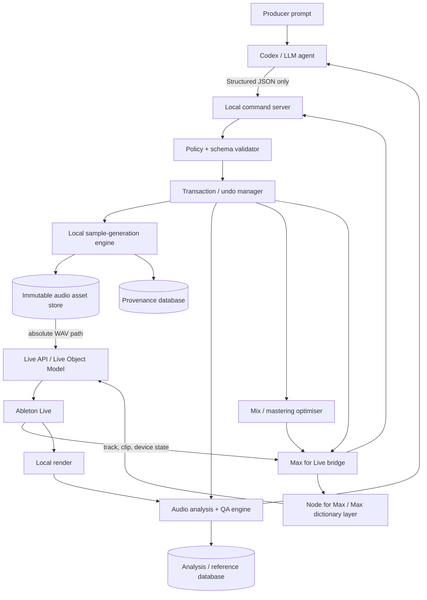
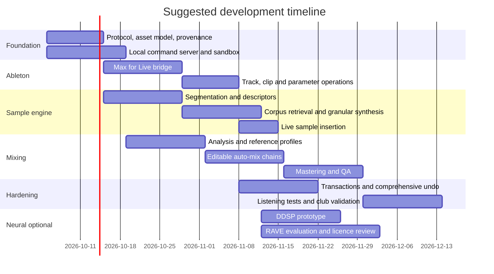

# Codex-Driven Local Audio Production for Ableton Live

## Executive summary

The strongest design is **not** to ask Codex to behave like a text-to-audio model. It should act as the **creative director, programmer and control plane** for a collection of local audio engines that it can inspect, configure and run. Codex can work against code and tools on the local machine, while OpenAI explicitly recommends sandboxing local execution, resource limits and command filtering. A Codex local workflow executes the actual commands and files on the user's machine; this should be distinguished from claiming that the Codex model itself is an offline local model. citeturn18search0turn18search1

For the stated goal—house, deep house and melodic techno that does **not** have the homogenised character often associated with prompt-to-music generation—the recommended hierarchy is:

| Priority | Objective | Recommended decision |
|---|---|---|
| **Highest** | Preserve a tangible human/sample origin | Generate primarily by slicing, analysing, recombining, granulating and transforming cleared real recordings rather than synthesising everything from latent noise. |
| **Highest** | Keep all audio generation local | Codex invokes local DSP/ML processes; raw source audio need not be sent to a cloud audio generator. |
| **Highest** | Make every change editable | Mixing/mastering should result in Live devices, automation and parameters wherever possible—not merely a baked AI waveform. |
| **High** | Strong provenance | Every generated sample gets parent-source hashes, recipe, random seed, model version and licence metadata. |
| **High** | Reliable Ableton integration | Use a Max for Live bridge and the Live Object Model; Live's API can create tracks and clips, query devices and set automatable parameters. citeturn18search2turn26search0turn26search1turn26search3 |
| **High** | Club optimisation without destroying dynamics | Reference-match the mix/master and enforce true-peak, spectral, phase and low-end QA rather than blindly chasing a fixed LUFS number. ITU-R BS.1770 defines loudness/true-peak measurement, but does not define a "club loudness". citeturn24search0turn24search8 |
| **Later** | Neural sample resynthesis | Add DDSP and, where licensing permits, RAVE after the deterministic corpus engine is working. DDSP provides differentiable synthesis/effects; RAVE was designed for high-quality 48 kHz neural audio and reports 20× real-time inference on a laptop CPU in the original paper. citeturn19search0turn19search1 |

**The key recommendation is therefore a hybrid system:** start with **FluCoMa-style corpus manipulation + granular/concatenative synthesis**, add sample-conditioned DSP and resynthesis, and only then add neural latent generation. FluCoMa was specifically developed for manipulating large sound corpora, including descriptor-based browsing, component replacement and hybridisation by concatenation, and it has a Max implementation under a permissive BSD-3-Clause licence. citeturn19search3turn19search7turn17search15turn17search22

That approach also has a provenance advantage. With concatenative/granular synthesis the system can say, for example, **"the attack came from source A frames 83,200–91,412 and the body from source B frames 210,112–267,994"**. Once source audio is learned into an autoencoder such as RAVE, exact per-sample attribution is generally no longer available; provenance becomes corpus/model-level rather than an exact reconstruction of the output's ancestry. This distinction should be reflected in the product design.

For mixing and mastering, I would **not train an end-to-end neural network to output "the mastered song" for the first version**. Codex should analyse the Set, infer roles such as kick/bass/percussion/music/FX, compare the track against several local reference masters, and then build an ordinary editable Live chain with EQ Eight, compressors, Glue Compressor, Utility, optional Roar/Multiband Dynamics and Limiter. Ableton documents EQ Eight as an eight-band parametric EQ, Glue Compressor as suitable for group/Main-bus cohesion, Multiband Dynamics as a mastering-oriented dynamics processor, Roar as a multistage saturation device, and Limiter as a mastering-quality processor. citeturn27search0turn27search5

The most useful MVP therefore looks like this:

**Prompt → Codex → structured JSON → local audio/sample engine → generated WAV → Live audio clip → editable Live mix chain → reference analysis → mastered club WAV → automated QA → human approval.**

No Serum is required. No external text-to-audio service is required. The "sound generator" is predominantly **your own or properly licensed real recordings transformed locally**.

Hardware was not specified. A CPU-only machine can comfortably support the deterministic MVP and audio analysis; RAVE's original paper demonstrates faster-than-real-time CPU inference, although training is a different matter. Current RAVE documentation lists minimum training GPU-memory figures ranging from 8 GB for v1/v2_small, 16 GB for v2, 18 GB for the discrete configuration and 32 GB for v3. citeturn19search0turn21view0

My engineering estimate is **six to nine engineer-weeks for a genuinely useful MVP** with one developer who already knows Python/TypeScript and Max, and around **twelve to eighteen engineer-weeks for a robust producer-facing beta** with provenance, reference matching, comprehensive tests and neural back-ends. Those are project estimates rather than vendor claims.

## Architecture and required components

The architecture should deliberately separate the **reasoning plane**, **audio plane** and **DAW-control plane**. This prevents an LLM error from becoming an unrestricted file-system or Live-control operation and makes individual audio engines replaceable.



Ableton officially exposes the Live Object Model through Max for Live. It includes Songs, tracks, scenes, clip slots, clips, devices, device parameters and mixer objects; operations include querying, setting properties, calling functions and observing properties. citeturn18search2turn17search28 Cycling '74's current LOM documentation, which presently refers to Live 12.4.5, exposes functions such as `Song.create_audio_track`, `Song.create_midi_track`, `ClipSlot.create_audio_clip(path)` and arrangement-track `create_audio_clip(file_path, position)`. This means the bridge can take a local WAV generated by the sample engine and place it directly in Session or Arrangement View without screen automation. citeturn26search0turn26search1turn26search2turn26search3

The bridge should use ordinary `live.path` / `live.object` / `live.observer` calls for state changes. Live API calls run on Live's main thread and are automatically deferred, so the system should **not** use the LOM as a high-rate message transport. For genuinely real-time parameter movement, `live.remote~` exists, but Cycling '74 explicitly notes that it does not create Live undo steps; that makes it appropriate for transient real-time control, but a poor canonical mechanism for state that needs transactional undo. citeturn17search19turn17search29

**Codex/LLM agent.** Codex should never manipulate raw Ableton state from natural language directly. Its job is to call high-level capabilities such as `generate_sample_from_sources`, `create_midi_clip`, `apply_mix_chain`, `analyse_mix`, `master_track` and `render_for_club`. OpenAI's guidance for local-shell agent execution explicitly recommends sandboxing/containerisation, resource limits, command filtering and logging. citeturn18search1turn18search5

A useful design consequence is that Codex can reason over **compact metadata** rather than needing the audio itself in model context:

```text
Track: Bass
Role confidence: bass 0.94
Peak: -7.2 dBFS
Integrated loudness: -20.1 LUFS
F0 median: 49 Hz
Energy 25-60 Hz: -14.8 dB rel.
Energy 60-120 Hz: -9.1 dB rel.
Stereo side/mid below 100 Hz: -17.4 dB
Masking conflict with Kick: 0.71
Current devices:
  Utility
  EQ Eight
  Compressor
```

Codex can use that to decide *what* should change, while deterministic local code performs the measurement and DSP.

**Local command server.** I recommend Python for the central daemon because most audio/ML tooling is already Python-accessible. FastAPI or an equivalent small HTTP/WebSocket stack is sufficient. Bind it to `127.0.0.1` by default, require a session token, expose an explicit action registry rather than arbitrary shell execution, and give audio workers their own process pool.

**Max for Live bridge.** A small `.amxd` device can relay Live state/actions to the server. `node.script` is particularly useful because Cycling '74 defines it as a mechanism for controlling a **local Node.js process from Max**, and its `max-api` module can translate Max dictionaries to JSON and maintain persistent state. citeturn18search3turn18search7

The bridge's API should be intentionally thin:

```text
get_live_version
get_song_state
get_tracks
get_track
get_clip
get_devices
get_device_parameters
create_audio_track
create_midi_track
create_audio_clip
create_midi_clip
set_notes
set_device_parameter
set_track_volume
set_track_pan
set_send
fire_clip
stop_clip
set_tempo
render_request
```

Current Live APIs expose device identities, automatable device parameters, latency and parameter values; the API can also create audio clips from absolute file paths, which is exactly what a local sample generator needs. citeturn26search0turn26search6turn26search8

**Audio asset store and provenance database.** Generated files should be immutable and content-addressed:

```text
project/
  sources/
  generated/
    sha256/
  renders/
  models/
  references/
  provenance.sqlite
  transactions.sqlite
  analysis.sqlite
```

Never overwrite a generated sample. A new process or model setting creates a new hash. Ableton clips then reference those immutable files.

**Audio analysis service.** Keep this outside Live so automated tests do not depend upon UI state. At minimum it should calculate loudness/true peak to ITU-R BS.1770, spectral-band statistics, crest factor, DC offset, clipping, low-band mid/side balance and mono-fold behaviour. ITU-R BS.1770-5 is the current in-force recommendation defining loudness and true-peak measurement; true peaks may occur between discrete samples, which is why an ordinary sample-peak check is not sufficient. citeturn24search0turn24search8

## Local sample generation from real sources

The sample engine should have **two modes of creativity** rather than treating every sound as an ML problem.

The first mode, which should ship first, is **traceable corpus synthesis**. Analyse every real recording into transient/steady-state regions, derive descriptors, search the corpus for compatible material, then compose a new waveform from those pieces. FluCoMa is unusually well matched to this because its project explicitly targets descriptor-based exploration, signal decomposition, machine learning and hybridisation by concatenation of sound corpora. citeturn19search3turn19search7

A practical one-shot pipeline would be:

```text
source recordings
    ↓
remove silence / reject corrupt files
    ↓
transient + novelty segmentation
    ↓
per-segment descriptors
    ↓
feature normalisation
    ↓
nearest-neighbour / stochastic retrieval
    ↓
attack selection + body selection + tail selection
    ↓
micro time/pitch/envelope transformation
    ↓
granular/crossfade reconstruction
    ↓
optional analogue-style DSP
    ↓
quality checks
    ↓
generated WAV + provenance graph
```

Descriptors worth storing include duration, RMS/loudness, zero-crossing rate, onset strength, spectral centroid, spectral roll-off, spectral flatness, MFCC-like timbre coefficients, estimated pitch where meaningful, transientness and decay characteristics. For drum synthesis, the retrieval distance can change with the segment: transient similarity is weighted heavily for the attack; spectral envelope and decay dominate the body/tail.

Feature normalisation matters when computing nearest-neighbour distance because features on numerically larger ranges would otherwise dominate the distance. FluCoMa's learning materials explicitly discuss scaling before similarity measurement, and its dataset/search tooling supports nearest-neighbour corpus lookup. citeturn16search0turn16search9

For example, a generated deep-house kick could be created from a cleared recording of an acoustic floor-tom attack, the low-frequency body of a recorded drum-machine kick, and a short room tail, with sub-cycle phase alignment and an envelope designed around the desired BPM. That still produces a new sample, but the timbral "matter" is substantially derived from actual recordings rather than a generic oscillator preset.

| Approach | What it does | Real-source fidelity | Provenance quality | Local compute | Best use here | Recommendation |
|---|---|---:|---:|---:|---|---|
| **Segment concatenation** | Reassembles analysed pieces of recordings | Very high | **Excellent**: exact source segments | Very low | Kicks, percussion, foley, impacts | **Ship first**. FluCoMa explicitly supports corpus hybridisation/concatenation. citeturn19search7 |
| **Granular resynthesis** | Overlap-adds short grains with local time/pitch/position variation | High | **Excellent–good** | Low | Hats, shakers, textures, atmospheres, vocal fragments | **Ship first** alongside concatenation. |
| **Descriptor morphing + DSP** | Picks related real samples then changes envelope, pitch, filter, saturation etc. | High | Excellent | Low | Club drums, bass hits, FX | **Ship first**. |
| **DDSP-style resynthesis** | Neural controls drive interpretable harmonic/noise/filter/reverb DSP | Medium–high for suitable signals | Corpus/model level | Moderate | Pitched bass, plucks, tonal resynthesis | **Second wave**. DDSP combines neural networks with differentiable synthesis/effects. citeturn19search1 |
| **RAVE autoencoder** | Encodes waveform into a learned latent space and decodes/transforms it | High when well trained | Corpus/model level | Low–moderate inference; substantial training | Percussion, texture, broadband timbre transfer | **Excellent technically, licence/hardware review required**. citeturn19search0turn21view0 |
| **NSynth** | WaveNet autoencoder embeds sounds for interpolation/resynthesis | Historically important | Corpus/model level | Heavy/legacy | Research/reference | **Do not choose for a new 2026 implementation**: the Magenta repository is archived and the original NSynth training workflow was extremely expensive. citeturn19search2turn19search6 |

**DDSP is especially interesting for bass/pluck material.** Its library contains differentiable synthesis, effects and losses, including harmonic synthesis, filtered noise and trainable reverb; the project is Apache-2.0 licensed. citeturn19search1 Rather than asking it to invent a finished kick or song, a sample-derived encoder can estimate time-varying pitch/loudness/timbre controls from one of your recordings and then resynthesise or morph them. This makes it much more controllable than an unrestricted text-to-audio generator.

**RAVE is the stronger neural candidate for broadband material.** The original IRCAM/Sorbonne paper introduced a waveform VAE capable of 48 kHz output and reported approximately 20× real-time synthesis on a standard laptop CPU. RAVE provides latent-space manipulation and timbre transfer rather than requiring the input to fit a harmonic oscillator model. citeturn19search0turn19search8 The current implementation can export a trained model as streaming TorchScript and the authors document loading those models in Max/Pure Data via `nn~`; `nn~` in turn interfaces TorchScript neural models with Max. citeturn20search1turn20search2

Its training requirements are important:

| Hardware available | Realistic sample-generation strategy |
|---|---|
| **Modern CPU, 16 GB RAM** | Corpus segmentation, granular/concatenative synthesis, DSP and analysis. RAVE inference may be viable, but do not plan on serious custom RAVE training. |
| **Modern CPU, 32 GB RAM** | Preferred CPU-only production box; enough headroom for Live, corpus indexes, parallel renders and offline analysis. |
| **NVIDIA GPU with ~8 GB VRAM** | Current RAVE docs list v1 and `v2_small` at an 8 GB minimum; `v2_small` is explicitly positioned for timbre transfer of stationary signals. citeturn21view0 |
| **NVIDIA GPU with ~16 GB VRAM** | RAVE v2 reaches its documented minimum; this is the sensible neural-development tier. citeturn21view0 |
| **~18–24 GB VRAM** | RAVE's discrete configuration clears its documented 18 GB minimum; considerably more experimentation becomes practical. citeturn21view0 |
| **32 GB+ VRAM** | RAVE v3 reaches its stated minimum; the repository describes v3 as adding a descriptive discriminator and Adaptive Instance Normalisation for style transfer. citeturn21view0 |
| **Apple Silicon** | Excellent for the deterministic/DSP engine and general local workflow. Test RAVE inference on the actual machine; `nn~` supports CPU operation, while RAVE documentation still describes its GPU option as experimental in the Max context. citeturn20search1turn20search2 |

The RAM recommendations above, other than the published RAVE VRAM minima, are engineering recommendations rather than model requirements.

There is also a significant **licensing reason not to make RAVE the foundation of the commercial MVP**. ACIDS/IRCAM projects and model releases have used Creative Commons non-commercial terms in this ecosystem; a current issue against `nn~` specifically flags its CC BY-NC 4.0 licence and notes that the same issue applies to RAVE. A commercial system should therefore treat RAVE/`nn~` licensing as a formal go/no-go review rather than assuming "source available" equals commercially unrestricted. citeturn28search1turn28search3

By comparison, FluCoMa's Max project is BSD-3-Clause and DDSP is Apache-2.0, making them much cleaner starting points for a product intended to release commercial music. citeturn17search15turn17search22turn19search1

A useful library stack is therefore:

| Library/model | Role | Licence/status | Recommendation |
|---|---|---|---|
| **FluCoMa / flucoma-max** | Segmentation, descriptors, dataset indexing, decomposition, corpus retrieval | BSD-3-Clause; open source. citeturn17search15turn17search22 | **Core MVP** |
| **Custom NumPy/SciPy audio engine** | Crossfades, envelopes, resampling, granular reconstruction, phase work | Depends on dependencies | **Core MVP** |
| **DDSP** | Neural/physical resynthesis and differentiable DSP | Apache-2.0. citeturn19search1 | **Preferred neural experiment** |
| **RAVE** | Broadband VAE resynthesis/timbre transfer | Check commercial licence before adoption; `nn~` ecosystem currently carries NC concerns. citeturn28search1turn28search3 | Research/optional |
| **nn~** | Host TorchScript models in Max | Useful for RAVE integration; licence needs review for commercial deployment. citeturn20search2turn28search1 | Optional |
| **NSynth** | Legacy autoencoder/interpolation | Magenta repository archived; historical training was computationally extreme. citeturn19search2turn19search6 | **Do not build around it** |
| **dasp-pytorch** | Differentiable EQ, dynamics, distortion, stereo and reverb | Apache-2.0; CPU/GPU. citeturn20search3turn20search4 | Strong for future auto-mix optimisation |
| **Spotify Pedalboard** | Offline DSP/plugin hosting from Python | GPLv3; supports VST3/AU and built-in audio effects. citeturn17search0 | Useful prototype/QA tool; assess GPL implications |
| **pyloudnorm / libebur128** | Local standards-based loudness measurement | Lightweight open-source metering implementations | Core QA candidate |
| **Essentia** | General music-information retrieval | AGPL-licensed open-source audio/MIR toolkit | Useful, but assess AGPL implications for a closed commercial product |

A particularly good creative rule is to expose an **"AI amount"** or, preferably, **"source distance"** control. At `0`, output stays close to selected source segments. At increasing values the engine can allow progressively farther nearest neighbours, stronger grain rearrangement and ultimately latent resynthesis. This makes "don't make it sound AI" an explicit product constraint rather than just prompt wording.

## Automated mixing, mastering and club targets

The system should separate **mix decisions** from **mastering decisions**. Trying to correct a kick/bass arrangement conflict with a final limiter is exactly the kind of automation that produces flat, synthetic-sounding masters.

The mix analyser should first infer structural roles:

```text
Kick
Sub/bass
Percussion
Drum tops
Lead/pluck
Pads/harmony
Vocals
FX/atmosphere
Returns
Main
```

It then builds a masking/conflict graph. If the kick and bass overlap strongly in the same sub region, the agent should decide which is intended to be the lowest-frequency anchor, then choose among arrangement edits, envelope shortening, EQ, phase/timing changes or sidechain dynamics rather than automatically carving an arbitrary static EQ hole.

The automated loop should be:

```text
inspect Live Set
  → render/analyse stems
  → classify track roles
  → analyse reference tracks
  → establish reference-relative targets
  → propose gain/EQ/dynamics changes
  → create editable Live chain
  → render preview
  → objective QA
  → level-matched reference comparison
  → iterate within limits
  → human approval
```

The **reference-track system is more important than a universal genre preset**. The producer should keep perhaps three to five lawfully obtained WAV references for each target aesthetic: deep house, house, melodic techno, and perhaps separate "warm", "dark", "big-room" and "minimal" profiles. The engine analyses them locally and derives median spectral, loudness and dynamic descriptors. This is more robust than trying to encode the entire genre into one master curve.

There is no authoritative standards body prescribing a particular LUFS value for a house or techno club master. ITU-R BS.1770 defines how loudness and true peak are measured; EBU R128's −23 LUFS target is explicitly a broadcast normalisation recommendation, not a dance-music mastering target. AES streaming recommendations similarly focus on distribution loudness and avoiding unnecessary degradation from excessive limiting. citeturn24search0turn24search1turn24search2turn24search10

Accordingly, the following should be treated as **initial engineering profiles for the agent, not standards**:

| Profile | Proposed starting LUFS-I window | True-peak ceiling | System behaviour |
|---|---:|---:|---|
| **Deep house** | **−10 to −8 LUFS-I** | **≤ −1.0 dBTP** | Bias towards punch, depth, longer decays and less continuous limiting. |
| **House** | **−9 to −7 LUFS-I** | **≤ −1.0 dBTP** | Moderate/high density while preserving kick/transient definition. |
| **Melodic techno** | **−9 to −6.5 LUFS-I** | **≤ −1.0 dBTP** | Permit more density, but reject audible pumping or flattened drops. |
| **Reference-matched** | Median reference LUFS ± roughly 1 LU | **≤ −1.0 dBTP by default** | Preferred mode. Target the actual selected references rather than the genre label. |

The −1 dBTP ceiling is a conservative default rather than a club loudness rule. EBU R128 specifies no more than −1 dBTP for its production context, and ITU-R BS.1770 explains why true peaks can exceed sample peaks. citeturn24search0turn24search5 A `club_only_aggressive` profile could permit a different ceiling after deliberate testing, but the default should remain distribution-safe.

The automation should also **refuse to optimise only for integrated LUFS**. A loud master can score well on LUFS while having poor transient definition, excessive high-frequency distortion or serious kick/sub cancellation. The AES's streaming guidance expressly warns against excessive peak limiting that degrades audio quality. citeturn24search2turn24search10

A useful objective QA profile is:

| Measurement | Default engineering gate |
|---|---|
| Integrated loudness | Inside chosen genre/reference window |
| True peak | ≤ −1.0 dBTP |
| Digital clipping | Zero unclipped over-range samples in final PCM render |
| Limiter gain reduction | Warning if sustained reduction regularly exceeds roughly 4 dB; hard review before pushing towards 6 dB |
| Spectral balance | Median deviation from selected references should generally remain within about ±2 dB in broad bands from ~40 Hz–16 kHz unless deliberately overridden |
| Subsonics | Flag material with disproportionate energy below ~25–30 Hz |
| Low-frequency stereo | Flag strong Side energy below ~100–120 Hz and test mono fold-down |
| Mono compatibility | Flag significant low-band loss/cancellation on L+R fold-down |
| DC offset | Near zero; failure if material contains a meaningful DC component |
| Stem reconstruction | Sum of exported stems should reproduce the expected main mix within the defined routing/tolerance model |
| Silence/tails | No unintended truncation; no unexpectedly long reverb tail |
| File integrity | Expected channels, bit depth, sample rate, duration and metadata |

The limiter figures are deliberately conservative. Ableton itself notes that roughly 6 dB or more of limiter gain reduction may produce the wanted loudness but can significantly alter the sound and destroy dynamic structure. citeturn27search5 The agent should therefore respond to excessive limiting by reopening the **mix**: lower conflicting buses, tame isolated peaks, change low-frequency envelopes or introduce controlled saturation/soft clipping earlier.

For club low end, the key is not "everything below 120 Hz must always be mono". It is **predictable summation and phase behaviour**. Bass management systems commonly route low-frequency content to subwoofers, making phase and crossover alignment particularly important. The QA engine should therefore inspect Mid/Side energy and the difference between stereo and mono-folded low bands rather than imposing a naïve stereo-width rule.

A practical house/deep-house mix recipe is:

| Area | Initial automated chain | What Codex is solving |
|---|---|---|
| **Kick** | Utility/gain → corrective EQ → optional subtle saturation/clip | Remove unusable subsonics, control resonances, establish fundamental/attack relationship |
| **Bass** | EQ → optional saturation → kick-keyed Compressor → Utility | Keep the low foundation consistent and create temporal room for the kick |
| **Drum bus** | EQ Eight → optional Roar/Saturator → Glue Compressor | Cohesion and peak management without erasing transient hierarchy |
| **Percussion/tops** | EQ → transient-aware compression only when required → width | Prevent brittle high-frequency buildup and maintain motion |
| **Music bus** | Broad corrective EQ → optional compression → width management | Keep pads/plucks out of the sub region and preserve midrange depth |
| **FX/returns** | EQ before/after reverb or delay → level automation | Prevent reverb lows and high-frequency tails accumulating into the master |
| **Main premaster** | Utility → broad EQ → optional Glue → optional very light saturation | Macro tonal/dynamic shaping |
| **Master** | Corrective EQ if required → optional gentle glue/saturation → conditional multiband → Limiter → external QA meter | Reach reference density without fixing arrangement problems at the limiter |

All of those can be implemented using native Live devices. EQ Eight supports stereo, L/R and M/S processing; Glue Compressor provides external sidechain facilities; Multiband Dynamics offers three-band dynamics; Roar provides saturation with serial, parallel, multiband and mid/side possibilities; Limiter is intended for final peak control. citeturn27search0turn27search1

The mix engine should avoid adding Multiband Dynamics simply because a preset says "mastering". It should only instantiate it when analysis identifies a time-varying band-specific problem that a broad EQ cannot solve.

| Tool family | Advantages | Limitations | Role |
|---|---|---|---|
| **Native Live devices** | Already editable in the Set; parameters exposed through Live; no third-party dependency | Parameter optimisation is effectively black-box from Python | **Default production path**. citeturn26search6turn26search8turn27search0 |
| **Custom Max for Live analyser/controller** | Exact integration with Live; can show agent decisions and confidence | Requires Max development | **Strongly recommended** |
| **FluCoMa in Max** | Corpus analysis and ML directly in the Max ecosystem | Not a turnkey mastering system | Sample engine + analysis. citeturn17search22turn19search7 |
| **dasp-pytorch** | Differentiable EQ, compression, distortion, stereo and reverb on CPU/GPU; Apache-2.0 | Effects will not sound numerically identical to every Live device | Offline optimisation/surrogate mastering research. citeturn20search3 |
| **Pedalboard** | Offline Python audio effects and VST3/AU hosting | GPLv3 implications; not your canonical Ableton state | Rendering/tests/prototyping. citeturn17search0 |
| **Standards-based loudness libraries** | Deterministic, testable measurements outside the DAW | Measurement only | **Mandatory QA layer** |

An interesting later-stage option is to optimise a differentiable chain in `dasp-pytorch` against a spectral/dynamic/reference loss, then use the resulting values as a **proposal** for analogous Live settings. Its project explicitly supports differentiable dynamics, EQ, distortion, stereo processing and reverb and is Apache-2.0 licensed. citeturn20search3turn20search4 This would let the ML component solve *parameters* while Live remains the editable source of truth.

## Command protocol and Ableton integration

The command protocol should be a versioned JSON RPC-style envelope. The language model should never generate direct `live.object` instructions as its primary interface; those belong in the M4L adapter.

Every mutating request should contain a unique request identifier, optimistic state version, dry-run/preview support, deterministic random seed where relevant and a request to create an undo transaction. This mirrors OpenAI's recommendation to put strict control around local execution rather than forwarding unrestricted model-generated shell activity. citeturn18search1

A canonical envelope can look like:

```json
{
  "protocol": "codex-live/1.0",
  "request_id": "req_01K6XCBJZT7M1Y1A",
  "project_id": "project_nightdrive",
  "action": "action_name",
  "expected_state_version": 42,
  "mode": "commit",
  "seed": 172904,
  "params": {},
  "safety": {
    "create_undo_point": true,
    "max_runtime_seconds": 120,
    "max_generated_files": 16,
    "allow_network": false
  }
}
```

**Composition action.** A composition command should describe musical intent in data rather than asking the Max bridge to interpret prose:

```json
{
  "protocol": "codex-live/1.0",
  "request_id": "req_compose_001",
  "project_id": "project_nightdrive",
  "action": "create_midi_clip",
  "expected_state_version": 42,
  "mode": "commit",
  "seed": 84721,
  "params": {
    "track": {
      "name": "Bass",
      "create_if_missing": true
    },
    "location": {
      "view": "arrangement",
      "start_beat": 0,
      "length_beats": 32
    },
    "musical_context": {
      "tempo_bpm": 124,
      "key": "F minor",
      "style": "deep_house",
      "role": "sub_bass"
    },
    "notes": [
      {
        "pitch": 41,
        "start": 0.75,
        "duration": 0.22,
        "velocity": 104
      },
      {
        "pitch": 41,
        "start": 1.75,
        "duration": 0.22,
        "velocity": 96
      },
      {
        "pitch": 44,
        "start": 2.75,
        "duration": 0.18,
        "velocity": 91
      }
    ]
  },
  "safety": {
    "create_undo_point": true,
    "allow_network": false
  }
}
```

Live's current object model exposes track and MIDI-clip creation, so the M4L adapter can translate this into supported LOM operations rather than resorting to keyboard/mouse automation. citeturn26search1turn26search3

**`generate_sample_from_sources`.** This should be the flagship command:

```json
{
  "protocol": "codex-live/1.0",
  "request_id": "req_sample_018",
  "project_id": "project_nightdrive",
  "action": "generate_sample_from_sources",
  "expected_state_version": 43,
  "mode": "commit",
  "seed": 9928171,
  "params": {
    "sources": [
      {
        "source_id": "src_tom_room_0042",
        "role": "attack",
        "max_contribution_ms": 80
      },
      {
        "source_id": "src_kick_analogue_0117",
        "role": "body"
      },
      {
        "source_id": "src_room_tail_0029",
        "role": "tail",
        "max_contribution_ms": 180
      }
    ],
    "method": "concat_granular",
    "target": {
      "type": "kick",
      "genre": "deep_house",
      "duration_ms": 510,
      "fundamental_hz": 49,
      "transient_character": 0.72,
      "decay_character": 0.46,
      "source_distance": 0.32
    },
    "processing": {
      "phase_align_segments": true,
      "crossfade_ms": 4,
      "remove_dc": true,
      "normalise_mode": "peak_safe",
      "peak_dbfs": -3
    },
    "variations": 6,
    "output": {
      "sample_rate": 48000,
      "bit_depth": 24,
      "channels": 1,
      "directory": "generated/kicks"
    },
    "provenance": {
      "require_derivative_rights": true,
      "require_ml_training_rights": false,
      "reject_unknown_licence": true,
      "record_source_segments": true
    },
    "ableton": {
      "create_audio_track_if_needed": true,
      "target_track": "Generated Kicks",
      "insert_best_variation_in_session_slot": 0
    }
  },
  "safety": {
    "create_undo_point": true,
    "max_runtime_seconds": 60,
    "max_generated_files": 6,
    "allow_network": false
  }
}
```

Changing `method` to `"rave_reconstruction"` or `"ddsp_resynthesis"` should automatically change the provenance test to `require_ml_training_rights: true`. This matters because licences may permit using a sample in a composition without granting permission to use it as model-training material.

The resulting WAV can then be inserted into Live using `ClipSlot.create_audio_clip` or the arrangement `Track.create_audio_clip`, both of which accept local audio-file paths. citeturn26search0turn26search1

**`apply_mix_chain`.**

```json
{
  "protocol": "codex-live/1.0",
  "request_id": "req_mix_021",
  "project_id": "project_nightdrive",
  "action": "apply_mix_chain",
  "expected_state_version": 44,
  "mode": "preview_then_commit",
  "params": {
    "target": {
      "type": "track",
      "name": "Bass"
    },
    "analysis_snapshot": "analysis_8ab47",
    "intent": {
      "role": "sub_bass",
      "preserve_transients": true,
      "priority": "kick_bass_separation"
    },
    "chain": [
      {
        "device": "EQ Eight",
        "purpose": "remove_subsonic_and_control_masking",
        "parameters": {
          "band_1_type": "high_pass",
          "band_1_frequency_hz": 27,
          "band_3_frequency_hz": 74,
          "band_3_gain_db": -1.7,
          "band_3_q": 1.1
        }
      },
      {
        "device": "Compressor",
        "purpose": "kick_sidechain",
        "sidechain_track": "Kick",
        "parameters": {
          "ratio": 3.0,
          "attack_ms": 2.5,
          "release_ms": 105,
          "target_peak_gain_reduction_db": 3.0
        }
      },
      {
        "device": "Utility",
        "purpose": "low_frequency_width_control",
        "parameters": {
          "width_percent": 92
        }
      }
    ],
    "validation": {
      "rerender_seconds": 32,
      "compare_against_reference_profile": "deep_house_warm_v3",
      "reject_if_true_peak_increase_db_gt": 3
    }
  },
  "safety": {
    "create_undo_point": true,
    "allow_network": false
  }
}
```

The precise Live parameter values must be resolved through the device's exposed `DeviceParameter` objects rather than assuming that UI labels always correspond to fixed indices. Live exposes the device's parameter collection and whether a parameter is currently enabled for modification. citeturn26search6turn26search8

**`master_track`.**

```json
{
  "protocol": "codex-live/1.0",
  "request_id": "req_master_009",
  "project_id": "project_nightdrive",
  "action": "master_track",
  "expected_state_version": 45,
  "mode": "preview_then_commit",
  "params": {
    "input": {
      "source": "live_main",
      "analysis_snapshot": "analysis_premaster_113"
    },
    "profile": "melodic_techno_club",
    "references": [
      "ref_mt_001",
      "ref_mt_004",
      "ref_mt_009"
    ],
    "targets": {
      "integrated_lufs": {
        "min": -9.0,
        "max": -6.5,
        "preference": "match_reference_median"
      },
      "max_true_peak_dbtp": -1.0,
      "preserve_transients": true,
      "max_sustained_limiter_reduction_db": 4.0,
      "spectral_match": {
        "enabled": true,
        "max_broadband_deviation_db": 2.0
      },
      "low_frequency": {
        "subsonic_warning_below_hz": 27,
        "mono_compatibility_check_below_hz": 110
      }
    },
    "allowed_processors": [
      "EQ Eight",
      "Glue Compressor",
      "Roar",
      "Multiband Dynamics",
      "Limiter",
      "Utility"
    ],
    "rules": {
      "multiband_only_if_problem_detected": true,
      "prefer_mix_revision_over_heavy_limiting": true,
      "no_destructive_bounce": true
    }
  },
  "safety": {
    "create_undo_point": true,
    "allow_network": false
  }
}
```

**`render_for_club`.** The 48 kHz / 24-bit settings below are an example profile, not a universal club standard; the system should preserve the project rate or conform to the actual playback/label specification when one is supplied.

```json
{
  "protocol": "codex-live/1.0",
  "request_id": "req_render_037",
  "project_id": "project_nightdrive",
  "action": "render_for_club",
  "expected_state_version": 46,
  "mode": "commit",
  "params": {
    "source": "main",
    "range": "full_arrangement",
    "format": {
      "container": "wav",
      "codec": "pcm",
      "sample_rate": 48000,
      "bit_depth": 24,
      "channels": 2,
      "normalise": false
    },
    "post_render_qa": {
      "measure_bs1770": true,
      "max_true_peak_dbtp": -1.0,
      "detect_clipped_samples": true,
      "detect_dc": true,
      "spectral_analysis": true,
      "mono_fold_check": true,
      "low_band_side_check": true,
      "compare_references": true
    },
    "artifacts": {
      "write_analysis_json": true,
      "write_provenance_manifest": true,
      "write_mastering_report": true
    }
  },
  "safety": {
    "create_undo_point": false,
    "allow_network": false
  }
}
```

**`undo`.**

```json
{
  "protocol": "codex-live/1.0",
  "request_id": "req_undo_006",
  "project_id": "project_nightdrive",
  "action": "undo",
  "expected_state_version": 47,
  "mode": "commit",
  "params": {
    "transaction_id": "txn_master_009",
    "strategy": "restore_exact_pre_transaction_state",
    "generated_asset_policy": "unlink_if_unreferenced"
  },
  "safety": {
    "allow_network": false
  }
}
```

The response envelope should return enough evidence for Codex to reason about the result:

```json
{
  "request_id": "req_master_009",
  "status": "ok",
  "transaction_id": "txn_master_009",
  "previous_state_version": 45,
  "state_version": 46,
  "artifacts": [
    {
      "type": "analysis",
      "id": "analysis_master_114"
    }
  ],
  "metrics": {
    "integrated_lufs": -7.8,
    "max_true_peak_dbtp": -1.02,
    "loudness_range_lu": 4.3,
    "max_limiter_reduction_db": 3.4
  },
  "warnings": [
    {
      "code": "LOW_BAND_STEREO",
      "severity": "info",
      "message": "Side energy at 85-105 Hz is above the project reference median."
    }
  ]
}
```

One very important protocol rule is **idempotency**. Sending `req_master_009` twice must not instantiate two mastering chains. The server should return the stored result for a previously committed request ID. `expected_state_version` should also reject an action if the human has edited Live since Codex inspected it, preventing an agent from applying a stale decision over newer work.

## Provenance, licensing, safety and testing

The source-sample policy is arguably as important as the synthesis algorithm. A producer may have permission to put a commercial sample in a song while **not** having permission to use it to train a generative model.

Splice is a particularly clear example. Its current Terms prohibit using Splice Sounds as source or training material for generative or other AI models. This means an owned/downloaded Splice sample **must not** simply be added to a RAVE/DDSP training corpus because it is royalty-free for normal production purposes. citeturn23search4

Ableton's own EULA similarly distinguishes using included materials in original compositions from creating new sound packs/sample libraries. It allows materials to contribute to original compositions subject to its conditions, while prohibiting reformatting, filtering, re-synthesising or otherwise altering those materials for standalone commercial sampling products or sample libraries without permission. citeturn23search1 That makes Live's factory/Packs content unsuitable as the automatic default corpus for a commercial "new sample generator" unless the relevant rights are specifically cleared.

For a serious commercial system, the preferred source hierarchy is therefore:

**own field/studio recordings → commissioned recordings with explicit derivative/ML terms → CC0/public-domain material with provenance → CC BY where obligations are manageable → separately negotiated commercial libraries expressly allowing ML/resynthesis.**

Creative Commons confirms that CC BY permits adaptation and commercial reuse with attribution; CC BY-SA adds share-alike; NC licences restrict use to non-commercial purposes; and ND licences prohibit sharing adaptations. CC0 places material into the public-domain framework without those conditions. citeturn23search2turn23search6

Freesound can be useful, but its own FAQ stresses that sounds carry different Creative Commons licences, some prohibit commercial use, many require attribution, and user uploads may occasionally contain material the uploader did not actually have the right to upload. A `freesound` origin field therefore cannot itself count as clearance. citeturn23search3

The provenance database should record, for every source:

```json
{
  "source_id": "src_0000042",
  "sha256": "9dba...",
  "original_filename": "warehouse_tom_03.wav",
  "creator": "User",
  "acquisition_type": "own_recording",
  "acquisition_date": "2026-10-02",
  "source_url": null,
  "licence_id": "OWNED",
  "licence_snapshot_hash": "lic_79a...",
  "evidence_path": "rights/src_0000042/",
  "rights": {
    "commercial_music": true,
    "derivative_audio": true,
    "ml_training": true,
    "generated_sample_redistribution": true
  },
  "attribution_required": false,
  "performer_release": "not_applicable"
}
```

A generated output needs a second record:

```json
{
  "asset_id": "gen_kick_b42f",
  "sha256": "b42f...",
  "generator": "concat_granular/1.3.0",
  "seed": 9928171,
  "parents": [
    {
      "source_id": "src_tom_room_0042",
      "start_frame": 83200,
      "end_frame": 91412,
      "role": "attack"
    },
    {
      "source_id": "src_kick_analogue_0117",
      "start_frame": 210112,
      "end_frame": 267994,
      "role": "body"
    }
  ],
  "processing_recipe_hash": "recipe_8c7...",
  "model_hash": null,
  "created_at": "2026-10-02T14:21:16Z",
  "approved_for_commercial_release": true
}
```

For a RAVE or DDSP output, `parents` becomes a **training-corpus manifest plus conditioning inputs/model hash** rather than pretending that a particular output sample maps exactly to particular training frames.

This is not a substitute for legal advice; sample-library and model licences can change, and commercial release should always use the terms that applied to the acquired material and actual intended exploitation.

**Undo and safety should operate independently of Live's own undo history.** This matters because some real-time Live mechanisms do not create undo entries; Cycling '74 specifically documents this behaviour for `live.remote~`. citeturn17search19 The application's transaction database should therefore capture the before-state of every parameter or object the agent changes.

A transaction record should hold:

```text
transaction_id
request_id
timestamp
pre_state_hash
post_state_hash
expected_live_state_version
objects_created
objects_deleted
parameters_before
parameters_after
files_created
files_referenced
random_seed
command_payload_hash
inverse_operations
```

High-impact transformations should default to **non-destructive topology**: duplicate a clip, create a new track/chain, or create a new generated asset rather than replacing the producer's only copy. `undo` restores parameter values and topology, and generated files are merely unlinked; immutable audio is only garbage-collected after verifying that no Live Set or transaction references it.

Codex's operating permissions should be split into `inspect`, `preview`, `apply`, `render` and `destructive_admin`. A normal music-making session should not expose `destructive_admin`. OpenAI's local-shell guidance recommends precisely this style of sandboxing, resource limits and high-risk-command scrutiny. citeturn18search1turn18search5

Testing needs four layers.

| Layer | Test | Acceptance idea |
|---|---|---|
| **Protocol** | JSON Schema, invalid field handling, duplicate request ID, stale version | Invalid requests never reach Max; replays are idempotent |
| **DSP** | Impulse, sine, noise, silence and known WAV fixtures | Deterministic output within numeric tolerance; no NaN/Inf/DC surprises |
| **Live integration** | Create/delete track, insert audio, create MIDI, set parameters, reload Set | State returned by Live equals expected committed state |
| **Audio/production** | Loudness, TP, spectral, phase, stem sum, references, listening | Objective gates pass and human blind comparison does not reveal systematic degradation |

For generated samples, automated QA should catch empty files, clipped output, unusually high DC, broken transients, obvious discontinuities/clicks, pitch mistakes where pitch was specified and suspicious near-duplicates. A corpus generator should additionally calculate similarity against each source; if output is nearly identical to a single parent, it can reject it as insufficiently transformed where the intended licence/workflow requires meaningful transformation.

For mixing/mastering, each candidate revision should produce an analysis JSON that includes at least integrated and short-term loudness, true peak, loudness range, spectral-band energy, peak/RMS or crest statistics, low-band Mid/Side ratio and mono-fold delta. Loudness and true-peak measurements should follow ITU-R BS.1770 rather than an ad-hoc meter. citeturn24search0turn24search8

**Reference comparisons must be level-matched.** Otherwise a louder candidate tends to confound an evaluation of tonal balance and quality. The system should temporarily normalise candidate and reference to the same comparison loudness for A/B listening, even though their release masters remain at their original levels.

Club testing should use versioned renders and a fixed test sheet. At minimum, audition the build on accurate nearfields, headphones, a small consumer speaker, mono, a sub-equipped monitoring system and eventually a known club PA. Record observations for kick/sub relationship, perceived impact, vocal/lead presence, harshness, stereo stability at different positions, limiter pumping and whether the breakdown/drop contrast survives a large system.

The actual club PA test should not just ask **"is it loud enough?"**. A useful form is:

| Question | Score |
|---|---:|
| Kick remains distinct from bass | 1–5 |
| Sub is powerful without hanging over the next kick | 1–5 |
| Drop feels materially bigger than breakdown | 1–5 |
| Hats/leads remain comfortable at realistic playback level | 1–5 |
| Stereo elements survive central/side listening positions | 1–5 |
| Mono fold does not destroy groove or bass | 1–5 |
| Master sounds as finished as the reference set when level-matched | 1–5 |

The system should keep those human results against the master transaction ID. Over time, the user's own approved/rejected masters become more useful than generic genre assumptions: Codex can learn rules such as *"this producer consistently rejects masters where melodic-techno limiter reduction exceeds 3 dB during the drop"* without needing to train a new waveform-generation model.

## Implementation roadmap, resources and key references

The recommended build sequence deliberately delays custom neural synthesis. A deterministic corpus engine will already deliver the core artistic benefit—new sounds made from genuine recordings—while being dramatically easier to debug, clear and reproduce. RAVE and DDSP then become optional **new timbral engines behind the same `generate_sample_from_sources` protocol**, rather than architectural dependencies.



The dates in that diagram are illustrative rather than commitments; sequencing is more important than calendar date.

| Phase | Deliverable | Estimated engineering effort |
|---|---|---:|
| Foundation | JSON schemas, local server, asset/provenance DB, permissions | 1–2 weeks |
| Ableton bridge | Read Live state; create tracks/clips; edit parameters | 2–3 weeks |
| Real-sample generator | Segmentation, descriptors, search, concatenation/granular engine | 2–3 weeks |
| Mix analyser | Stem/reference measurements and role classification | 1–2 weeks |
| Auto-mix | Native Live chain construction and preview loop | 2–3 weeks |
| Mastering/QA | Reference matching, BS.1770 measurements, render checks | 2–3 weeks |
| Production hardening | Undo, state conflicts, crash recovery, test fixtures | 2–3 weeks |
| Neural extension | DDSP and/or RAVE prototype | 2–6+ additional weeks |

Work can overlap, which is why the proposed **MVP is roughly six to nine engineer-weeks rather than the sum of every row**. A robust beta with all hardening and club testing is more realistically in the twelve-to-eighteen engineer-week range. Custom neural training can expand considerably depending on corpus size, hardware and how much model tuning is needed.

For staffing, the efficient combination is **one audio-capable software engineer** comfortable with Python, TypeScript/JavaScript and Max, plus a producer/mix engineer for perhaps one or two focused evaluation sessions per week. A dedicated ML engineer is only necessary when custom neural training moves beyond experimentation.

The recommended MVP acceptance test is deliberately concrete:

> From a natural-language prompt, Codex selects only cleared real source recordings, generates six novel percussion/kick variants locally, records exact provenance, places the selected sample in Ableton, creates or edits the relevant MIDI/audio clips, builds an editable kick/bass mix chain, creates an editable Main mastering chain, renders a 24-bit WAV, returns LUFS/true-peak/spectral/mono QA results, and can reverse every DAW modification through one transaction-level `undo` without destroying the source or generated audio.

That MVP proves every important architectural assumption while avoiding the highest-risk piece—custom neural generation.

The recommended development order is consequently:

**FluCoMa/corpus DSP → Ableton bridge → provenance → editable auto-mix → mastering/QA → DDSP → optional RAVE.**

That order is technically conservative but artistically aligned with the original requirement. The system will begin by treating **real recorded audio as the raw material**, with Codex deciding how to search, combine and process it. Neural resynthesis is then available when it genuinely produces a useful sound, instead of becoming the default aesthetic.

The principal primary references for implementation are:

| Reference | Why it matters |
|---|---|
| [OpenAI — Using Codex with your ChatGPT plan](https://help.openai.com/en/articles/11369540-using-codex-with-your-chatgpt-plan) | Current Codex local/cloud workflow distinction. citeturn18search0 |
| [OpenAI — Local shell](https://developers.openai.com/api/docs/guides/tools-local-shell) | Local execution model and sandbox/security guidance. citeturn18search5 |
| [Ableton — Max for Live manual](https://www.ableton.com/en/live-manual/12/max-for-live/) | Official Max for Live integration. citeturn18search6 |
| [Cycling '74 — Live Object Model](https://docs.cycling74.com/apiref/lom/) | Exact programmable Live classes/functions. citeturn26search2 |
| [Cycling '74 — Node for Max `node.script`](https://docs.cycling74.com/reference/node.script) | Local Node/JSON bridge from Max. citeturn18search3 |
| [FluCoMa](https://www.flucoma.org/) | Open corpus manipulation, decomposition and machine-learning toolkit. citeturn19search3turn19search7 |
| [RAVE paper — Caillon & Esling](https://arxiv.org/abs/2111.05011) | Original high-quality real-time neural-audio autoencoder paper. citeturn19search0 |
| [RAVE implementation](https://github.com/acids-ircam/RAVE) | Current training/export configurations and hardware minima. citeturn21view0 |
| [DDSP repository](https://github.com/magenta/ddsp) | Apache-licensed differentiable DSP/resynthesis library. citeturn19search1 |
| [dasp-pytorch](https://github.com/csteinmetz1/dasp-pytorch) | Differentiable mixing/mastering DSP building blocks. citeturn20search3 |
| [ITU-R BS.1770-5](https://www.itu.int/rec/R-REC-BS.1770-5-202311-I/en) | Authoritative loudness and true-peak algorithms. citeturn24search8 |
| [EBU R128](https://tech.ebu.ch/publications/r128) | Loudness/true-peak terminology and a useful reminder that distribution targets are context-specific. citeturn24search1 |
| [Creative Commons licence guide](https://creativecommons.org/share-your-work/cclicenses/) | Distinguishes BY, SA, NC, ND and CC0 rights. citeturn23search6 |
| [Splice Terms](https://splice.com/terms) | Critical restriction against using downloaded Sounds as AI training/source material. citeturn23search4 |
| [Ableton EULA](https://www.ableton.com/en/eula/) | Restrictions on repackaging/re-synthesising Ableton materials into standalone sample products. citeturn23search1 |

The resulting system is best thought of not as an "AI music generator", but as a **Codex-operated production environment**: the musical raw material remains recordings and samples; generative algorithms create variations and hybrids from them; Live remains the editable DAW; conventional DSP remains visible and adjustable; and every automated decision—from a four-millisecond grain to the final limiter setting—can be inspected, measured, versioned and undone.