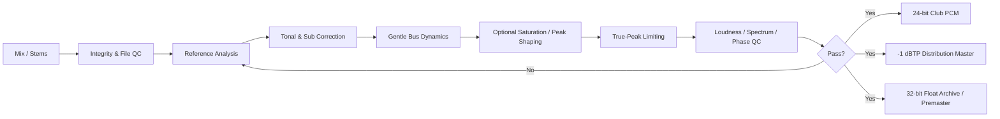
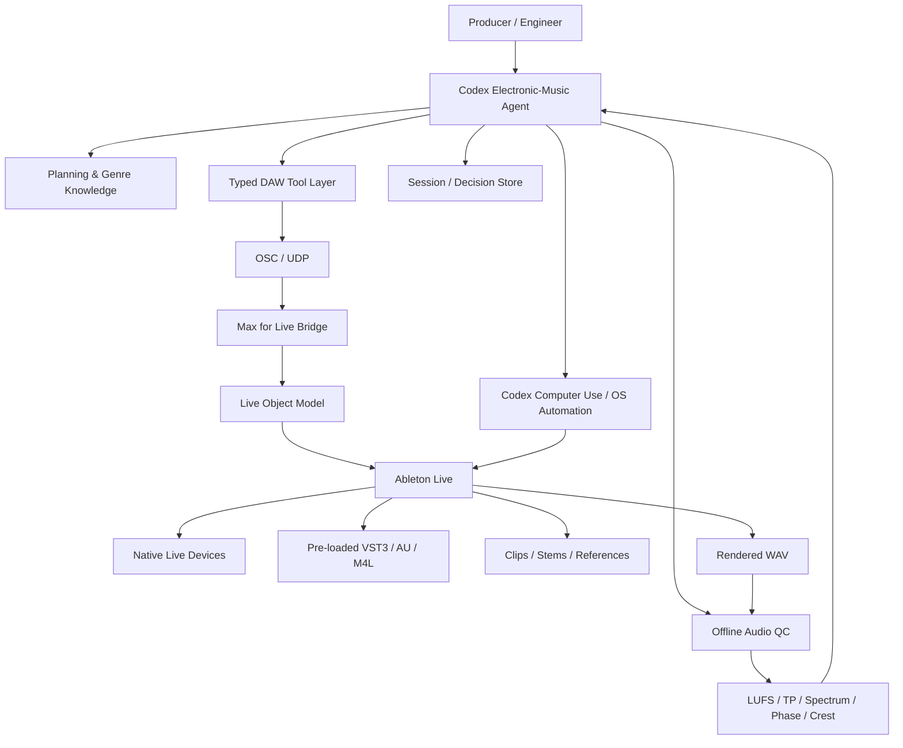
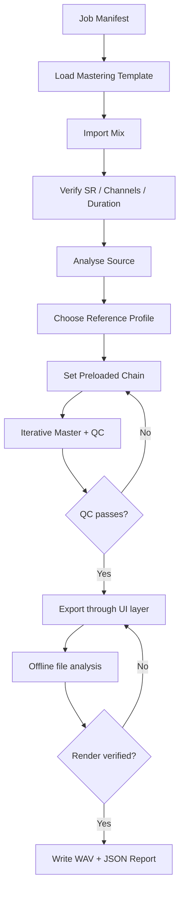

# Designing a Codex Agent for Expert Electronic-Music Mixing and Mastering in Ableton Live

## Executive summary

A capable Codex mixing/mastering agent for Ableton Live should **not** be designed as a model that simply moves knobs until a requested LUFS number is reached. It should be built as a measurement-driven audio-engineering system in which Codex performs diagnosis, planning, controlled parameter changes, A/B comparison, rendering, objective quality control and—at defined checkpoints—asks for or respects human artistic judgement. OpenAI's current Agents SDK is well suited to this orchestration model because it supports typed tools, persistent run state, MCP integrations, guardrails, human review, tracing and evaluation; current Codex also has computer-use capability for applications that do not expose a complete API. citeturn21search1turn21search2turn21search5

For Ableton Live itself, the best control architecture is **Max for Live + the Live Object Model as the deterministic control plane**, with OSC or UDP between the agent process and a Max for Live bridge. Max for Live can query, observe and modify a Live Set through `live.path`, `live.object`, `live.observer`, `live.remote~`, or JavaScript's Live API object. Ableton's current Live Object Model documentation, referring to Live 12.3.5 at the time of this research, exposes tracks, mixer parameters, clips, devices, plug-ins, racks, transport and many other objects. citeturn17search2turn17search4

There is, however, an important automation boundary. Since Live 12.3, the LOM can programmatically insert **native Live devices**, but Cycling '74 explicitly states that `insert_device` currently does **not** insert Max for Live devices or third-party plug-ins. The documented `Song` interface also provides no public save, render or Export Audio function. The robust design is therefore **template-first**: third-party plug-ins and Max devices are loaded in advance, with important controls exposed as rack macros or plug-in parameters; the agent manipulates those existing devices through the API. File export, loading arbitrary third-party plug-ins, saving and a few other operations should be delegated to Codex computer use/OS UI automation or to a supervised operator. citeturn17search0turn17search1turn21search1

The other central conclusion is that **there is no standards-defined "club LUFS" target**. ITU-R BS.1770 defines methods for measuring programme loudness and true peaks; EBU R128's -23 LUFS convention is a broadcast recommendation, not a dance-music mastering target. A club's acoustic SPL depends on playback gain, system processing, loudspeaker/subwoofer deployment, room acoustics and the sound engineer—not simply on a file's LUFS measurement. Professional mastering practice is correspondingly context-dependent: in a recent AES survey, Bob Katz described a usual digital-distribution practice around -14 LUFS/-1 dBTP while also reporting client-requested masters as loud as -8 LUFS. citeturn18search2turn18search5turn18search9

For an electronic-music agent, the correct policy is therefore:

> **Use loudness as a constraint and reference metric, not as the optimisation objective.**

The agent should infer its working envelope from several **lossless, genre- and era-relevant reference masters**, then optimise for kick/sub separation, low-frequency consistency, transient integrity, tonal balance, mono compatibility, stereo stability and lack of objectionable limiter distortion. Ian Shepherd similarly recommends measuring comparable reference songs and level-matching them rather than pursuing a single loudness number; he also advises treating roughly 3–4 dB of limiter gain reduction as a point beyond which the audible side-effects deserve particular scrutiny. citeturn16search1turn16search5

For club translation specifically, the agent should be unusually conservative about uncontrolled sub energy and stereo phase, while **not relying on the old myth that very low frequencies are inherently non-directional**. AES research has shown directional discrimination with pink-noise stimuli centred as low as 31.5 Hz and pure tones from 63.5 Hz; other AES work demonstrates that standing waves and sound-system geometry materially affect low-frequency perception. Mono-compatible bass is useful because it improves robustness and headroom across different playback systems, not because listeners categorically cannot localise bass. citeturn19search6turn19search9turn19search30

A good automated mastering system should normally create at least two deliverables: a **24-bit PCM club/reference master with healthy true-peak margin**, and, where required, a **distribution master with a conservative -1 dBTP ceiling** to accommodate downstream encoding/sample-rate conversion. True peak is distinct from sample peak because reconstructed signals can exceed the largest stored sample; ITU and AES work formalise this issue, and Ian Dash's AES tutorial specifically addresses true-peak metering. citeturn18search9turn19search0turn19search2

The recommended high-level mastering topology is:



The guiding philosophy is the one seen repeatedly in credible mastering practice: **excellent monitoring, small deliberate changes, level-matched comparison and preservation of punch beat heroic correction**. Bob Katz's mastering room is designed around calibrated, extended-bandwidth monitoring and low-frequency accuracy, while mastering engineer Matt Colton similarly emphasises reliable monitoring and preservation of transients rather than indiscriminate loudness. citeturn16search2turn16search3


## System objectives, scope and agent architecture

The agent should be defined as an **electronic-music mix/master engineer operating Ableton Live**, rather than as a generic DAW automation bot. Its expertise should encompass house, techno and drum & bass initially, with an extensible genre profile for garage, dubstep, breaks, jungle, trance, electro and related bass-heavy music. Genre knowledge should affect its priors—typical rhythmic architecture, transient density, kick/sub relationships and expected master density—but should never become a rigid preset that overrides measurement.

Its primary objective should be:

**Given an Ableton Set, stereo premaster or aligned set of stems, produce the best-sounding technically valid mix/master for the requested artistic and playback context while preserving musical intent and documenting every material intervention.**

That decomposes into six objectives:

| Objective | What the agent should optimise | What it must not do |
|---|---|---|
| Musical balance | Hierarchy of kick, bass, drums, musical elements, vocals and FX | Flatten everything merely to maximise LUFS |
| Club translation | Stable sub energy, punch, mono compatibility and non-fatiguing spectral balance | Assume one PA, crossover or room represents every club |
| Technical compliance | File integrity, bit depth, true peak, sample rate, channel configuration | Confuse broadcast/streaming targets with club requirements |
| Repeatability | State snapshots, deterministic tools and reproducible renders | Depend entirely on mouse coordinates or undocumented GUI state |
| Explainability | Log diagnosis → action → measurement → result | Make hidden destructive processing changes |
| Artistic safety | Preserve transients, depth, groove and intentional distortion | "Fix" deliberate artistic characteristics merely because they differ from a generic reference |

The distinction between **analysis**, **processing**, and **validation** should be explicit. Mixing decisions are hypotheses: for example, "the drop loses impact because bass energy from 45–80 Hz masks the kick". The agent then performs the smallest reasonable intervention, renders or measures it, compares the result with the unprocessed version at equal perceived loudness, and retains the intervention only if the evidence supports it.

### Recommended control architecture

Codex should run outside Live as the planning and reasoning layer. The OpenAI Agents SDK is particularly appropriate when the application owner wants typed tool calls, custom storage, direct control over tool implementations, tracing, evaluation and guardrails. citeturn21search2turn21search5



Max for Live is well suited to the bridge because the Live API can get and set properties, observe changes and call functions throughout the current Set. Signal-rate parameter control is possible through `live.remote~`. citeturn17search2 MIDI remote mapping remains a useful fallback for pre-defined controls, while Ableton also supports custom Remote Scripts; Live 11 and later use Python 3 for such scripts, although Ableton does not provide support for third-party custom scripts, making them a secondary rather than primary integration path. citeturn13search3turn15search20

An OSC/UDP bridge is preferable to making MIDI the core protocol. MIDI CC is useful for exposed macros but has relatively crude native value resolution and weak semantic addressing; a Max bridge can instead expose commands such as:

```text
/live/set/inspect
/live/track/7/volume -4.25
/live/track/7/device/2/parameter/6 0.384
/live/master/rack/ClubMaster/macro/Glue 0.31
/live/reference/select 2
/live/qc/request 16bars
/live/checkpoint/create pre_master_A
```

Cycling '74 directly supports OSC-oriented Max networking and UDP communication, so the bridge need not rely on a proprietary communications mechanism. citeturn13search2turn13search7

### Typed tools the agent should expose

Rather than letting the language model manufacture arbitrary Live paths, expose a small stable tool vocabulary:

```text
inspect_session()
inspect_track(track_id)
inspect_device(track_id, device_id)
read_parameter(...)
set_parameter(..., value, ramp_ms, expected_old_value)
set_mixer_value(...)
insert_native_device(...)
import_audio_file(path, track, arrangement_position)
set_clip_warping(...)
create_automation(...)
capture_meter_snapshot(duration)
capture_spectrum_snapshot(duration)
select_reference(reference_id)
checkpoint(label)
restore_checkpoint(label)
analyse_audio_file(path)
render_via_ui(render_spec)
verify_render(path, render_spec)
compare_versions(path_a, path_b, loudness_match=True)
```

Every **write** operation should return the parameter's previous value and its confirmed new value. This matters because model-generated automation without a read-back step is unsafe: the requested value may be clipped to a legal range, mapped non-linearly, or addressed to the wrong device after the session structure changes.

The tool system should also encode *semantic* rather than only numerical intent. For example:

```json
{
  "action": "set_parameter",
  "target": {
    "track": "BASS",
    "device": "Bass Sidechain",
    "parameter": "Threshold"
  },
  "value_db": -18.5,
  "ramp_ms": 250,
  "reason": "Reduce kick/bass overlap; target 3 dB maximum GR on drop",
  "rollback_if": {
    "max_gain_reduction_db": 5.0
  }
}
```

That creates an audit trail and allows an evaluation layer to reject nonsensical actions before Live receives them.

### The crucial API boundary

The present Live API has enough control for serious work, but not enough for a completely clean headless Ableton mastering server. Cycling '74 documents `insert_device` for tracks and rack chains, available since Live 12.3, but explicitly limits it to native Live devices; Max for Live and plug-in insertion are not currently supported. citeturn17search0turn17search7

Similarly, the documented `Song` functions include transport, track and scene operations, duplication, cue navigation, undo/redo and related set manipulation, but no render/export or save method. It is therefore reasonable to infer that those operations must presently happen outside the public LOM. citeturn17search1

This suggests a hierarchy of control:

**Deterministic:** Live API/M4L → native devices and already-present plug-ins.

**Semi-deterministic:** MIDI mappings or a Python Remote Script.

**Fallback:** Codex computer use to navigate the browser, load an untemplated plug-in, save a Set or operate Export Audio.

Current Codex computer use can see, click and type in desktop applications, providing a viable fallback where APIs are absent. citeturn21search1 It should nevertheless be the *last* layer, not the main control mechanism: a mastering agent that relies on pixel coordinates for a limiter ceiling is inherently more brittle than one setting a named parameter and verifying the returned value.

### Plug-in hosting and automation

Ableton should remain the actual plug-in host. Live supports common plug-in formats including VST and VST3, with Audio Units on macOS; the agent's job is to control plug-ins hosted in Live, not re-host them in the Codex process. citeturn2search0turn15search21

For reliable third-party processing:

1. Create a **Mastering Tools.adg** rack containing the approved plug-ins.
2. Save their initial states in the Rack; Ableton notes that putting a plug-in inside a Rack is the appropriate way to retain plug-in parameter values in a preset. citeturn2search5
3. Map only the controls the agent is allowed to adjust to Rack macros.
4. Define safe ranges in the external agent schema.
5. Let the agent manipulate those macros rather than hundreds of vendor-specific parameters.
6. Store a plug-in/vendor/version fingerprint with each session manifest.

Ableton Audio Effect Racks support serial and parallel chains, macro mapping and Macro Variations, which makes them particularly effective as an abstraction layer between the agent and arbitrary processing chains. citeturn1search3

Automation should use ordinary Live automation for musical/time-varying changes and `live.remote~` only when real-time control is required. Ableton exposes most mixer/device controls to automation, while the Max API provides signal-rate remote parameter control when necessary. citeturn1search6turn17search2 The mastering agent should strongly prefer **static master settings** unless a section-specific problem demonstrably calls for automation; continually changing master EQ or limiting makes QC and recall substantially harder.

### Session recall, stems and file I/O

Session recall should have two levels:

**The `.als` Set** is the authoritative DAW state.

**An agent manifest** is the reproducibility/audit state.

A useful manifest might look like:

```yaml
project:
  id: night_train_mix_v17
  live_version: 12.3.5
  sample_rate: 48000
  tempo: 174
  genre_profile: drum_and_bass

inputs:
  source_mode: stems
  stems:
    - kick.wav
    - snare.wav
    - drums.wav
    - sub.wav
    - bass_mids.wav
    - music.wav
    - vox_fx.wav

reference_set:
  - ref_01.wav
  - ref_02.wav
  - ref_03.wav

master_state:
  chain: ClubMaster_Clean_v4
  target_profile: modern_dnb
  parameters:
    trim_db: -2.1
    side_low_cut_hz: 82
    glue_max_gr_db: 1.4
    saturation_drive_db: 1.8
    limiter_ceiling_dbtp: -1.0

qc:
  integrated_lufs: -6.8
  max_true_peak_dbtp: -1.0
  max_limiter_gr_db: 3.1
  mono_review: pass
  low_end_review: pass

provenance:
  parent_checkpoint: mix_v16
  human_approval: final_A
```

The agent should resolve Live objects afresh after loading a Set rather than depending permanently on transient object IDs. Human-readable track/device names plus structural paths and secondary fingerprints are safer.

The Live API can create audio clips from file paths and inspect Arrangement clips, making controlled stem insertion feasible. citeturn17search0turn17search8 Incoming stems should have identical start points, lengths where possible, sample rates and intended polarity. Warping should normally be disabled on already aligned production stems unless tempo manipulation is intentional. Ableton's own Audio Fact Sheet recommends avoiding unnecessary real-time sample-rate conversion and notes that playback/rendering at mismatched sample rates is non-neutral; for high-integrity transfer work, matching source and project rates is preferable. citeturn17search3

Live now also includes stem-separation functionality, but an agent should treat separated stems as a **repair/fallback source**, not as equivalent to original multitrack exports. citeturn15search27

### Batch mastering

A production-ready batch system should therefore operate as:



Do not let batch mode silently "fix" a track that lies far outside the learned profile. If the system detects, for example, a 10 dB sub excess, severe clipping at source, missing channels, broken stem alignment, or the need for more than modest master-bus correction, its correct action is **return to mix / flag for review**, not force the material through a mastering preset.


## Electronic-music mixing workflows for club translation

The agent should view club-oriented mixing as a problem of **energy allocation over frequency, time and stereo space**. This is particularly important because sound-reinforcement low-frequency performance varies dramatically across venues. AES work on large-scale reinforcement shows how subwoofer placement, orientation and calibration affect low-frequency coverage throughout an audience area. citeturn19search1turn19search4 A mix that succeeds only at one studio listening position is therefore not truly "club translated".

### Universal Ableton mixing workflow

Before applying genre-specific logic, the agent should perform the same structural pass on every project.

**First, organise the Set.** A recommended Ableton hierarchy is:

| Group | Contents | Primary agent concern |
|---|---|---|
| KICK | Main kick, layers | Transient and fundamental |
| DRUMS | Snare/clap, hats, percussion, break layers | Crest factor and mid/high density |
| BASS | SUB + BASS MID + bass FX | Phase, masking and low-frequency width |
| MUSIC | Synths, keys, pads, leads | Midrange occupancy |
| VOX | Vocals / spoken samples | Intelligibility and harshness |
| FX | Risers, impacts, noise | Peak and width management |
| RETURNS | Room, long verb, delay, parallel processing | Low-frequency accumulation |
| REF | Lossless reference tracks | Must bypass master processing |
| MAIN | Mastering / monitoring chain | Conservative mix-bus treatment |

Ableton's Group Tracks, routing, sends and returns support this hierarchical workflow directly. citeturn3search4

**Second, establish the static mix before mastering.** Live has large internal processing headroom and 64-bit summing at mix points, so a mystical requirement that the premaster "must peak at exactly -6 dBFS" has no technical basis. The real requirements are that the premaster is not already unintentionally clipped/limited and that the engineer leaves convenient operational margin. citeturn17search3 A useful agent preference is approximately -6 to -3 dBFS sample-peak during mixdown, but this should be treated as workflow headroom, **not** a mastering standard.

**Third, diagnose low-end conflicts by time as well as spectrum.** Kick and bass can occupy similar frequencies if their envelopes are separated; conversely, two nominally different fundamentals can still interact badly if tails overlap. The agent should examine:

- kick fundamental and its tail;
- sub fundamental and harmonics;
- relative phase during kick/sub overlap;
- level envelope over at least several bars;
- energy below approximately 30–35 Hz;
- side-channel low-frequency energy;
- bus/limiter gain reduction when the two coincide.

**Fourth, treat high-pass filtering as surgery, not housekeeping.** Automatically high-passing every non-bass track often strips body without solving the actual low-frequency problem. Remove low material when it is noise, rumble, unwanted reverb or genuinely competing energy.

**Fifth, make the low end robust rather than dogmatically mono.** A sensible default is to concentrate core sub information towards the Mid channel somewhere around 70–120 Hz while allowing upper harmonics to widen. The frequency should be learned from the actual bass and references. AES findings showing low-frequency localisation down into the 31.5–63.5 Hz region are a useful warning against the simplistic "humans cannot localise bass" explanation. citeturn19search6turn19search30

EQ Eight directly supports Mid/Side operation and can therefore be used to attenuate unwanted low Side information without collapsing the entire signal to mono. citeturn4view0

### House

For conventional four-on-the-floor house, the agent's first priority is the **kick/bass groove relationship**.

A useful starting procedure is:

1. Solo kick and bass, then reintroduce the rest of the mix.
2. Identify whether the kick or bass is intended to own the lowest fundamental region.
3. If their envelopes conflict, shorten one, move the bass rhythm, or use side-chain gain reduction before reaching for broad master EQ.
4. Use Live Compressor/Glue or an approved third-party side-chain processor on the bass.
5. Start with approximately **2:1–4:1 ratio**, tune threshold for roughly **2–5 dB of momentary reduction**, and set release roughly **80–180 ms** as a *starting range*, then synchronise by ear with the actual groove.
6. Check whether the bass returns naturally between four-on-the-floor kicks; a visible pumping envelope that fights the bass line is a failure.
7. Keep kick and foundational sub comparatively stable in the stereo image and derive width from upper bass harmonics, percussion, reverbs and musical parts.
8. Bypass and loudness-match the side-chain version. Retain it only if groove and apparent impact improve.

Those values are proposed starting points, not published standards.

For drum-bus processing, a good native starting point is **Glue Compressor, 2:1, 10–30 ms attack, Auto or rhythmically appropriate release, 0.5–2 dB maximum regular gain reduction**. Glue Compressor is explicitly intended for bus-like processing and provides attack/release control, Range and optional oversampling. Its Soft Clip stage is a deliberate coloration rather than a transparent safety limiter and should therefore be used intentionally. citeturn4view1

House frequently benefits more from **space around the kick** than from making the kick itself dramatically louder. The agent should therefore look at sustained synth/pad lows, reverb returns and stereo bass layers when the drop feels weak.

### Techno

In techno, a common difficulty is that the "bass" is not a single bass track. Kick tails, reverberated kick rumble, drones, toms and bass synths may collectively create the low-frequency bed.

A useful Ableton rumble workflow is:


The agent should remove reverb energy that is not musically useful, control the rumble's decay so that successive kicks do not produce uncontrolled accumulation, and side-chain or shape the return where necessary. It should evaluate the **kick + rumble together** rather than optimising each in isolation.

For dense techno, the most frequent mastering mistake is attempting to obtain all "power" with broadband limiting. The agent should first search for density problems in the mix: sustained mid-bass, stacked distorted layers, long reverbs and constant high-frequency noise. A less crowded arrangement often becomes louder more gracefully than an unchanged mix fed another 4 dB into a limiter. Practitioner discussion in professional mastering forums repeatedly reflects this point: very loud numerical readings are not themselves evidence of a better club master, and dynamically healthier masters can sound larger when comparisons are level-matched. Such forum evidence should be treated as practitioner experience rather than a formal standard. citeturn16search0turn16search4

The techno agent should pay special attention to approximately the **upper-mid/presence region** at realistic monitoring levels. Material that seems exciting at bedroom level can become fatiguing once reproduced loudly. The correct response is not a blanket fixed-frequency cut; it is to find whether distortion, hats, rides, synth resonance or limiting is responsible.

### Drum & bass

Drum & bass has a particularly demanding interaction between **fast transient drums and sustained low-frequency material**. The agent should therefore separate analysis into at least:

- Kick
- Snare
- Break/percussion bus
- Sub
- Bass mids
- Music/vocals
- FX

If sub and distorted bass are one printed sound, it can still use M/S and spectral measurements, but having separate sub and mid-bass components gives the agent substantially more control.

A practical DnB workflow is:

1. Make the **sub understandable without the bass mids**.
2. Verify that kick and sub do not create a large low-frequency spike when coincident.
3. Check snare peak level and crest factor before master limiting.
4. Control pathological drum peaks on the drum bus—often through small amounts of saturation/clipping—rather than asking the final limiter to remove every transient.
5. Recombine sub and bass mids and check mono.
6. Only then determine master density.

For very loud DnB, staged peak control usually performs better than one stage doing all the work. For example, 1–2 dB of deliberate peak rounding at a drum/bass or premaster stage followed by 1–3 dB of true-peak limiting may retain more shape than 5 dB of continual final limiting. This is a workflow heuristic rather than an absolute rule; Ian Shepherd similarly advocates distributing gain control across stages rather than forcing a limiter into excessive reduction. citeturn16search1

Live's Saturator is useful here because it offers Analog Clip, Digital Clip, Soft Sine and other waveshaping modes, has a high-quality mode to reduce aliasing, and permits reduced saturation of low frequencies—valuable when upper bass/drum peaks need shaping without unnecessarily distorting the core sub. citeturn15search0

A good agent policy is:

> **If the limiter is reacting mainly to sub rather than audible attack, fix the low-end envelope before increasing limiter input.**

This principle generalises across all three genres.


## Mastering chain, loudness, metering and club-master preparation

### There is no universal club loudness standard

The agent's most important mastering rule should be to reject the premise that a track must equal a fixed LUFS number merely because it is intended for a club.

LUFS measurement is based on the ITU-R BS.1770 family of algorithms and is valuable because peak level alone is a poor description of perceived programme loudness. AES educational material demonstrates that two signals with virtually the same peak level can differ substantially in LUFS after heavy dynamics processing. citeturn18search5turn18search9

But a club is not a loudness-normalised broadcast channel. PA gain and venue processing determine acoustic level. Sound-reinforcement research also shows that subwoofer configuration and audience position alter low-frequency coverage, further weakening the idea of a single file-level number guaranteeing club impact. citeturn19search1

Accordingly, these are **recommended agent operating envelopes**, not standards:

| Profile | Proposed starting envelope, LUFS-I | Preferred true-peak ceiling | Agent interpretation |
|---|---:|---:|---|
| Dynamic/deep electronic | about -11 to -8 | -1.0 dBTP | Preserve depth; do not densify merely because commercial tracks can be louder |
| House | about -9 to -6.5 | -1.0 dBTP distribution; up to roughly -0.5 dBTP dedicated PCM only | Calibrate to subgenre reference set |
| Techno | about -9 to -6 | same | Density varies enormously; reference matching essential |
| Drum & bass / bass music | about -8 to -5.5 | same | Very loud masters possible, but reject audible drum/sub collapse |
| Streaming/distribution | **No universal mastering target** | ordinarily ≤ -1 dBTP is prudent | Platform normalisation is playback policy, not a creative master target |
| Broadcast EBU R128 | -23 LUFS | -1 dBTP in relevant R128 workflows | **Not a club-music target** |

The electronic ranges above are **this report's proposed QC bands**, not values mandated by AES, ITU, Ableton or a streaming service. Their purpose is to catch obviously anomalous outputs while leaving the final loudness reference-led. Professional practice itself spans a wide range: Bob Katz told the AES that his usual digital-distribution specification is -14 LUFS/-1 dBTP but that he has delivered -8 LUFS work at client request. citeturn18search2

A substantially better automatic target calculation is:

\[
L_\text{working} =
\operatorname{median}
(L_\text{ref1},L_\text{ref2},...,L_\text{refN})
\]

and then constrain the agent initially to approximately:

\[
L_\text{working} \pm 1 \text{ LU}
\]

while preserving the option to stay **quieter** if reaching that range audibly damages the track.

Measure both whole-track integrated loudness and a defined comparable section—typically an 8–32-bar peak/drop section—because arrangement strongly influences integrated LUFS.

### Recommended Ableton-native mastering chain

A clean native chain is:

```text
Utility
  ↓
EQ Eight
  ↓
Glue Compressor
  ↓
Saturator (optional)
  ↓
Limiter in True Peak mode
  ↓
Metering / QC
```

These devices are all native, which is especially useful for automation because current `insert_device` support covers native Live devices. citeturn17search0

**Utility — gain staging and sanity control**

Start with no processing other than enough trim to give the downstream chain convenient operating margin. Utility can control gain, stereo width and channel/phase functions; 0% Width produces mono while values above 100% increase width. citeturn15search0

Do **not** use master-width expansion by default. Width greater than 100% should require a positive A/B result and a mono-compatibility pass.

**EQ Eight — corrective tonal work**

Recommended agent defaults:

| Parameter | Starting value | Rule |
|---|---:|---|
| HP filter | Off | Engage only for unwanted infra/rumble |
| HP frequency when required | roughly 18–25 Hz | Start gentle, usually 12 dB/oct |
| Broad tonal correction | normally within ±0.5–1.5 dB | Larger correction should trigger mix-review warning |
| Low Side attenuation | optional around 70–120 Hz | Only if stereo low-end instability is measured |
| Oversampling | On for final-quality work | Prioritise fidelity over CPU in mastering |

EQ Eight supports stereo, left/right and Mid/Side processing as well as multiple cut slopes and oversampling. citeturn4view0

A 20 Hz high-pass should **not** be permanently enabled just because a track is electronic. Low fundamentals, filter movement and phase response differ from record to record. The agent should turn it on when it solves an observed problem.

**Glue Compressor — small-scale envelope cohesion**

Good default:

```text
Ratio:       2:1
Attack:      30 ms
Release:     Auto
Range:       2 dB
Dry/Wet:     100%
Soft Clip:   Off
Oversample:  On
Target GR:   0.5–1.5 dB typical
```

For material requiring firmer drum cohesion, test 10 ms attack. If kick/snare impact decreases, return to 30 ms or bypass. Glue offers Range, Auto release, Dry/Wet, soft clipping and oversampling, so it can be tightly constrained by the agent. citeturn4view1

The agent should not regard "compressor active" as synonymous with "better". If level-matched bypass wins, remove it.

**Saturator — optional peak conditioning**

Good conservative starting point:

```text
Curve:        Analog Clip
Drive:        +1 to +2 dB
Output:       inverse-match Drive approximately
Hi-Quality:   On
Pre-DC:       On if DC offset is present
Amt Lo:       neutral or slightly reduced
Dry/Wet:      100%, unless explicitly used in parallel
```

Saturator's current Live implementation offers Analog Clip and several other shaping curves, separate low/high saturation weighting, high-quality mode and a Pre-DC filter. citeturn15search0

The agent should gain-match before judging saturation. An improvement that disappears after level matching was mostly a loudness preference.

**Limiter — final peak management**

Current Live's Limiter provides several lookahead values and includes a **True Peak** ceiling mode designed to prevent inter-sample peaks; Ableton recommends placing it at the end of a processing chain when it is being used to prevent output clipping. citeturn4view2turn4view3

Recommended clean starting state:

```text
Mode:          True Peak
Ceiling:       -1.0 dBTP
Lookahead:     3 ms
Stereo Link:   high / conservative
Input/Gain:    raise until target/reference balance reached
```

Test 6 ms when 3 ms gives audible transient or low-frequency distortion. Test shorter lookahead when transient character is being softened, but re-run true-peak and distortion QC.

For distribution, **-1 dBTP** is a strong default. True-peak headroom protects against peaks that occur between stored samples and against some downstream processing/encoding conditions; both ITU-R BS.1770 and AES literature address this distinction. citeturn18search9turn19search0 Ian Shepherd likewise recommends -1 dBTP as a practical final limiter setting for material likely to undergo lossy/data-reduced distribution. citeturn16search1

For a dedicated, unencoded club PCM version, an engineer may choose a ceiling closer to approximately -0.5 dBTP, but the agent should only do so when there is a reason. The extra half decibel is rarely worth sacrificing decode/playback safety. Maintaining -1 dBTP for both club and distribution masters is entirely defensible.

The agent should create a warning at **3 dB sustained/regular limiter reduction** and a strong review condition by approximately **4 dB**. That threshold follows Ian Shepherd's practical guidance rather than a formal standard. citeturn16search1

### Third-party limiter comparison

| Limiter | Particularly useful capabilities | Best agent role | Automation caveat |
|---|---|---|---|
| **Ableton Live Limiter** | Native integration, True Peak mode, multiple lookaheads, stereo/M/S-related routing options | Default deterministic final limiter | Native, so current LOM can insert it programmatically. citeturn4view2turn17search0 |
| **FabFilter Pro-L 2** | True-peak limiting and metering, integrated loudness meter, multiple algorithms, oversampling and dither; its Aggressive algorithm is explicitly positioned for EDM/dance | Excellent general/EDM reference limiter and automated meter | Pre-load in Rack; current LOM cannot insert plug-ins. citeturn20search0turn20search1 |
| **iZotope Ozone 12 Maximizer** | IRC 5 uses a four-band multiband limiting architecture | Useful when broadband limiter pumping is the limiting factor | More parameters and greater potential for over-processing; pre-load. citeturn20search16turn20search17 |
| **Sonnox Oxford Limiter** | Dedicated true-peak control plus Enhance and dithering capabilities | Strong mastering option where low-end/transient behaviour is preferred | Pre-load; expose only safe controls. citeturn20search18turn20search28 |

Matt Colton reports using the Oxford Limiter specifically because he values retaining transients and punch while obtaining requested loudness, illustrating why the agent should choose limiters by audible behaviour rather than brand-independent numerical output alone. citeturn16search3

FabFilter explicitly describes Pro-L 2's Aggressive style as useful for EDM/dance and Modern as its general transparent option. It also supports true-peak limiting, BS.1770-compatible metering and oversampling, which makes **Modern versus Aggressive at equal output loudness** an excellent automated A/B test for house, techno and DnB. citeturn20search0turn20search2

### Compressor comparison

| Compressor | Character / facilities | Suggested electronic-music role |
|---|---|---|
| **Ableton Glue Compressor** | Bus-oriented model; Range, Auto release, Dry/Wet, optional soft clipping and oversampling | First-choice native mix/master glue; extremely automation-friendly. citeturn4view1 |
| **FabFilter Pro-C 2** | Multiple compression styles, extensive timing/side-chain control, oversampling and M/S facilities | Precision side-chain duties, flexible master-bus alternatives and genre-dependent pumping. citeturn12search0 |
| **TDR Kotelnikov GE** | High-fidelity wide-band processor with independent treatment of peak/RMS behaviour, side-chain filtering and stereo-oriented controls | Transparent stereo-bus/master dynamics where coloration is unwanted. citeturn20search15turn20search20 |

The agent should A/B compressors on **equal output loudness**, record maximum and average gain reduction, and reject a compressor if the principal improvement is merely increased level.

### True peak, stereo width and sub management

The club-master policy should be:

**True peak:** Measure it, even for PCM. Sample peak alone cannot show all reconstructed peaks. citeturn19search0turn19search2

**Sub:** Look for needless energy below the meaningful range of the composition, but never blindly high-pass because "clubs cannot play below 30 Hz". Sound systems vary, and modern reinforcement can reproduce substantial low-frequency extension. AES sound-reinforcement literature demonstrates that LF performance is fundamentally deployment-dependent. citeturn19search1

**Stereo:** Prefer stable Mid-channel fundamentals with width above the deepest bass where musically appropriate. Use correlation/mono tests, but remember that positive correlation is not itself proof of a good stereo image.

**Dynamics:** Avoid allowing a sustained sub note to force broadband attenuation of hats, vocals and synths. Fix the bass envelope or use a more suitable staged/dynamic process first.

**EQ:** Broad mastering EQ should normally be subtle. A recurring 3–5 dB tonal repair is evidence that the mix should probably be revised.

### Dither and file preparation

Ableton's export documentation and Audio Fact Sheet make the core rule straightforward: 32-bit rendering is appropriate when further processing will follow; when rendering to a lower fixed bit depth, dither is appropriate, and repeated dithering should be avoided. Ableton's triangular dither is the conservative/default choice where no specific noise-shaping strategy is required. citeturn2search2turn2search4turn17search3

Recommended deliverables:

| Deliverable | Format | Dither | Purpose |
|---|---|---|---|
| Master archive / further processing | 32-bit float WAV | None | Maximum interchange headroom |
| Club/DJ master | 24-bit WAV at agreed project/delivery sample rate | Once, at final reduction | Primary uncompressed playback master |
| Distribution master | 24-bit WAV, ordinarily ≤ -1 dBTP | Once | Distributor/encoding source |
| 16-bit version if explicitly required | 16-bit PCM | Once at final conversion | Legacy delivery |

Avoid needless sample-rate conversion. Ableton specifically notes that conversion is non-neutral and recommends matching material to the project's operating rate where possible. citeturn17search3

The mastering agent should never apply dither to an intermediate 32-bit float file, reopen it, process it, and dither again.


## Reference workflow, monitoring and club-translation verification

### Reference-track workflow

References are more important than a global loudness target because they encode the actual expectations of the chosen subgenre, label, period and production style.

Use **three to five** references rather than one. A single reference can contain an unusual tonal choice that the agent would otherwise mistake for a genre rule.

The Ableton template should contain a `REF` track whose audio bypasses the project's master-processing chain. One practical method is routing it directly to the same hardware output rather than through the processed Main path. The A/B tool should ensure that only one source is active at once and that output gain is controlled.

For each reference:

1. Use a **local lossless source** where possible.
2. Disable warping unless deliberately needed.
3. Select comparable musical sections: drop-to-drop, breakdown-to-breakdown.
4. Measure integrated LUFS, short-term LUFS in the chosen section, true peak, broad spectrum, low-frequency ratio and a peak-to-loudness/dynamic metric.
5. Turn the louder signal down until comparisons are perceptually fair.
6. Compare at the same monitoring gain.
7. Record differences as observations rather than automatic correction instructions.

Ian Shepherd explicitly advocates loading stylistically comparable references, measuring them and level-matching during mastering rather than blindly maximising loudness. citeturn16search5

A reference report might read:

```text
DROP COMPARISON

Target:
  LUFS-S       -6.9
  TP           -1.0 dBTP
  20-80 Hz     slightly stronger than ref median
  80-200 Hz    similar
  2-5 kHz      +1.4 dB vs median
  Side <100 Hz elevated

References median:
  LUFS-S       -6.5
  TP           -0.9 dBTP

Interpretation:
  Loudness already competitive.
  Do NOT add limiter gain.
  Investigate side-bass and 2-5 kHz density.
```

This is a much better machine instruction than:

> "Make this -6 LUFS."

### Suggested musical references

These are **candidate test records**, not universal tonal targets. The user should substitute records from the precise label/subgenre being targeted and use legitimately obtained lossless versions.

| Area | Candidate references | What to compare |
|---|---|---|
| House | Bicep – *Glue*; Disclosure – *When a Fire Starts to Burn* | Low-end balance, percussion depth, ambience |
| Techno | Jon Hopkins – *Open Eye Signal*; Daniel Avery – *Drone Logic* | Sustained density, kick/bass relationship, high-frequency restraint |
| Drum & bass | Noisia – *Collider* / *Mantra*; Calibre – *Even If* | Drum/bass separation and contrasting approaches to density |
| General mastering | Bob Katz's published mastering demonstrations | Level-matched differences between processing approaches; Katz provides mastering demonstrations through his mastering site. citeturn16search2 |

The most useful reference set is not necessarily the most famous one. For an agent mastering minimal dub techno, five recent and sonically respected dub-techno releases are more valuable than a generic collection of festival EDM masters.

### Monitoring hierarchy

Monitoring is the largest uncontrolled variable in an automated mastering system. Bob Katz's mastering environment illustrates the professional ideal: extended low-frequency reproduction, calibrated satellite/sub integration, phase/time alignment and room correction. citeturn16search2 The lesson is not that every producer needs the same hardware; it is that the agent should distrust conclusions made from one imperfect listening system.

Use a **translation ladder**:

| Check | Purpose | Agent decision |
|---|---|---|
| Main monitors, normal calibrated level | Tonal balance, depth, transients | Primary judgement |
| Main monitors, low level | Relative balance and midrange hierarchy | Kick/snare/vocal/music should remain intelligible |
| Mono on mains | Phase/width compatibility | Flag disappearing bass, synths or reverbs |
| Quality headphones | Low-end detail, clicks/distortion, stereo extremes | Cross-check room-dependent judgements |
| Small speaker / restricted-bandwidth monitor | Midrange translation | Determine whether groove survives without sub |
| Multiple physical room positions | LF modal sensitivity | Do not EQ a master merely to correct one listening node |
| Proper club/PA line check | End-use test | Final low-frequency and high-SPL translation check |

Mastering engineer Matt Colton has specifically described headphones as a useful reference for tonal balance alongside his mastering monitoring, reinforcing the value of multiple independent playback perspectives. citeturn10search0

Do **not** try to reproduce nightclub SPL for long periods in the production studio. Club translation can be assessed with sensible monitoring and brief controlled PA checks; louder monitoring does not create more reliable information once hearing adaptation/fatigue becomes a factor.

### Room and low-frequency measurement

The agent should support an optional measurement microphone workflow. The objective is not to "master to the room curve"; it is to understand whether a tonal observation is coming from the file or from the room.

Recommended measurements:

**Log swept sine:** approximately 20 Hz–20 kHz, used to observe room/speaker response.

**Focused LF sweep:** approximately 20–200 Hz, useful for identifying strong modal peaks/nulls.

**Multiple microphone positions:** repeat near the normal listening position rather than trusting one point.

**Decay/waterfall information:** useful when a perceived "boomy mix" is actually a long room decay.

**Stepped bass tones:** e.g. 30, 40, 50, 60, 80, 100 Hz at controlled level for subjective calibration.

Room behaviour matters profoundly in this region. AES research on low-frequency localisation and standing waves has shown that room conditions can alter localisation judgement, while sound-reinforcement literature shows substantial position dependence in large audience spaces. citeturn19search33turn19search1

This leads to an important agent rule:

> **Never make a large master-EQ move from a low-frequency observation that occurs only at one listening position.**

### Automated QC metrics

The agent should collect at least:

| Metric | Why |
|---|---|
| Integrated LUFS | Whole-track programme loudness |
| Short-term LUFS | Loudest/drop-section density |
| Maximum true peak | Headroom / downstream safety |
| Sample peak | Diagnostic comparison with true peak |
| Peak-to-loudness ratio or equivalent | Broad indication of retained macro/peak dynamics |
| Long-term spectrum | Tonal comparison against reference median |
| Sub-band energy | Detect unintended infra/sub excess |
| Mid/Side energy by band | Detect side-heavy low frequencies |
| Correlation / mono difference | Stereo robustness |
| Maximum limiter GR | Detect over-limiting |
| Clipped-sample count | Catch accidental hard digital clipping |
| DC estimate | Detect offset problems |
| Render duration/channels/SR/bit depth | File correctness |

A standards-compatible offline analyser should be used **after export**, rather than trusting only the real-time DAW meter. FFmpeg, for example, implements an `ebur128` analysis path and true-peak processing in its current audio filter code. citeturn15search13turn15search9

The exported file—not the Live meter—is the final artefact. QC it.

### Real club test

For a serious release, take the candidate master and at least one reference to a properly operated PA.

Run this protocol:

1. Confirm that both files are the intended uncompressed masters.
2. Disable or document any player-side gain normalisation.
3. Set the reference at a comfortable system level.
4. Gain-match the candidate by ear/meter rather than assuming identical mixer fader positions mean identical loudness.
5. Listen first to kick/sub relationship and limiter pumping.
6. Walk from the centre to side/rear audience positions.
7. Listen for bass notes whose apparent level changes excessively.
8. Check whether hats, snares, distorted synths or vocals become aggressive at realistic level.
9. Compare in mono if the system or test configuration allows it.
10. Make notes; do not EQ while standing at one anomalous audience point.
11. Correct at the mix level when the problem originates in an individual component.
12. Repeat with the same reference.

Large-scale low-frequency coverage is intrinsically position- and array-dependent, according to AES sound-reinforcement research; walking the room is therefore more informative than judging the master from one location. citeturn19search1


## Failure modes, fixes and mastering decision rules

The agent should contain an explicit failure-mode library because many poor masters are not caused by insufficient processing; they are caused by treating a **mix problem as a mastering problem**.

| Symptom | Likely causes | Correct agent response |
|---|---|---|
| Kick disappears after limiting | Sub/bass triggers limiter; kick too long; transient rounded | Fix kick/sub envelope first; reduce low-end peak; then re-evaluate limiter |
| Master is loud but sounds small on PA | Excess compression/limiting, low crest factor | Reduce bus/master dynamics and level-match comparison |
| Sub varies wildly around room | Mix phase/side content plus inevitable room/system behaviour | Check mono/Side LF and multiple room positions; do not compensate one venue node |
| Drop sounds quieter than breakdown despite higher LUFS | Breakdown too dense/bright; drop transient energy being limited | Examine arrangement and limiter GR, not simply gain |
| Master sounds harsh at club level | Too much upper-mid/HF energy or clipping/saturation artifacts | Identify source tracks or distortion stage; reduce locally |
| Bass vanishes in mono | Phase-opposed/stereo low-frequency content | Correct bass source; use M/S low-side attenuation where appropriate |
| Limiter pumps on every kick | Kick/sub too dominant or release behaviour unsuitable | Mix correction; different limiter style/timing; staged peak control |
| Loudness will not rise cleanly | Arrangement/mix density rather than limiter deficiency | Reduce masking/density; do not force target |
| Reference always sounds "better" | It is simply louder in the comparison | Loudness-match first |
| Agent keeps boosting/cutting same band | Room anomaly or unstable optimiser | Freeze processing and demand independent monitoring evidence |
| Export clips despite clean sample peaks | Inter-sample/true-peak overs | Enable true-peak limiting/metering and leave margin |
| File sounds subtly different after export | Sample-rate conversion, warp state, export processing | Verify sample rate and render configuration; run null/comparison test |
| High end collapses after encoding | Near-zero peak headroom or excessive stereo/high-frequency processing | Use conservative TP ceiling and codec audition |
| Version recall sounds different | Plug-in/version state not captured | Validate plug-in fingerprints and parameter manifest |

Peak-only thinking is particularly dangerous. AES educational examples show that signals with similar peaks can have dramatically different loudness and compression characteristics, while true-peak literature addresses the further problem of reconstructed peaks that ordinary sample meters miss. citeturn18search5turn19search0

### Rules the agent should refuse to violate

**Never solve a mix problem by default with the master limiter.**

**Never increase loudness without a loudness-matched before/after comparison.**

**Never call -23 LUFS a club target.** That figure belongs to broadcast-oriented EBU R128 practice, not electronic club mastering. citeturn18search9

**Never assume bass below a fixed frequency is unlocalisable.** Empirical AES work contradicts that simplification. citeturn19search6turn19search30

**Never automatically mono everything below 120 Hz.** Mono-compatible foundational bass is often robust, but the crossover is an artistic/system decision.

**Never high-pass at 20/30 Hz merely because a preset says to.**

**Never apply a second dither stage to an already-finalised fixed-bit-depth master.** Ableton advises applying dither when reducing bit depth and avoiding unnecessary repeated dither. citeturn2search4turn17search3

**Never use a stream-normalised reference as a direct loudness target without recovering a meaningful source level.**

**Never permit GUI automation to make a critical processing change without a value/read-back or subsequent audio measurement.**

**Never render a batch without inspecting the resulting files.**

**Never allow the agent's genre prior to overrule the actual music.**

### Stop conditions

The mastering loop should terminate when improvement becomes smaller than uncertainty.

Example:

```text
PASS when:
  tonal deviation is within approved reference envelope
  AND true peak passes delivery profile
  AND no clipping / file errors
  AND limiter reduction is within approved range
  AND mono test passes
  AND sub-side energy passes
  AND loudness is competitive enough for the requested context
  AND A/B preference >= baseline

STOP AND REVIEW when:
  > 3 dB broad mastering EQ seems necessary
  OR > 4 dB sustained final limiting is needed
  OR low-frequency phase cannot be made stable at master level
  OR source is already audibly clipped
  OR references disagree materially
  OR the agent has reversed the same parameter twice
```

The thresholds are engineering policies, not standards. In particular, the 3–4 dB limiting caution is consistent with Ian Shepherd's practical mastering guidance. citeturn16search1

A mature agent needs the ability to conclude:

> "The best mastering move is no move; revise the bass in the mix."

That is evidence of expertise rather than failure.


## Ableton templates, racks, Max for Live devices and the agent runbook

### Electronic-music mixing template

A practical default Ableton Set:

```text
00 REF
   Reference A
   Reference B
   Reference C

01 KICK
   Kick Main
   Kick Layer

02 DRUMS
   Snare / Clap
   Hats
   Percussion
   Breaks
   Drum FX

03 BASS
   Sub
   Bass Mid
   Bass FX

04 MUSIC
   Lead
   Chords
   Pads
   Arp / Sequence

05 VOX
   Lead Vox / Spoken
   Vox FX

06 FX
   Risers
   Impacts
   Atmospheres

RETURNS
   A Short Room
   B Long Reverb
   C Tempo Delay
   D Parallel Drums
   E Genre-specific Rumble

MAIN
   Mix Safety Rack
   Metering
```

The template should name every important signal path consistently. Agent automation is far safer against `BASS/SUB/Bass Control` than against "Track 24 → Device 6".

### Mastering template

```text
TRACK 1: SOURCE
  Utility [source trim]
  ↓

TRACK 2: REFERENCE
  Utility [reference matching]
  Output → hardware directly / bypass master processing
  ↓

MAIN:
  [A] Utility
  [B] EQ Eight
  [C] Glue Compressor
  [D] Saturator
  [E] Limiter — True Peak
  [F] Spectrum / approved loudness meter
  [G] M4L Master-QC Bridge
```

Store at least these Macro Variations:

```text
CLEAN
DYNAMIC
HOUSE_START
TECHNO_START
DNB_START
BYPASS_LEVEL_MATCHED
```

Macro Variations are a native Rack facility and provide a convenient mechanism for reproducible A/B snapshots. citeturn1search3

### Example rack: `Club Master – Clean`

These settings are intentionally conservative **starting values**, not magic mastering settings.

| Device | Parameter | Initial value |
|---|---|---:|
| Utility | Gain | 0 dB; agent trims as required |
| Utility | Width | 100% |
| EQ Eight | HP | Off |
| EQ Eight | Optional HP | 20 Hz / 12 dB octave |
| EQ Eight | Broad bands | 0 dB |
| EQ Eight | M/S Side LF control | Off; initialise around 90 Hz only when needed |
| Glue | Ratio | 2:1 |
| Glue | Attack | 30 ms |
| Glue | Release | Auto |
| Glue | Range | 2 dB |
| Glue | Soft Clip | Off |
| Saturator | Curve | Analog Clip |
| Saturator | Drive | +1 dB |
| Saturator | Output | -1 dB |
| Saturator | Hi-Quality | On |
| Limiter | Mode | True Peak |
| Limiter | Lookahead | 3 ms |
| Limiter | Ceiling | -1 dBTP |

EQ Eight's M/S modes, Glue's bus-oriented controls, Saturator's current waveshaping/high-quality facilities and Limiter's True Peak mode are all documented in Live 12. citeturn4view0turn4view1turn15search0turn4view2

Map eight macros:

```text
1  INPUT TRIM
2  LOW TILT
3  HIGH / PRESENCE TILT
4  SIDE LOW CONTROL
5  GLUE AMOUNT
6  SATURATION
7  LIMITER DRIVE
8  OUTPUT CEILING
```

The important design trick is to **restrict the range**. A mastering AI does not need ±15 dB of low-shelf gain. Give it, for example, only ±2 dB on broad tonal macros and force it to request a "mix-repair" mode for anything more extreme.

### Example rack: `Sub Guard`

```text
EQ Eight
Mode: M/S

MID:
  no mandatory filtering

SIDE:
  low-cut starting point: 80–100 Hz
  slope: 12 dB/oct
  default device/band: OFF

Utility:
  Width: 100%
```

The controlling macro can move the Side high-pass through roughly 60–140 Hz. The agent activates it only when low-frequency Side energy is causing a measurable or audible mono/translation problem.

Do not call the rack "Mono Below 100" because that encodes the wrong conceptual assumption. Its job is **low-frequency stereo robustness**, not obedience to an arbitrary crossover.

### Example rack: `Transient-Preserving Loud`

```text
Glue Compressor
  Ratio:   2:1
  Attack:  30 ms
  Range:   1.5 dB
  Release: Auto

Saturator
  Analog Clip
  Drive: +1.5 dB
  Output: -1.5 dB
  Hi-Quality On

Limiter
  True Peak
  Lookahead: 3 ms
  Ceiling: -1 dBTP
```

Agent constraints:

```text
Glue GR warning:        >1.5 dB sustained
Saturation review:      >2.5 dB drive
Limiter warning:        >3 dB regular GR
Limiter strong warning: >4 dB regular GR
```

If more loudness is required, the agent must first revisit kick/sub/drum peak structure instead of simply raising limiter gain.

### Max for Live device ideas

**LiveBridge.amxd**

The core network bridge. It should expose selected LOM objects via local OSC/UDP and implement allow-listed get/set/call commands. Max for Live's API objects can query, observe and control Live, while Max provides OSC/network communications. citeturn17search2turn13search7

Required features:

```text
discover_tracks
discover_devices
get_parameter
set_parameter
observe_parameter
set_transport
create_track
import_clip
insert_native_device
get_meter_snapshot
undo
```

Add authentication or bind it only to localhost; there is little reason for arbitrary LAN clients to control the mastering Set.

**MasterMeterProbe.amxd**

Collect a time-windowed stream of:

```text
L/R peak
RMS-like energy
master meter
clip/over flags
selected device GR if exposed
transport/section metadata
```

Do not poll every meter object continuously at unnecessary frequency. Meter/UI observations can create overhead; sample only what the decision loop actually needs.

**ReferencePilot.amxd**

Controls:

```text
Reference A/B/C
Target/reference toggle
Reference trim
Mono
Dim
Loop drop
Loop breakdown
```

The agent writes measured reference gain offsets into this device so every A/B is reproducible.

**SubScope.amxd**

Outputs:

```text
20–40 Hz energy
40–80 Hz energy
80–120 Hz energy
Mid versus Side LF energy
L/R correlation
selected-band phase estimate
```

Rather than trying to infer "good bass" from a single number, it should compare those values against the project's references.

**AgentSnapshot.amxd**

Creates a JSON-friendly snapshot of all approved parameters and Macro Variation state. Since the LOM provides observable/settable properties but not a general public render/save command, an explicit parameter snapshot greatly improves recovery and regression testing. citeturn17search1turn17search2

**AutomationGuard.amxd**

Rejects or smooths parameter jumps outside the approved bounds. Useful for avoiding a model accidentally sending, for example, `+18 dB` instead of `+1.8 dB`.

**RenderGuardian.amxd**

Although it cannot substitute for the missing public export API, it can signal the external Codex process when:

```text
transport stopped
processing settled
reference muted
master chain active
correct arrangement range selected
no tracks soloed unexpectedly
QC device ready
```

Codex computer use can then operate Export Audio, after which the external analyser verifies the resulting file. Current Codex desktop capabilities make this fallback feasible. citeturn21search1

### Agent knowledge profile

The expert agent prompt/skill should encode principles, not only recipes. A condensed instruction set would be:

```text
You are an electronic-music mix/master engineer specialising in
house, techno, drum & bass and related club music.

Priority order:
1. Artistic intent and groove
2. Kick/sub clarity
3. Tonal balance
4. Transient integrity
5. Stereo/mono robustness
6. Appropriate loudness
7. File/delivery compliance

Never:
- chase LUFS at the expense of sound;
- assume a fixed club loudness standard;
- high-pass or mono low frequencies without evidence;
- make >2 dB broad master EQ corrections without flagging the mix;
- sustain >4 dB final limiting without review;
- compare versions at unmatched loudness;
- dither intermediate 32-bit float files;
- overwrite a session without a checkpoint.

Always:
- inspect before changing;
- state a hypothesis;
- make the smallest useful intervention;
- read back the result;
- render/analyse when the decision is consequential;
- compare against references at equal apparent loudness;
- retain the bypass version;
- log every accepted change.
```

### End-to-end checklist

The agent's final runbook should be executed in this order.

| Stage | Mandatory checks | Pass condition |
|---|---|---|
| **Ingest** | Files readable; channels, sample rate and duration valid; stems aligned | No corrupt/mismatched input |
| **Session audit** | Track/routing/device inventory; unexpected solos/mutes; source clipping | State completely known |
| **Reference setup** | 3–5 suitable lossless references; matching sections identified | Reference median/profile established |
| **Static mix** | Kick, bass, drums, music, vocals/FX hierarchy | Groove/intent intact before master processing |
| **Low end** | Kick/sub envelope, phase, infra energy, Side LF | Stable in stereo and mono |
| **Dynamics** | Drum and bus peak structure | No avoidable peaks dominating master |
| **Tonal pass** | Broad spectrum versus references | No unjustified large mastering correction |
| **Master compression** | Level-matched A/B | Adds cohesion without removing impact |
| **Peak shaping** | Saturation/clipping only where helpful | No audible unwanted distortion |
| **Limiter** | TP mode, ceiling, GR history | Appropriate loudness without collapse |
| **Stereo** | Mono, correlation, M/S-by-band | No critical element disappears |
| **Reference A/B** | Loudness matched | Master competes sonically, not merely numerically |
| **Export** | Correct WAV, bit depth, rate, dither policy | File matches manifest |
| **Offline QC** | LUFS-I/S, dBTP, clipping, spectrum, duration, channels | All technical gates pass |
| **Translation** | mains, low level, headphones, mono, secondary playback | No system-specific failure |
| **Club/PA** | reference-matched venue test where practical | LF/impact/harshness acceptable across positions |
| **Archive** | `.als`, settings manifest, 32-bit archive where required, delivery WAV | Fully reproducible master |

The agent's final report for each job should be compact but auditable:

```text
MASTER RESULT: PASS

Genre profile:
  Techno / peak-time

Primary diagnosis:
  Excess 45–70 Hz sustain caused limiter pumping.
  Side energy below 95 Hz was elevated.

Mix interventions:
  Bass release shortened.
  Rumble return -1.4 dB.
  Side LF attenuation introduced at 92 Hz.

Master:
  EQ: -0.7 dB broad low shelf
  Glue: 0.8 dB max regular GR
  Saturator: +1.2 dB Analog Clip
  Limiter: True Peak, -1 dBTP, 2.6 dB max GR

Measurements:
  LUFS-I: -7.2
  loudest drop LUFS-S: -6.4
  max TP: -1.0 dBTP

Reference median:
  drop LUFS-S: -6.2

QC:
  mono PASS
  low-side PASS
  codec audition PASS
  exported-file QC PASS

Decision:
  Do not increase loudness further.
  Current version retains stronger kick transient than +0.8 dB louder test.
```

That last decision—**choosing the more convincing master rather than the louder one**—is the behaviour the entire architecture should be designed to encourage. AES loudness guidance, experienced mastering engineers and even long-running specialist mastering discussions converge on the same broad principle: numerical level is useful evidence, but excessive compression and limiting can damage dynamics and sound quality, and there is no static loudness value that substitutes for listening and context. citeturn18search2turn18search5turn16search0turn16search4

As of the 2 October 2026 research snapshot, the most technically sound implementation is therefore a **hybrid Codex/Ableton system**: Codex for reasoning, tool orchestration, computer-use fallbacks and evaluation; a Max for Live/LOM bridge for deterministic DAW control; pre-built Racks for third-party plug-in abstraction; offline BS.1770/true-peak analysis for exported-file verification; and reference-led electronic-music engineering rules that prioritise low-end integrity, transient punch and repeatable club translation over arbitrary loudness maximisation. OpenAI's current agent tooling provides the orchestration, Live 12's API provides much—but not all—of the DAW control, and the combination can be made sufficiently deterministic for serious semi-autonomous mixing/mastering provided its API limitations, monitoring uncertainty and artistic judgement boundaries are treated as first-class engineering constraints. citeturn21search1turn21search5turn17search0turn17search1turn17search4